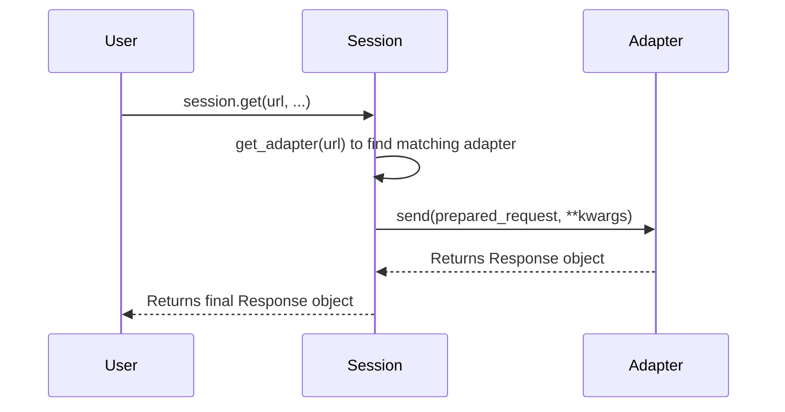
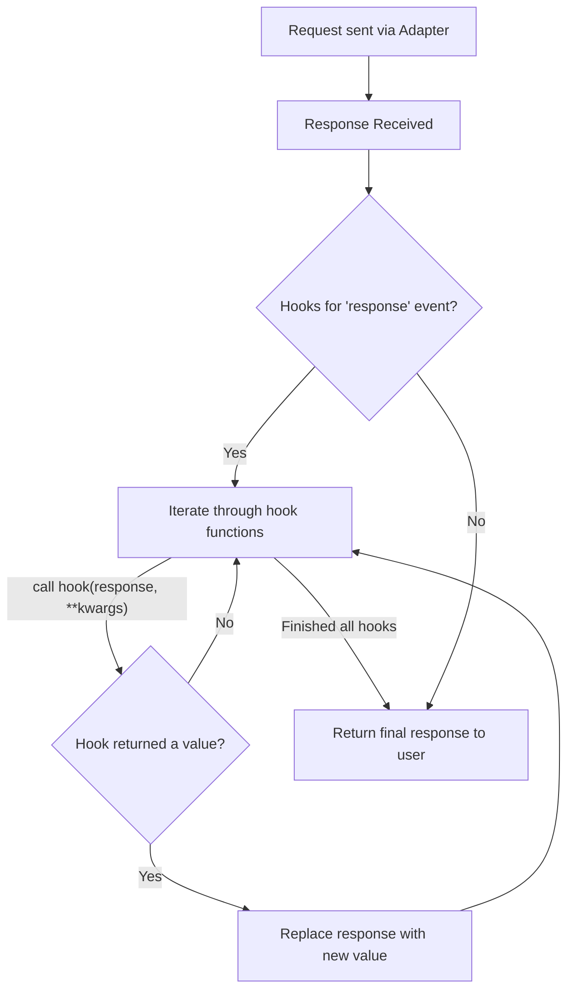

# Custom Adapters and Hooks

Requests provides powerful, low-level customization options through Transport Adapters and an event hook system. Adapters allow you to modify or replace the core logic for how requests are sent, while hooks let you register callbacks to inspect or alter parts of the request lifecycle, primarily the response.

This section covers how to extend Requests' functionality for advanced use cases like custom retry strategies, non-standard authentication, or response post-processing.

## Transport Adapters

Transport Adapters are the core of how Requests handles network operations. When you make a call like `requests.get()`, a `Session` object determines the appropriate adapter based on the URL prefix (e.g., `http://` or `https://`) and delegates the request to it. The default is the `HTTPAdapter`, which uses the `urllib3` library for all HTTP and HTTPS communication.

By creating a custom adapter, you can implement unique transport behavior for specific protocols or hosts.

### Creating a Custom Adapter

To create a custom adapter, you subclass `requests.adapters.BaseAdapter` and, at a minimum, implement the `send()` method. This method is responsible for executing the request and must return a `requests.Response` object.

The base `send` method signature is:

```python
def send(self, request, stream=False, timeout=None, verify=True, cert=None, proxies=None):
    """Sends PreparedRequest object. Returns Response object."""
    raise NotImplementedError
```

A practical approach is to inherit from the existing `HTTPAdapter` and override its methods. This allows you to add functionality without rewriting the entire HTTP/HTTPS connection logic.

#### Example: Custom Retry Adapter

The `HTTPAdapter` already supports retry logic through `urllib3`. You can create a specialized adapter to configure this behavior for specific needs, such as retrying only on certain HTTP status codes.

```python
import requests
from requests.adapters import HTTPAdapter
from urllib3.util.retry import Retry

class RetryAdapter(HTTPAdapter):
    def __init__(self, *args, **kwargs):
        # Configure a retry strategy to retry on 5xx server errors
        retries = Retry(
            total=5, # Total number of retries
            backoff_factor=0.2, # A delay factor between attempts
            status_forcelist=[500, 502, 503, 504], # Status codes to retry on
            allowed_methods=frozenset(['GET', 'POST']) # Methods to retry
        )
        # The 'max_retries' parameter is passed to the parent HTTPAdapter
        super().__init__(max_retries=retries, *args, **kwargs)

# Create a session and mount the custom adapter for all HTTPS requests
session = requests.Session()
session.mount("https://", RetryAdapter())

try:
    # This request will be retried up to 5 times if it returns a 503 status
    response = session.get("https://httpbin.org/status/503")
    print(f"Request succeeded with status: {response.status_code}")
except requests.exceptions.RetryError as e:
    print(f"Request failed after multiple retries: {e}")

```

### Mounting an Adapter

Custom adapters are registered with a `Session` object using the `session.mount()` method. You associate an adapter instance with a URL prefix, and the session will use the adapter with the longest matching prefix for a given request URL.

For example, you could mount different adapters for different services:

```python
s = requests.Session()

# Use a standard adapter for most sites
s.mount('https://', HTTPAdapter())

# Use our special retry adapter only for a specific API
s.mount('https://api.example.com', RetryAdapter())

s.get('https://google.com') # Uses the standard HTTPAdapter
s.get('https://api.example.com/data') # Uses the RetryAdapter
```

### Adapter Request Flow

The following diagram illustrates how a `Session` selects and uses an adapter to send a request.



## Event Hooks

Requests also includes a hook system that allows you to attach callbacks to a single event in the request/response cycle: `response`.

This hook is triggered after a response is received from the server but before it is returned to your application code. Hooks are useful for implementing cross-cutting concerns like global logging, response modification, or centralized error handling.

### The `response` Hook

The only available hook is `response`. A `response` hook is a callable that accepts the `response` object as its first argument, along with any other keyword arguments passed to the request method.

```python
def my_hook(response, **kwargs):
    # Inspect the response
    print(f"Received response from {response.url} with status {response.status_code}")

    # Optionally, modify and return it
    if 'X-Special-Header' not in response.headers:
        response.headers['X-Special-Header'] = 'Added by hook!'
    return response
```
If the hook function returns a value, that value will replace the original response. If it returns `None`, the original response is used.

### Registering Hooks

You can register hooks either on a `Session` object for all subsequent requests or on a per-request basis.

#### Session-level Hooks
Hooks are stored in the `session.hooks` dictionary. The value for each event key should be a list of callables.

```python
import requests

def log_response_details(response, **kwargs):
    print(f"URL: {response.url}, Elapsed: {response.elapsed}")

session = requests.Session()
session.hooks['response'] = [log_response_details]

session.get('https://httpbin.org/get')
session.get('https://httpbin.org/delay/1')
```

#### Per-request Hooks
Alternatively, you can pass a `hooks` dictionary directly to a request method.

```python
import requests

def check_for_error(response, **kwargs):
    """A hook that automatically raises an exception for HTTP errors."""
    response.raise_for_status()

try:
    # This request will use the hook and raise an exception
    requests.get('https://httpbin.org/status/500', hooks={'response': [check_for_error]})
except requests.exceptions.HTTPError as e:
    print(f"Caught expected error: {e}")

# This request will not use the hook and will not raise an exception
response = requests.get('https://httpbin.org/status/500')
print(f"Request without hook completed with status: {response.status_code}")
```

### Hook Execution Flow

The hook system processes the response before returning it to the user, allowing for inspection or modification at a critical point.



By leveraging custom adapters and hooks, you can tailor Requests' behavior to fit nearly any networking requirement. For more detailed information on the classes and methods discussed, please consult the [API Reference](./api-reference.md).
