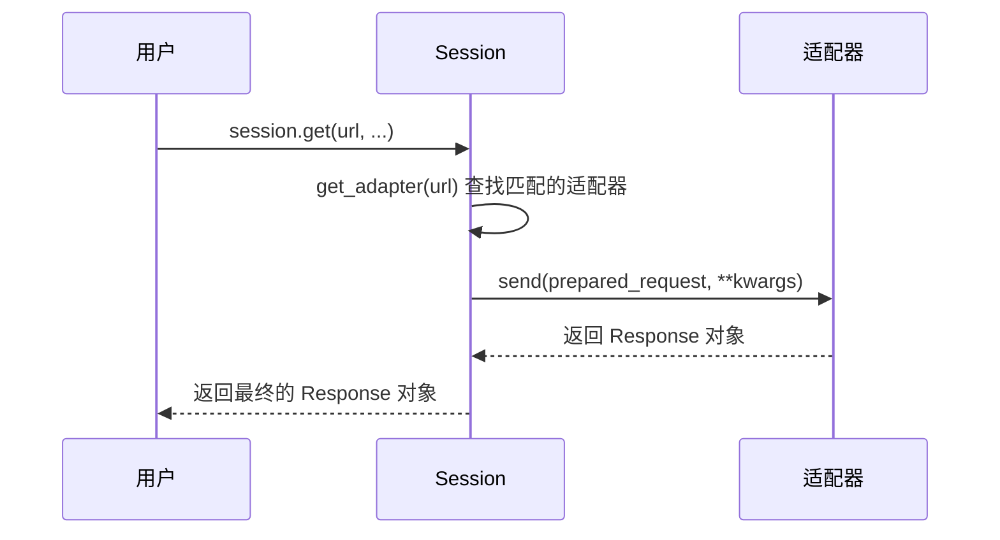
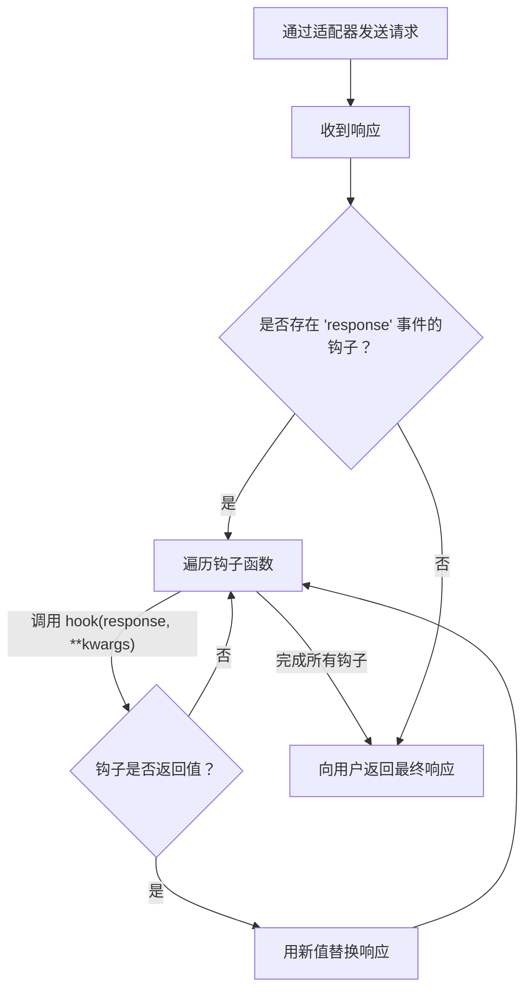

# 自定义适配器和钩子

Requests 通过传输适配器和事件钩子系统提供了强大的底层定制选项。适配器允许您修改或替换请求发送的核心逻辑，而钩子则允许您注册回调函数来检查或更改请求生命周期的各个部分，主要是响应。

本节介绍如何扩展 Requests 的功能以适应高级用例，例如自定义重试策略、非标准身份验证或响应后处理。

## 传输适配器

传输适配器是 Requests 处理网络操作的核心。当您调用 `requests.get()` 时，`Session` 对象会根据 URL 前缀（例如 `http://` 或 `https://`）确定合适的适配器，并将请求委托给它。默认的适配器是 `HTTPAdapter`，它使用 `urllib3` 库处理所有 HTTP 和 HTTPS 通信。

通过创建自定义适配器，您可以为特定协议或主机实现独特的传输行为。

### 创建自定义适配器

要创建自定义适配器，您需要子类化 `requests.adapters.BaseAdapter`，并至少实现 `send()` 方法。该方法负责执行请求，并且必须返回一个 `requests.Response` 对象。

`send` 基本方法的签名为：

```python
def send(self, request, stream=False, timeout=None, verify=True, cert=None, proxies=None):
    """发送 PreparedRequest 对象。返回 Response 对象。"""
    raise NotImplementedError
```

一种实用的方法是继承现有的 `HTTPAdapter` 并重写其方法。这样，您无需重写整个 HTTP/HTTPS 连接逻辑即可添加功能。

#### 示例：自定义重试适配器

`HTTPAdapter` 已通过 `urllib3` 支持重试逻辑。您可以创建一个专门的适配器来配置此行为以满足特定需求，例如仅在某些 HTTP 状态码上重试。

```python
import requests
from requests.adapters import HTTPAdapter
from urllib3.util.retry import Retry

class RetryAdapter(HTTPAdapter):
    def __init__(self, *args, **kwargs):
        # 配置重试策略，在 5xx 服务器错误时重试
        retries = Retry(
            total=5, # 重试总次数
            backoff_factor=0.2, # 两次尝试之间的延迟因子
            status_forcelist=[500, 502, 503, 504], # 需要重试的状态码
            allowed_methods=frozenset(['GET', 'POST']) # 需要重试的方法
        )
        # 'max_retries' 参数传递给父类 HTTPAdapter
        super().__init__(max_retries=retries, *args, **kwargs)

# 创建一个会话并为所有 HTTPS 请求挂载自定义适配器
session = requests.Session()
session.mount("https://", RetryAdapter())

try:
    # 如果此请求返回 503 状态，它将被重试最多 5 次
    response = session.get("https://httpbin.org/status/503")
    print(f"请求成功，状态码：{response.status_code}")
except requests.exceptions.RetryError as e:
    print(f"多次重试后请求失败：{e}")

```

### 挂载适配器

自定义适配器通过 `session.mount()` 方法注册到 `Session` 对象上。您将适配器实例与 URL 前缀关联，会话将为给定的请求 URL 使用具有最长匹配前缀的适配器。

例如，您可以为不同的服务挂载不同的适配器：

```python
s = requests.Session()

# 对大多数站点使用标准适配器
s.mount('https://', HTTPAdapter())

# 仅对特定 API 使用我们特制的重试适配器
s.mount('https://api.example.com', RetryAdapter())

s.get('https://google.com') # 使用标准 HTTPAdapter
s.get('https://api.example.com/data') # 使用 RetryAdapter
```

### 适配器请求流程

下图说明了 `Session` 如何选择和使用适配器来发送请求。



## 事件钩子

Requests 还包含一个钩子系统，允许您将回调函数附加到请求/响应周期中的单个事件：`response`。

此钩子在从服务器接收到响应之后、返回到您的应用程序代码之前触发。钩子对于实现全局日志记录、响应修改或集中式错误处理等横切关注点非常有用。

### `response` 钩子

唯一可用的钩子是 `response`。`response` 钩子是一个可调用对象，它接受 `response` 对象作为其第一个参数，以及传递给请求方法的任何其他关键字参数。

```python
def my_hook(response, **kwargs):
    # 检查响应
    print(f"收到来自 {response.url} 的响应，状态码为 {response.status_code}")

    # 可选地，修改并返回它
    if 'X-Special-Header' not in response.headers:
        response.headers['X-Special-Header'] = '由钩子添加！'
    return response
```
如果钩子函数返回值，该值将替换原始响应。如果返回 `None`，则使用原始响应。

### 注册钩子

您可以在 `Session` 对象上为所有后续请求注册钩子，也可以按单次请求注册。

#### 会话级钩子
钩子存储在 `session.hooks` 字典中。每个事件键的值应该是一个可调用对象列表。

```python
import requests

def log_response_details(response, **kwargs):
    print(f"URL: {response.url}, 耗时: {response.elapsed}")

session = requests.Session()
session.hooks['response'] = [log_response_details]

session.get('https://httpbin.org/get')
session.get('https://httpbin.org/delay/1')
```

#### 请求级钩子
或者，您可以将 `hooks` 字典直接传递给请求方法。

```python
import requests

def check_for_error(response, **kwargs):
    """一个为 HTTP 错误自动引发异常的钩子。"""
    response.raise_for_status()

try:
    # 此请求将使用钩子并引发异常
    requests.get('https://httpbin.org/status/500', hooks={'response': [check_for_error]})
except requests.exceptions.HTTPError as e:
    print(f"捕获到预期错误：{e}")

# 此请求不会使用钩子，也不会引发异常
response = requests.get('https://httpbin.org/status/500')
print(f"未使用钩子的请求完成，状态码：{response.status_code}")
```

### 钩子执行流程

钩子系统在将响应返回给用户之前对其进行处理，从而允许在关键点进行检查或修改。



通过利用自定义适配器和钩子，您可以定制 Requests 的行为以适应几乎任何网络需求。有关所讨论的类和方法的更多详细信息，请查阅[API 参考](./api-reference.md)。
