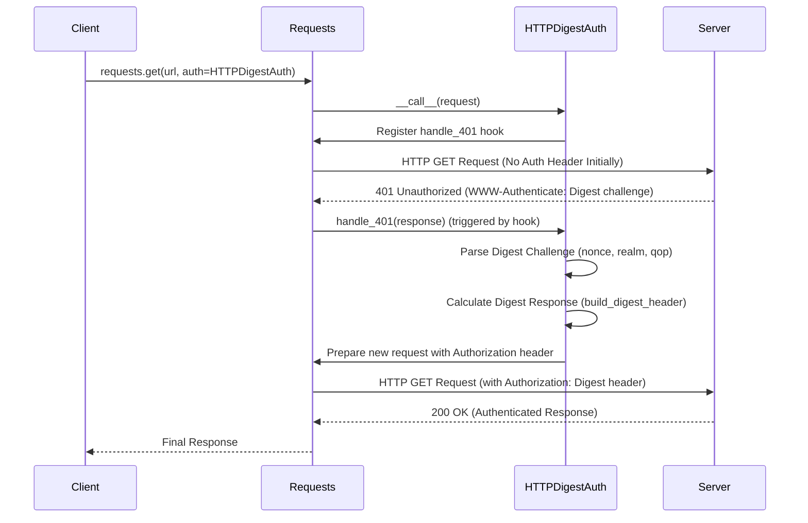

# Authentication

Requests provides various mechanisms to handle HTTP authentication, allowing you to interact with services that require credentials. This section guides you through implementing common authentication methods like Basic, Digest, and Proxy authentication. You can attach authentication directly to individual requests or configure it on a `Session` object for persistence across multiple requests.

For general information on how sessions manage persistent settings, refer to the [Session Object](./api-reference-session-object.md) section.

## Basic Authentication

HTTP Basic Authentication is a simple, standardized method for authenticating a user with a username and password. Requests offers `HTTPBasicAuth` to easily apply this type of authentication.

### Usage

To use Basic authentication, you can pass an `HTTPBasicAuth` object to the `auth` parameter of your request. This object takes your username and password.

**Example**

```python
import requests
from requests.auth import HTTPBasicAuth

# Create a basic authentication object
auth = HTTPBasicAuth('your_username', 'your_password')

# Make a GET request with basic authentication
try:
    response = requests.get('https://httpbin.org/basic-auth/your_username/your_password', auth=auth)
    response.raise_for_status() # Raise an exception for HTTP errors
    print('Status Code:', response.status_code)
    print('Response JSON:', response.json())
except requests.exceptions.HTTPError as e:
    print(f"HTTP error occurred: {e}")
except requests.exceptions.RequestException as e:
    print(f"An error occurred: {e}")
```

This example demonstrates how to create an `HTTPBasicAuth` object and apply it to a GET request. The `HTTPBasicAuth` class internally constructs the `Authorization` header using a Base64 encoded string of the username and password.

```python
def _basic_auth_str(username, password):
    """Returns a Basic Auth string."""
    # ... (encoding logic for username and password)
    authstr = "Basic " + to_native_string(
        b64encode(b":".join((username, password))).strip()
    )
    return authstr

class HTTPBasicAuth(AuthBase):
    def __init__(self, username, password):
        self.username = username
        self.password = password

    def __call__(self, r):
        r.headers["Authorization"] = _basic_auth_str(self.username, self.password)
        return r
```

The `__call__` method of `HTTPBasicAuth` is responsible for adding the `Authorization` header to the request object (`r`) before it is sent.

## Proxy Authentication

When your network requires authentication to use a proxy, you can use `HTTPProxyAuth`. This works similarly to `HTTPBasicAuth` but applies the credentials to the `Proxy-Authorization` header.

### Usage

Pass an `HTTPProxyAuth` object along with your proxy configuration. Note that `HTTPProxyAuth` inherits from `HTTPBasicAuth` and functions similarly.

**Example**

```python
import requests
from requests.auth import HTTPProxyAuth

# Configure your proxy with authentication
proxies = {
    'http': 'http://your_proxy_server:port',
    'https': 'http://your_proxy_server:port',
}

proxy_auth = HTTPProxyAuth('proxy_username', 'proxy_password')

# Make a request through the authenticated proxy
try:
    response = requests.get('https://example.com', proxies=proxies, auth=proxy_auth)
    response.raise_for_status()
    print('Status Code:', response.status_code)
    print('Content Length:', len(response.content))
except requests.exceptions.RequestException as e:
    print(f"An error occurred: {e}")
```

This example shows how to configure `HTTPProxyAuth` with your proxy settings. Requests automatically handles the `Proxy-Authorization` header for non-HTTPS schemes; for HTTPS tunneling, `urllib3` handles this.

```python
class HTTPProxyAuth(HTTPBasicAuth):
    """Attaches HTTP Proxy Authentication to a given Request object."""

    def __call__(self, r):
        r.headers["Proxy-Authorization"] = _basic_auth_str(self.username, self.password)
        return r
```

## Digest Authentication

HTTP Digest Authentication is a more secure challenge-response authentication mechanism than Basic authentication, as it does not send credentials in plain text. Requests handles the complex multi-step process of Digest authentication for you with `HTTPDigestAuth`.

### Usage

Similar to Basic Auth, you pass an `HTTPDigestAuth` object to the `auth` parameter. Requests manages the challenge-response handshake automatically.

**Example**

```python
import requests
from requests.auth import HTTPDigestAuth

# Make a request to a server requiring Digest authentication
digest_auth = HTTPDigestAuth('digest_user', 'digest_password')

try:
    response = requests.get('https://httpbin.org/digest-auth/auth/digest_user/digest_password', auth=digest_auth)
    response.raise_for_status()
    print('Status Code:', response.status_code)
    print('Response JSON:', response.json())
except requests.exceptions.RequestException as e:
    print(f"An error occurred: {e}")
```

### How Digest Authentication Works

Digest authentication involves a multi-step process where the server sends a challenge (a `401 Unauthorized` response with a `WWW-Authenticate` header) and the client responds with credentials encrypted using a hash function. The `HTTPDigestAuth` class manages this entire flow transparently. It registers hooks to intercept `401` responses and redirects to re-authenticate.

Here's a simplified sequence diagram of how `HTTPDigestAuth` handles the process:



Key methods in `HTTPDigestAuth`:

*   **`__call__(self, r)`**: This method is executed when the `HTTPDigestAuth` object is called. It initializes per-thread state, optionally adds an `Authorization` header if a `nonce` is already known from a previous interaction, and registers the `handle_401` and `handle_redirect` hooks.

*   **`handle_401(self, r, **kwargs)`**: This is a response hook that gets triggered when Requests receives a `401 Unauthorized` response. It parses the `WWW-Authenticate` header from the server's response, builds the correct `Authorization` header (including `nonce`, `cnonce`, `response` digest, etc.), and then resends the request with the new header. It also handles rewinding the request body if it was a file-like object.

*   **`build_digest_header(self, method, url)`**: This method performs the core cryptographic calculations required for Digest authentication, generating the `response` digest and constructing the final `Authorization` header string based on the server's challenge and the request details.

## Session-level Authentication

You can set a default authentication method for all requests made through a `Session` object. This is convenient when interacting with an API that consistently requires the same authentication.

### Usage

Assign an authentication object to the `auth` attribute of your `Session` instance.

**Example**

```python
import requests
from requests.auth import HTTPBasicAuth

with requests.Session() as session:
    session.auth = HTTPBasicAuth('session_user', 'session_password')

    # All requests made via this session will now include basic auth
    response1 = session.get('https://httpbin.org/basic-auth/session_user/session_password')
    print('Response 1 Status Code:', response1.status_code)

    response2 = session.get('https://httpbin.org/basic-auth/session_user/session_password')
    print('Response 2 Status Code:', response2.status_code)
```

When you call `session.prepare_request(req)`, the session's authentication setting is merged with any authentication explicitly provided in the `Request` object. If an `auth` object is defined on the session, it will be used unless overridden by an `auth` parameter on the specific request.

```python
class Session(SessionRedirectMixin):
    # ...
    def __init__(self):
        # ...
        self.auth = None # Default Authentication tuple or object
        # ...

    def prepare_request(self, request):
        # ...
        auth = request.auth
        if self.trust_env and not auth and not self.auth:
            auth = get_netrc_auth(request.url)
        # ...
        p.prepare(
            # ...
            auth=merge_setting(auth, self.auth),
            # ...
        )
        return p
```

## Environment-based Authentication (`.netrc`)

Requests can also automatically pick up authentication credentials from your `~/.netrc` file (or `_netrc` on Windows) if the `trust_env` session setting is `True` (which is the default).

### Usage

Ensure your `.netrc` file is configured correctly. Requests will then use these credentials for matching hosts without explicit `auth` parameters.

**Example `.netrc` entry:**

```
machine httpbin.org
    login myuser
    password mypassword
```

Then, in your Python code:

```python
import requests

# With trust_env=True (default), Requests will look for .netrc
response = requests.get('https://httpbin.org/basic-auth/myuser/mypassword')
print('Status Code:', response.status_code)
```

The `get_netrc_auth` utility function is used to retrieve authentication details from the `.netrc` file:

```python
# src/requests/utils.py
def get_netrc_auth(url, raise_errors=False):
    """Returns the Requests tuple auth for a given url from netrc."""
    # ... (logic to read .netrc file and find credentials)
```

This functionality is integrated into `Session.prepare_request` when `trust_env` is active.

---

This section provided an overview of configuring Basic, Digest, and Proxy authentication in Requests. You now have the tools to handle common authentication scenarios. To learn about configuring proxy servers for your requests, proceed to the [Proxies](./advanced-usage-proxies.md) section.