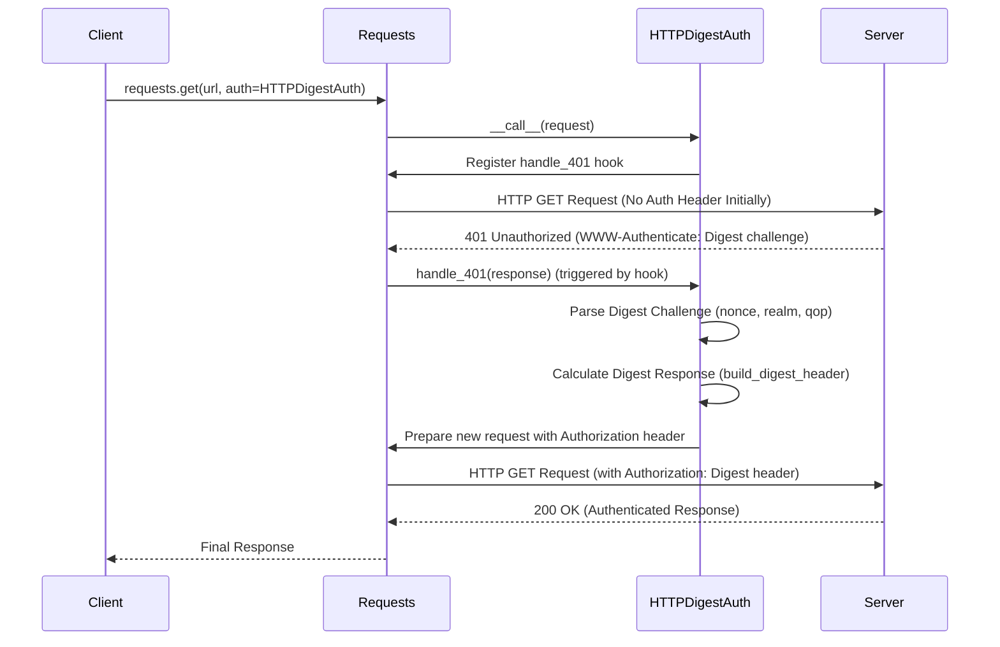

# 认证

Requests 提供了多种机制来处理 HTTP 认证，使您能够与需要凭据的服务进行交互。本节将指导您实现常见的认证方法，如 Basic、Digest 和 Proxy 认证。您可以直接将认证附加到单个请求上，或者将其配置在 `Session` 对象上，以便在多个请求中保持持久性。

有关会话如何管理持久设置的通用信息，请参阅[会话对象](./api-reference-session-object.md)部分。

## Basic Authentication

HTTP Basic Authentication 是一种简单、标准化的方法，用于通过用户名和密码对用户进行认证。Requests 提供了 `HTTPBasicAuth` 以便轻松应用此类认证。

### 用法

要使用 Basic 认证，您可以将 `HTTPBasicAuth` 对象传递给请求的 `auth` 参数。此对象接受您的用户名和密码。

**示例**

```python
import requests
from requests.auth import HTTPBasicAuth

# Create a basic authentication object
auth = HTTPBasicAuth('your_username', 'your_password')

# Make a GET request with basic authentication
try:
    response = requests.get('https://httpbin.org/basic-auth/your_username/your_password', auth=auth)
    response.raise_for_status() # Raise an exception for HTTP errors
    print('Status Code:', response.status_code)
    print('Response JSON:', response.json())
except requests.exceptions.HTTPError as e:
    print(f"HTTP error occurred: {e}")
except requests.exceptions.RequestException as e:
    print(f"An error occurred: {e}")
```

此示例演示了如何创建 `HTTPBasicAuth` 对象并将其应用于 GET 请求。`HTTPBasicAuth` 类在内部使用 Base64 编码的用户名和密码字符串构造 `Authorization` 头部。

```python
def _basic_auth_str(username, password):
    """Returns a Basic Auth string."""
    # ... (encoding logic for username and password)
    authstr = "Basic " + to_native_string(
        b64encode(b":".join((username, password))).strip()
    )
    return authstr

class HTTPBasicAuth(AuthBase):
    def __init__(self, username, password):
        self.username = username
        self.password = password

    def __call__(self, r):
        r.headers["Authorization"] = _basic_auth_str(self.username, self.password)
        return r
```

`HTTPBasicAuth` 的 `__call__` 方法负责在请求对象 (`r`) 发送之前向其添加 `Authorization` 头部。

## Proxy Authentication

当您的网络需要认证才能使用代理时，您可以使用 `HTTPProxyAuth`。这与 `HTTPBasicAuth` 类似，但将凭据应用于 `Proxy-Authorization` 头部。

### 用法

传入一个 `HTTPProxyAuth` 对象以及您的代理配置。请注意，`HTTPProxyAuth` 继承自 `HTTPBasicAuth` 并且功能类似。

**示例**

```python
import requests
from requests.auth import HTTPProxyAuth

# Configure your proxy with authentication
proxies = {
    'http': 'http://your_proxy_server:port',
    'https': 'http://your_proxy_server:port',
}

proxy_auth = HTTPProxyAuth('proxy_username', 'proxy_password')

# Make a request through the authenticated proxy
try:
    response = requests.get('https://example.com', proxies=proxies, auth=proxy_auth)
    response.raise_for_status()
    print('Status Code:', response.status_code)
    print('Content Length:', len(response.content))
except requests.exceptions.RequestException as e:
    print(f"An error occurred: {e}")
```

此示例展示了如何使用您的代理设置配置 `HTTPProxyAuth`。Requests 会自动为非 HTTPS 方案处理 `Proxy-Authorization` 头部；对于 HTTPS 隧道，则由 `urllib3` 处理。

```python
class HTTPProxyAuth(HTTPBasicAuth):
    """Attaches HTTP Proxy Authentication to a given Request object."""

    def __call__(self, r):
        r.headers["Proxy-Authorization"] = _basic_auth_str(self.username, self.password)
        return r
```

## Digest Authentication

HTTP Digest Authentication 是一种比 Basic 认证更安全的挑战-响应认证机制，因为它不以明文形式发送凭据。Requests 通过 `HTTPDigestAuth` 为您处理 Digest 认证的复杂多步骤过程。

### 用法

与 Basic 认证类似，您可以将 `HTTPDigestAuth` 对象传递给 `auth` 参数。Requests 会自动管理挑战-响应握手。

**示例**

```python
import requests
from requests.auth import HTTPDigestAuth

# Make a request to a server requiring Digest authentication
digest_auth = HTTPDigestAuth('digest_user', 'digest_password')

try:
    response = requests.get('https://httpbin.org/digest-auth/auth/digest_user/digest_password', auth=digest_auth)
    response.raise_for_status()
    print('Status Code:', response.status_code)
    print('Response JSON:', response.json())
except requests.exceptions.RequestException as e:
    print(f"An error occurred: {e}")
```

### Digest 认证的工作原理

Digest 认证涉及一个多步骤过程，其中服务器发送一个挑战（一个带有 `WWW-Authenticate` 头部 的 `401 Unauthorized` 响应），客户端则使用哈希函数加密的凭据进行响应。`HTTPDigestAuth` 类透明地管理整个流程。它注册钩子以拦截 `401` 响应并重定向以重新认证。

以下是 `HTTPDigestAuth` 如何处理该过程的简化序列图：



`HTTPDigestAuth` 中的关键方法：

*   **`__call__(self, r)`**：当调用 `HTTPDigestAuth` 对象时，此方法会执行。它初始化每个线程的状态，如果 `nonce` 已从先前的交互中得知，则可选地添加 `Authorization` 头部，并注册 `handle_401` 和 `handle_redirect` 钩子。

*   **`handle_401(self, r, **kwargs)`**：这是一个响应钩子，当 Requests 收到 `401 Unauthorized` 响应时会触发。它解析服务器响应中的 `WWW-Authenticate` 头部，构建正确的 `Authorization` 头部（包括 `nonce`、`cnonce`、`response` 摘要等），然后用新的头部重新发送请求。如果请求主体是文件类对象，它还会处理请求主体的倒回。

*   **`build_digest_header(self, method, url)`**：此方法执行 Digest 认证所需的核心密码学计算，生成 `response` 摘要并根据服务器的挑战和请求详细信息构建最终的 `Authorization` 头部字符串。

## 会话级认证

您可以为通过 `Session` 对象发出的所有请求设置默认认证方法。当与始终需要相同认证的 API 交互时，这非常方便。

### 用法

将认证对象分配给 `Session` 实例的 `auth` 属性。

**示例**

```python
import requests
from requests.auth import HTTPBasicAuth

with requests.Session() as session:
    session.auth = HTTPBasicAuth('session_user', 'session_password')

    # All requests made via this session will now include basic auth
    response1 = session.get('https://httpbin.org/basic-auth/session_user/session_password')
    print('Response 1 Status Code:', response1.status_code)

    response2 = session.get('https://httpbin.org/basic-auth/session_user/session_password')
    print('Response 2 Status Code:', response2.status_code)
```

当您调用 `session.prepare_request(req)` 时，会话的认证设置会与 `Request` 对象中明确提供的任何认证合并。如果在会话上定义了 `auth` 对象，则将使用它，除非被特定请求上的 `auth` 参数覆盖。

```python
class Session(SessionRedirectMixin):
    # ...
    def __init__(self):
        # ...
        self.auth = None # Default Authentication tuple or object
        # ...

    def prepare_request(self, request):
        # ...
        auth = request.auth
        if self.trust_env and not auth and not self.auth:
            auth = get_netrc_auth(request.url)
        # ...
        p.prepare(
            # ...
            auth=merge_setting(auth, self.auth),
            # ...
        )
        return p
```

## 基于环境的认证 (`.netrc`)

如果 `trust_env` 会话设置是 `True`（这是默认值），Requests 也可以自动从您的 `~/.netrc` 文件（或 Windows 上的 `_netrc`）中获取认证凭据。

### 用法

确保您的 `.netrc` 文件配置正确。Requests 将随后对匹配的主机使用这些凭据，而无需显式的 `auth` 参数。

**`.netrc` 条目示例：**

```
machine httpbin.org
    login myuser
    password mypassword
```

然后，在您的 Python 代码中：

```python
import requests

# With trust_env=True (default), Requests will look for .netrc
response = requests.get('https://httpbin.org/basic-auth/myuser/mypassword')
print('Status Code:', response.status_code)
```

`get_netrc_auth` 工具函数用于从 `.netrc` 文件中检索认证详细信息：

```python
# src/requests/utils.py
def get_netrc_auth(url, raise_errors=False):
    """Returns the Requests tuple auth for a given url from netrc."""
    # ... (logic to read .netrc file and find credentials)
```

当 `trust_env` 处于激活状态时，此功能已集成到 `Session.prepare_request` 中。

---

本节概述了如何在 Requests 中配置 Basic、Digest 和 Proxy 认证。您现在拥有处理常见认证场景的工具。要了解如何为您的请求配置代理服务器，请继续阅读[代理](./advanced-usage-proxies.md)部分。