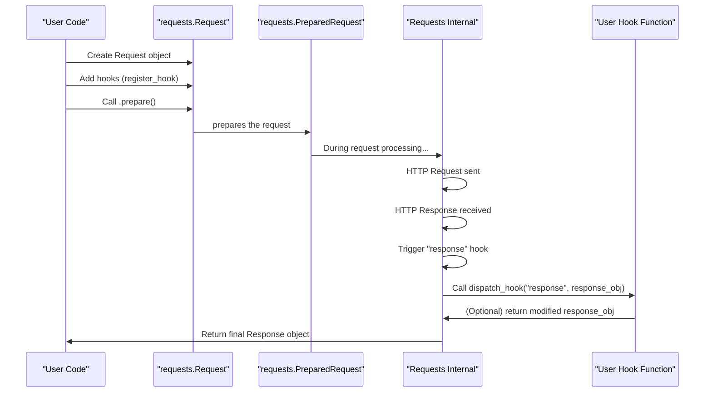

# Hooks

Requests provides a hook system, enabling you to inject custom logic at various stages of the request-response lifecycle. This allows for extended functionality, such as modifying requests before they are sent or processing responses before they are returned. The hook system is an advanced feature that allows for deep customization.

For an understanding of the objects involved, refer to the [Requests & Responses](./core-concepts-requests-responses.md) section.

## Understanding Requests Hooks

A hook in Requests is a callback function that the library executes at specific, predefined points during the HTTP communication process. These functions can receive data related to the event and, in some cases, modify that data before it proceeds.

Currently, Requests supports the following hook event:

*   `response`: This hook is triggered when a response is received from the server, immediately after the raw response content is read but before the `Response` object is fully processed and returned to the user. The `Response` object itself is passed as `hook_data` to this hook.

The internal mechanism for dispatching hooks is handled by the `dispatch_hook` function. This function iterates through all registered hook functions for a given event and executes them. If a hook function returns a non-`None` value, that value replaces the original `hook_data`, allowing for data transformation along the hook chain.



## Registering Hooks

You can register one or more hook functions for a specific event using the `register_hook` method. This method is available on both the `Request` and `PreparedRequest` objects.

```python
# From requests.models
class RequestHooksMixin:
    def register_hook(self, event, hook):
        """Properly register a hook."""

        if event not in self.hooks:
            raise ValueError(f'Unsupported event specified, with event name "{event}"')

        if isinstance(hook, Callable):
            self.hooks[event].append(hook)
        elif hasattr(hook, "__iter__"):
            self.hooks[event].extend(h for h in hook if isinstance(h, Callable))
```

**Parameters**

| Name | Type | Description |
|---|---|---|
| `event` | `string` | The name of the hook event to register the function for (e.g., `'response'`). |
| `hook` | `Callable` or `Iterable[Callable]` | The function(s) to be called when the event is dispatched. Can be a single callable or an iterable of callables. |

**Example**

```python
import requests

def my_response_hook(response, *args, **kwargs):
    print(f"Hook activated: Received response from {response.url} with status {response.status_code}")
    # You can modify the response object here, e.g., add a custom header
    response.headers['X-Hook-Processed'] = 'True'
    return response

# Create a Request object
req = requests.Request('GET', 'https://httpbin.org/get')

# Register the hook
req.register_hook('response', my_response_hook)

# Prepare and send the request using a Session (or requests.Session().send(req.prepare()))
s = requests.Session()
prepared_request = req.prepare()
response = s.send(prepared_request)

print(f"Response X-Hook-Processed header: {response.headers.get('X-Hook-Processed')}")
```

This example demonstrates how to register a simple function `my_response_hook` to be called when a response is received. The hook prints information about the response and adds a custom header to it. When `s.send(prepared_request)` is executed, the hook is invoked, and the changes made by the hook (the new header) are visible in the final `response` object.

## Deregistering Hooks

If you need to remove a previously registered hook function, you can use the `deregister_hook` method. This method removes the specified hook from the list of callbacks for a given event.

```python
# From requests.models
class RequestHooksMixin:
    def deregister_hook(self, event, hook):
        """Deregister a previously registered hook.
        Returns True if the hook existed, False if not.
        """

        try:
            self.hooks[event].remove(hook)
            return True
        except ValueError:
            return False
```

**Parameters**

| Name | Type | Description |
|---|---|---|
| `event` | `string` | The name of the hook event from which to deregister the function. |
| `hook` | `Callable` | The specific hook function to remove. |

**Returns**

| Name | Type | Description |
|---|---|---|
| `bool` | `bool` | `True` if the hook was successfully removed, `False` otherwise (e.g., if the hook was not registered). |

**Example**

```python
import requests

def another_response_hook(response, *args, **kwargs):
    print("Another hook executed!")
    return response

req = requests.Request('GET', 'https://httpbin.org/get')
req.register_hook('response', another_response_hook)

# Verify the hook is registered
print(f"Hooks before deregister: {req.hooks['response']}")

# Deregister the hook
deregistered = req.deregister_hook('response', another_response_hook)
print(f"Hook deregistered: {deregistered}")

# Verify the hook is no longer registered
print(f"Hooks after deregister: {req.hooks['response']}")

# Sending the request now will not trigger another_response_hook
s = requests.Session()
response = s.send(req.prepare())
```

This example shows how to register `another_response_hook` and then remove it using `deregister_hook`. The output confirms whether the hook was successfully removed from the `response` event's list of callbacks.

--- 

Understanding and using hooks gives you fine-grained control over the Requests library's behavior, allowing you to implement custom logging, error handling, or data transformations. To delve deeper into the objects manipulated by these hooks, proceed to the [Request & Response Objects](./api-reference-request-response-objects.md) section.