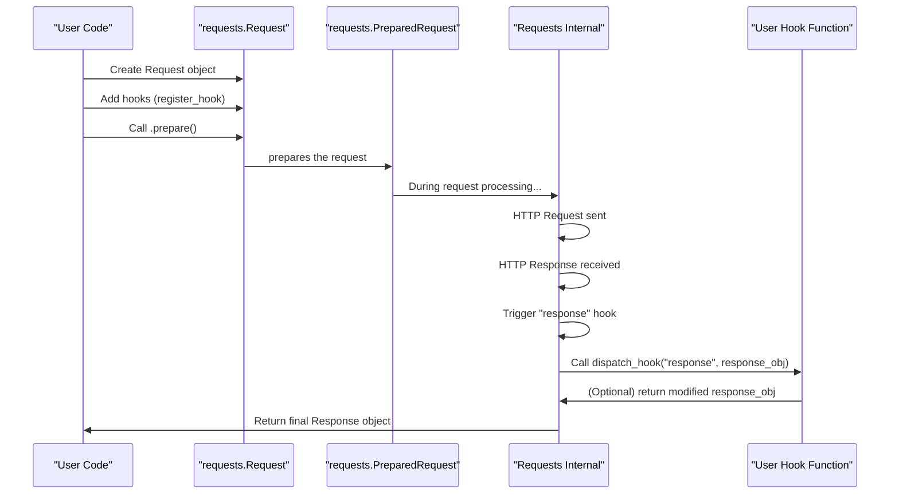

# Hooks

Requests 提供了一套 Hook（钩子）系统，允许您在请求-响应生命周期的各个阶段注入自定义逻辑。这使得扩展功能成为可能，例如在请求发送前对其进行修改，或者在响应返回前对其进行处理。Hook 系统是一个高级功能，允许进行深度定制。

要了解所涉及的对象，请参阅[请求与响应](./core-concepts-requests-responses.md)部分。

## 理解 Requests Hook

Requests 中的 Hook 是一个回调函数，库会在 HTTP 通信过程中的特定预定义点执行它。这些函数可以接收与事件相关的数据，并且在某些情况下，可以在数据处理之前对其进行修改。

Currenty, Requests 支持以下 Hook 事件：

*   `response`：当从服务器收到响应时，此 Hook 会立即触发。它发生在原始响应内容被读取之后，但在 `Response` 对象完全处理并返回给用户之前。`Response` 对象本身会作为 `hook_data` 传递给此 Hook。

分发 Hook 的内部机制由 `dispatch_hook` 函数处理。此函数会迭代指定事件的所有已注册 Hook 函数并执行它们。如果一个 Hook 函数返回一个非 `None` 值，该值将替换原始的 `hook_data`，从而允许在 Hook 链中进行数据转换。



## 注册 Hook

您可以使用 `register_hook` 方法为一个特定事件注册一个或多个 Hook 函数。此方法在 `Request` 和 `PreparedRequest` 对象上都可用。

```python
# From requests.models
class RequestHooksMixin:
    def register_hook(self, event, hook):
        """Properly register a hook."""

        if event not in self.hooks:
            raise ValueError(f'Unsupported event specified, with event name "{event}"')

        if isinstance(hook, Callable):
            self.hooks[event].append(hook)
        elif hasattr(hook, "__iter__"):
            self.hooks[event].extend(h for h in hook if isinstance(h, Callable))
```

**参数**

| Name | Type | Description |
|---|---|---|
| `event` | `string` | 要注册函数的 Hook 事件名称（例如，`'response'`）。 |
| `hook` | `Callable` 或 `Iterable[Callable]` | 事件分发时要调用的函数。可以是一个可调用对象，也可以是可调用对象的迭代器。 |

**示例**

```python
import requests

def my_response_hook(response, *args, **kwargs):
    print(f"Hook activated: Received response from {response.url} with status {response.status_code}")
    # You can modify the response object here, e.g., add a custom header
    response.headers['X-Hook-Processed'] = 'True'
    return response

# Create a Request object
req = requests.Request('GET', 'https://httpbin.org/get')

# Register the hook
req.register_hook('response', my_response_hook)

# Prepare and send the request using a Session (or requests.Session().send(req.prepare()))
s = requests.Session()
prepared_request = req.prepare()
response = s.send(prepared_request)

print(f"Response X-Hook-Processed header: {response.headers.get('X-Hook-Processed')}")
```

此示例演示了如何注册一个简单的函数 `my_response_hook`，以便在收到响应时调用它。该 Hook 打印有关响应的信息并为其添加自定义标头。当 `s.send(prepared_request)` 执行时，Hook 将被调用，Hook 所做的更改（新标头）将在最终的 `response` 对象中可见。

## 注销 Hook

如果您需要移除先前注册的 Hook 函数，可以使用 `deregister_hook` 方法。此方法将从给定事件的回调列表中移除指定的 Hook。

```python
# From requests.models
class RequestHooksMixin:
    def deregister_hook(self, event, hook):
        """Deregister a previously registered hook.
        Returns True if the hook existed, False if not.
        """

        try:
            self.hooks[event].remove(hook)
            return True
        except ValueError:
            return False
```

**参数**

| Name | Type | Description |
|---|---|---|
| `event` | `string` | 要从中注销函数的 Hook 事件名称。 |
| `hook` | `Callable` | 要移除的特定 Hook 函数。 |

**返回值**

| Name | Type | Description |
|---|---|---|
| `bool` | `bool` | 如果 Hook 成功移除，则为 `True`；否则为 `False`（例如，如果 Hook 未注册）。 |

**示例**

```python
import requests

def another_response_hook(response, *args, **kwargs):
    print("Another hook executed!")
    return response

req = requests.Request('GET', 'https://httpbin.org/get')
req.register_hook('response', another_response_hook)

# Verify the hook is registered
print(f"Hooks before deregister: {req.hooks['response']}")

# Deregister the hook
deregistered = req.deregister_hook('response', another_response_hook)
print(f"Hook deregistered: {deregistered}")

# Verify the hook is no longer registered
print(f"Hooks after deregister: {req.hooks['response']}")

# Sending the request now will not trigger another_response_hook
s = requests.Session()
response = s.send(req.prepare())
```

此示例展示了如何注册 `another_response_hook`，然后使用 `deregister_hook` 将其移除。输出确认 Hook 是否已成功从 `response` 事件的回调列表中移除。

---

理解和使用 Hook 可以让您对 Requests 库的行为进行细粒度控制，从而实现自定义日志记录、错误处理或数据转换。要深入了解这些 Hook 所操作的对象，请继续阅读[请求与响应对象](./api-reference-request-response-objects.md)部分。