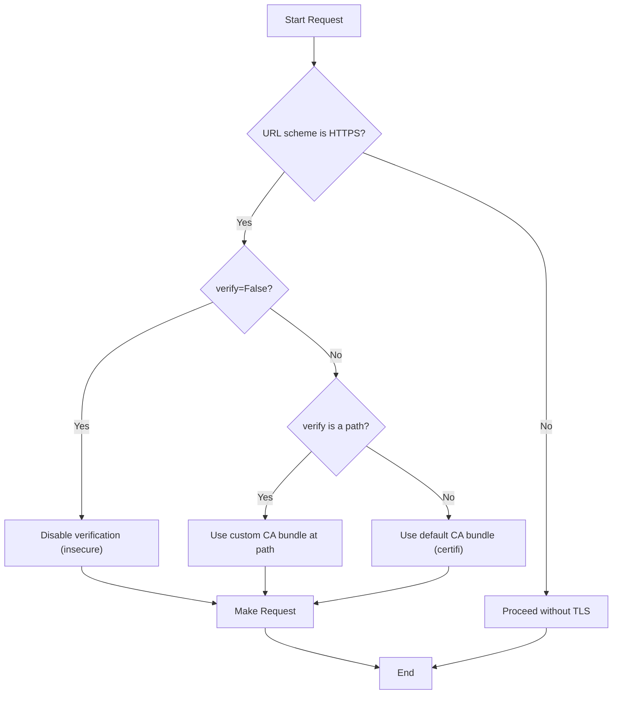

# SSL Certificate Verification

Requests verifies SSL certificates for HTTPS requests by default, preventing man-in-the-middle attacks. This verification relies on a system of trusted Certificate Authorities (CAs), similar to how your web browser operates. This section covers how to manage this behavior for different scenarios, such as using private CAs or client-side certificates.

## Default CA Verification

When you make a request to an `https://` URL, Requests checks that the server's certificate is valid and trusted. This behavior is enabled by default.

```python
import requests

# This works out of the box because httpbin.org has a valid, trusted certificate.
response = requests.get('https://httpbin.org/get')
print(response.status_code)
# 200
```

Internally, Requests uses the `certifi` package to provide its default set of trusted root certificates. You can find the path to the CA bundle it uses:

```python
from certifi import where

print(where())
# /path/to/your/virtualenv/lib/pythonX.X/site-packages/certifi/cacert.pem
```

## Custom CA Bundle

If you are interacting with a service that uses a private or self-signed certificate, such as in an enterprise or testing environment, you can direct Requests to trust a specific CA bundle by providing a path to it via the `verify` parameter.

```python
# Using a single CA bundle file (.pem)
requests.get('https://internal.service.com', verify='/path/to/ca.pem')

# Using a directory of CA certificates
requests.get('https://internal.service.com', verify='/path/to/certs/')
```

For convenience, you can also set this on a `Session` object to apply it to all subsequent requests made with that session.

```python
import requests

s = requests.Session()
s.verify = '/path/to/ca.pem'

# This request will use your custom CA bundle
response = s.get('https://another.internal.service.com')
```

Additionally, Requests will respect the `REQUESTS_CA_BUNDLE` and `CURL_CA_BUNDLE` environment variables if the `verify` parameter is not explicitly set in your code.

## Client-Side Certificates

Some services require clients to authenticate themselves using a certificate, a process known as mutual TLS (mTLS). You can provide a client-side certificate using the `cert` parameter.

If your certificate and private key are combined in a single file:

```python
requests.get(
    'https://api.service.com/resource',
    cert='/path/to/client.pem'
)
```

If your certificate and key are in separate files, pass them as a tuple:

```python
requests.get(
    'https://api.service.com/resource',
    cert=('/path/to/client.crt', '/path/to/client.key')
)
```

Like the `verify` setting, `cert` can also be configured on a `Session` object to apply to all requests within that session.

## Disabling Verification

For local development or on a fully trusted internal network, you might need to bypass SSL verification. You can do this by setting `verify=False`. 

**Warning**: This is insecure and should not be done in production environments, as it makes your application vulnerable to man-in-the-middle attacks.

```python
import requests

# This will disable certificate verification.
# It will likely produce an InsecureRequestWarning from urllib3.
response = requests.get('https://self-signed.badssl.com/', verify=False)
```

## Verification Workflow

The following diagram illustrates how Requests decides which verification method to use.



You can now manage SSL/TLS certificate verification for various scenarios, from using custom CAs to providing client-side certificates. For deeper customization of how Requests handles network connections, see the next section on [Custom Adapters and Hooks](./advanced-usage-adapters-and-hooks.md).
