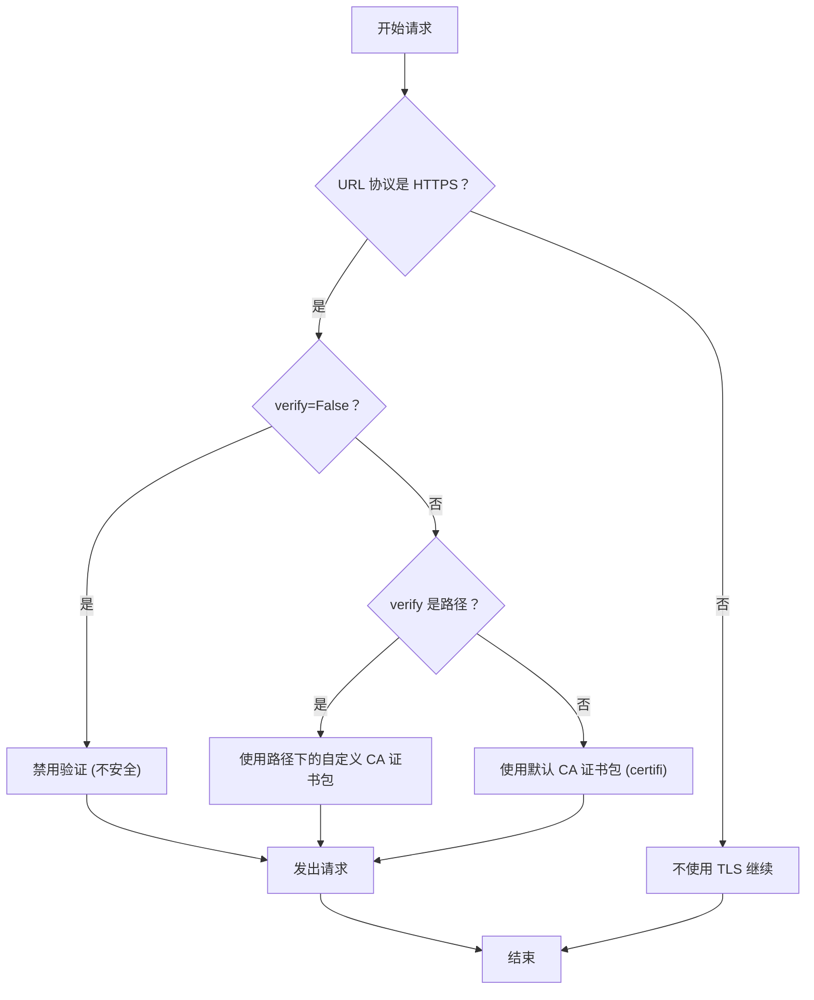

# SSL 证书验证

Requests 默认会为 HTTPS 请求验证 SSL 证书，以防止中间人攻击。此验证依赖于一个受信任的证书颁发机构 (CA) 系统，其工作方式与你的 Web 浏览器类似。本节将介绍如何针对不同场景管理此行为，例如使用私有 CA 或客户端证书。

## 默认 CA 验证

当你向 `https://` URL 发出请求时，Requests 会检查服务器的证书是否有效且受信任。此行为默认启用。

```python
import requests

# 这段代码可以直接运行，因为 httpbin.org 拥有一个有效且受信任的证书。
response = requests.get('https://httpbin.org/get')
print(response.status_code)
# 200
```

在内部，Requests 使用 `certifi` 包来提供其默认的受信任根证书集。你可以找到它所使用的 CA 证书包的路径：

```python
from certifi import where

print(where())
# /path/to/your/virtualenv/lib/pythonX.X/site-packages/certifi/cacert.pem
```

## 自定义 CA 证书包

如果你正在与使用私有或自签名证书的服务进行交互（例如在企业或测试环境中），你可以通过 `verify` 参数提供一个特定 CA 证书包的路径，以指示 Requests 信任该证书包。

```python
# 使用单个 CA 证书包文件 (.pem)
requests.get('https://internal.service.com', verify='/path/to/ca.pem')

# 使用一个包含多个 CA 证书的目录
requests.get('https://internal.service.com', verify='/path/to/certs/')
```

为方便起见，你还可以在 `Session` 对象上进行设置，以将其应用于该会话发出的所有后续请求。

```python
import requests

s = requests.Session()
s.verify = '/path/to/ca.pem'

# 此请求将使用你的自定义 CA 证书包
response = s.get('https://another.internal.service.com')
```

此外，如果你的代码中没有明确设置 `verify` 参数，Requests 将会遵循 `REQUESTS_CA_BUNDLE` 和 `CURL_CA_BUNDLE` 环境变量。

## 客户端证书

一些服务要求客户端使用证书进行身份验证，这一过程称为双向 TLS (mTLS)。你可以使用 `cert` 参数提供客户端证书。

如果你的证书和私钥合并在单个文件中：

```python
requests.get(
    'https://api.service.com/resource',
    cert='/path/to/client.pem'
)
```

如果你的证书和密钥位于不同的文件中，请将它们以元组的形式传递：

```python
requests.get(
    'https://api.service.com/resource',
    cert=('/path/to/client.crt', '/path/to/client.key')
)
```

与 `verify` 设置类似，`cert` 也可以在 `Session` 对象上进行配置，以应用于该会话中的所有请求。

## 禁用验证

对于本地开发或在完全受信任的内部网络上，你可能需要绕过 SSL 验证。你可以通过设置 `verify=False` 来实现。

**警告**：这样做是不安全的，不应在生产环境中使用，因为它会使你的应用程序容易受到中间人攻击。

```python
import requests

# 这将禁用证书验证。
# 这很可能会从 urllib3 中产生一个 InsecureRequestWarning。
response = requests.get('https://self-signed.badssl.com/', verify=False)
```

## 验证工作流

下图说明了 Requests 如何决定使用哪种验证方法。



现在，你可以为各种场景管理 SSL/TLS 证书验证，从使用自定义 CA 到提供客户端证书。要更深入地自定义 Requests 处理网络连接的方式，请参阅下一节关于[自定义适配器和钩子](./advanced-usage-adapters-and-hooks.md)的内容。
