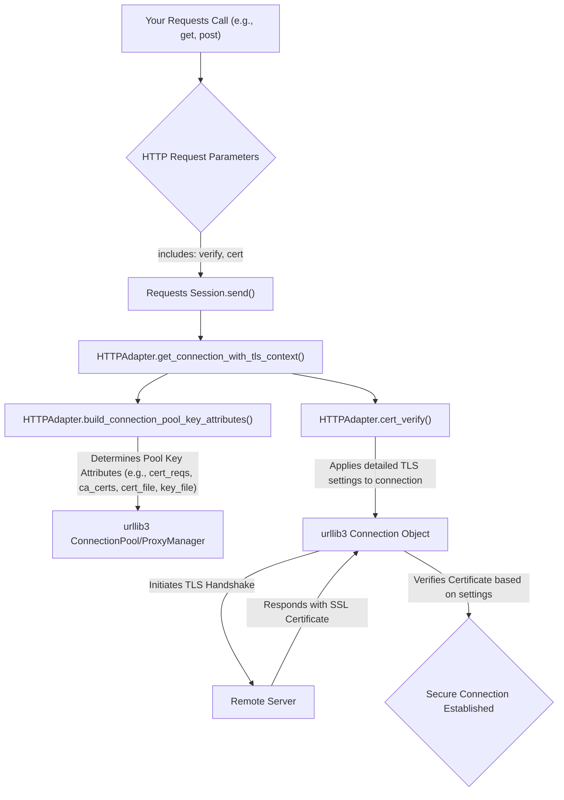

# SSL Verification & Client Certificates

When making HTTP requests, ensuring secure communication is essential. This section explains how Requests handles SSL/TLS certificate verification, allowing you to confirm the identity of the servers you connect to, and how to use client-side certificates for mutual TLS authentication. This builds upon the foundational concepts of managing connections, as discussed in [Sessions](./core-concepts-sessions.md), and can impact the [Error Handling](./advanced-usage-error-handling.md) of your requests.

## SSL/TLS Certificate Verification

SSL/TLS certificate verification is a critical security measure that helps prevent man-in-the-middle (MitM) attacks by ensuring that the server you are communicating with is legitimate. Requests performs SSL verification by default. You can control this behavior using the `verify` parameter.

### Default Verification (`verify=True`)

By default, Requests attempts to verify the server's SSL certificate using a set of trusted Certificate Authorities (CAs). Requests uses the `certifi` package to provide a curated list of trusted root certificates, which is generally the recommended approach for production environments.

```python
import requests

try:
    response = requests.get('https://example.com')
    print(f"Status Code: {response.status_code}")
    print("SSL verification successful.")
except requests.exceptions.SSLError as e:
    print(f"SSL verification failed: {e}")

# Or using a Session object:
s = requests.Session()
try:
    response = s.get('https://example.com', verify=True)
    print(f"Status Code: {response.status_code}")
    print("SSL verification successful with session.")
except requests.exceptions.SSLError as e:
    print(f"SSL verification failed with session: {e}")
```

This example shows a standard GET request where `verify` defaults to `True`, automatically verifying the server's certificate against known CAs.

### Disabling Verification (`verify=False`)

**WARNING**: Setting `verify` to `False` disables SSL certificate verification entirely. This means Requests will accept any TLS certificate presented by the server, ignoring hostname mismatches and/or expired certificates. This makes your application vulnerable to MitM attacks and should **only be used for local development or testing environments**. Never use `verify=False` in production.

```python
import requests
import warnings

# Suppress the InsecureRequestWarning when verify=False
from requests.packages.urllib3.exceptions import InsecureRequestWarning
warnings.simplefilter('ignore', InsecureRequestWarning)

try:
    response = requests.get('https://expired.badssl.com/', verify=False)
    print(f"Status Code: {response.status_code}")
    print("SSL verification explicitly disabled.")
except requests.exceptions.RequestException as e:
    print(f"Request failed even with verification disabled: {e}")
```

This example demonstrates how to disable SSL verification. Note the `warnings.simplefilter` line, which suppresses the warning that Requests emits when verification is disabled.

### Providing a Custom CA Bundle (`verify='/path/to/cacert.pem'`)

You can specify a custom path to a CA certificate bundle or a directory containing trusted CA certificates. This is useful for corporate networks that use internal Certificate Authorities or when you need to trust specific self-signed certificates.

**Parameters**

| Name | Type | Description |
|---|---|---| 
| `verify` | `string` | A path to a CA bundle file (`.pem`) or a directory containing trusted CA certificates. |

```python
import requests
import os

# Assuming you have a custom_ca_bundle.pem file
custom_ca_path = os.path.join(os.getcwd(), 'custom_ca_bundle.pem')

# Create a dummy CA bundle file for demonstration if it doesn't exist
# In a real scenario, this would be your actual CA bundle
if not os.path.exists(custom_ca_path):
    with open(custom_ca_path, 'w') as f:
        f.write("# This is a dummy CA bundle file.\n# Replace with your actual trusted certificates.")

try:
    response = requests.get('https://example.com', verify=custom_ca_path)
    print(f"Status Code: {response.status_code}")
    print(f"SSL verification successful using custom CA bundle: {custom_ca_path}")
except requests.exceptions.SSLError as e:
    print(f"SSL verification failed with custom CA bundle: {e}")
except requests.exceptions.RequestException as e:
    print(f"Request failed: {e}")

# Clean up the dummy file
# os.remove(custom_ca_path)
```

This example shows how to direct Requests to use a specific CA bundle file for verification. Requests' `HTTPAdapter` uses internal logic within `cert_verify` to read from the provided path and configure `urllib3`'s `ca_certs` or `ca_cert_dir`.

## Client Certificates (Mutual TLS)

Client certificates are used for mutual TLS (mTLS) authentication, where both the client and the server verify each other's identities. This provides an additional layer of security beyond server-only verification.

You can specify your client certificate using the `cert` parameter. This parameter accepts either a single string path to a `.pem` file containing both your certificate and key, or a tuple of two strings: `('path/to/cert.pem', 'path/to/key.pem')`.

**Parameters**

| Name | Type | Description |
|---|---|---| 
| `cert` | `string` or `tuple` | If a string, path to the client SSL certificate file (`.pem`). If a tuple, `('cert_file_path', 'key_file_path')` pair. |

### Single File Client Certificate

```python
import requests
import os

# Assuming you have a client_cert_and_key.pem file
# In a real scenario, this file would contain your actual client certificate and private key.
client_cert_path = os.path.join(os.getcwd(), 'client_cert_and_key.pem')

# Create a dummy client cert file for demonstration if it doesn't exist
if not os.path.exists(client_cert_path):
    with open(client_cert_path, 'w') as f:
        f.write("# This is a dummy client cert and key file.\n# Replace with your actual client certificate and private key.")

try:
    # Make a request to a server that requires client certificate
    response = requests.get('https://secure-api.example.com/data', cert=client_cert_path)
    print(f"Status Code: {response.status_code}")
    print("Client certificate successfully used.")
except requests.exceptions.SSLError as e:
    print(f"Client certificate negotiation failed: {e}")
except requests.exceptions.RequestException as e:
    print(f"Request failed: {e}")

# Clean up the dummy file
# os.remove(client_cert_path)
```

This example shows how to use a single `.pem` file that contains both the client certificate and its private key. Requests' `HTTPAdapter` will set `conn.cert_file` internally for the `urllib3` connection.

### Separate Certificate and Key Files

```python
import requests
import os

# Assuming you have client_cert.pem and client_key.pem files
# In a real scenario, these files would contain your actual client certificate and private key.
client_cert_file = os.path.join(os.getcwd(), 'client_cert.pem')
client_key_file = os.path.join(os.getcwd(), 'client_key.pem')

# Create dummy files for demonstration if they don't exist
if not os.path.exists(client_cert_file):
    with open(client_cert_file, 'w') as f:
        f.write("# This is a dummy client certificate file.")
if not os.path.exists(client_key_file):
    with open(client_key_file, 'w') as f:
        f.write("# This is a dummy client key file.")

try:
    # Make a request to a server that requires client certificate
    response = requests.get('https://secure-api.example.com/data', cert=(client_cert_file, client_key_file))
    print(f"Status Code: {response.status_code}")
    print("Client certificate and key successfully used.")
except requests.exceptions.SSLError as e:
    print(f"Client certificate negotiation failed: {e}")
except requests.exceptions.RequestException as e:
    print(f"Request failed: {e}")

# Clean up the dummy files
# os.remove(client_cert_file)
# os.remove(client_key_file)
```

This example demonstrates providing the client certificate and private key as separate files. Requests' `HTTPAdapter` will set both `conn.cert_file` and `conn.key_file` internally.

## Internal Flow of TLS Configuration

Requests leverages `urllib3` for its underlying connection management. The `verify` and `cert` parameters you provide are processed by Requests' `HTTPAdapter` to configure the `urllib3` connection objects. This ensures that the appropriate SSL/TLS settings are applied before establishing a secure connection to the remote server.



This diagram illustrates how your `verify` and `cert` settings are used to configure the underlying `urllib3` connection, which then performs the necessary TLS handshake and verification.

---

Understanding SSL verification and client certificates is crucial for building secure and reliable applications with Requests. Next, explore how to handle common issues and exceptions that may arise during your HTTP interactions in the [Error Handling](./advanced-usage-error-handling.md) section.