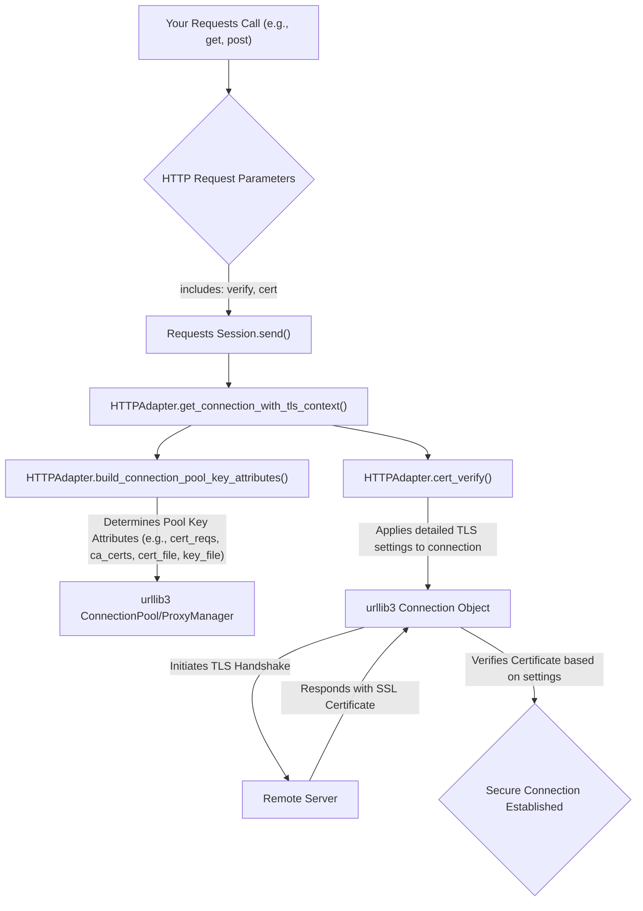

# SSL 验证与客户端证书

在发起 HTTP 请求时，确保安全通信至关重要。本节将解释 Requests 如何处理 SSL/TLS 证书验证，让您能够确认所连接服务器的身份，以及如何使用客户端证书进行双向 TLS 身份验证。这建立在 [会话](./core-concepts-sessions.md) 中讨论的连接管理基础概念之上，并可能影响您请求的 [错误处理](./advanced-usage-error-handling.md)。

## SSL/TLS 证书验证

SSL/TLS 证书验证是一项关键的安全措施，通过确保您正在通信的服务器是合法的，有助于防止中间人 (MitM) 攻击。Requests 默认执行 SSL 验证。您可以使用 `verify` 参数控制此行为。

### 默认验证 (`verify=True`)

默认情况下，Requests 尝试使用一组受信任的证书颁发机构 (CA) 来验证服务器的 SSL 证书。Requests 使用 `certifi` 包提供精选的受信任根证书列表，这通常是生产环境的推荐方法。

```python
import requests

try:
    response = requests.get('https://example.com')
    print(f"Status Code: {response.status_code}")
    print("SSL verification successful.")
except requests.exceptions.SSLError as e:
    print(f"SSL verification failed: {e}")

# Or using a Session object:
s = requests.Session()
try:
    response = s.get('https://example.com', verify=True)
    print(f"Status Code: {response.status_code}")
    print("SSL verification successful with session.")
except requests.exceptions.SSLError as e:
    print(f"SSL verification failed with session: {e}")
```

此示例展示了一个标准的 GET 请求，其中 `verify` 默认为 `True`，自动根据已知 CA 验证服务器证书。

### 禁用验证 (`verify=False`)

**警告**：将 `verify` 设置为 `False` 会完全禁用 SSL 证书验证。这意味着 Requests 将接受服务器提供的任何 TLS 证书，忽略主机名不匹配和/或过期证书。这会使您的应用程序容易受到 MitM 攻击，并且**只应在本地开发或测试环境中使用**。切勿在生产环境中使用 `verify=False`。

```python
import requests
import warnings

# Suppress the InsecureRequestWarning when verify=False
from requests.packages.urllib3.exceptions import InsecureRequestWarning
warnings.simplefilter('ignore', InsecureRequestWarning)

try:
    response = requests.get('https://expired.badssl.com/', verify=False)
    print(f"Status Code: {response.status_code}")
    print("SSL verification explicitly disabled.")
except requests.exceptions.RequestException as e:
    print(f"Request failed even with verification disabled: {e}")
```

此示例演示了如何禁用 SSL 验证。请注意 `warnings.simplefilter` 行，它抑制了 Requests 在禁用验证时发出的警告。

### 提供自定义 CA 捆绑包 (`verify='/path/to/cacert.pem'`)

您可以指定自定义路径到 CA 证书捆绑包或包含受信任 CA 证书的目录。这对于使用内部证书颁发机构的公司网络或需要信任特定自签名证书的情况非常有用。

**Parameters**

| Name | Type | Description |
|---|---|---|
| `verify` | `string` | CA 捆绑文件 (`.pem`) 或包含受信任 CA 证书的目录的路径。 |

```python
import requests
import os

# Assuming you have a custom_ca_bundle.pem file
custom_ca_path = os.path.join(os.getcwd(), 'custom_ca_bundle.pem')

# Create a dummy CA bundle file for demonstration if it doesn't exist
# In a real scenario, this would be your actual CA bundle
if not os.path.exists(custom_ca_path):
    with open(custom_ca_path, 'w') as f:
        f.write("# This is a dummy CA bundle file.\n# Replace with your actual trusted certificates.")

try:
    response = requests.get('https://example.com', verify=custom_ca_path)
    print(f"Status Code: {response.status_code}")
    print(f"SSL verification successful using custom CA bundle: {custom_ca_path}")
except requests.exceptions.SSLError as e:
    print(f"SSL verification failed with custom CA bundle: {e}")
except requests.exceptions.RequestException as e:
    print(f"Request failed: {e}")

# Clean up the dummy file
# os.remove(custom_ca_path)
```

此示例展示了如何指示 Requests 使用特定的 CA 捆绑文件进行验证。Requests 的 `HTTPAdapter` 使用 `cert_verify` 中的内部逻辑从提供的路径读取并配置 `urllib3` 的 `ca_certs` 或 `ca_cert_dir`。

## 客户端证书 (Mutual TLS)

客户端证书用于双向 TLS (mTLS) 身份验证，其中客户端和服务器都验证彼此的身份。这在仅服务器验证之上提供了一个额外的安全层。

您可以使用 `cert` 参数指定您的客户端证书。此参数接受一个包含您的证书和密钥的 `.pem` 文件的单一字符串路径，或者一个包含两个字符串的元组：`('path/to/cert.pem', 'path/to/key.pem')`。

**Parameters**

| Name | Type | Description |
|---|---|---|
| `cert` | `string` or `tuple` | 如果是字符串，则为客户端 SSL 证书文件 (`.pem`) 的路径。如果是元组，则为 `('cert_file_path', 'key_file_path')` 对。 |

### 单文件客户端证书

```python
import requests
import os

# Assuming you have a client_cert_and_key.pem file
# In a real scenario, this file would contain your actual client certificate and private key.
client_cert_path = os.path.join(os.getcwd(), 'client_cert_and_key.pem')

# Create a dummy client cert file for demonstration if it doesn't exist
if not os.path.exists(client_cert_path):
    with open(client_cert_path, 'w') as f:
        f.write("# This is a dummy client cert and key file.\n# Replace with your actual client certificate and private key.")

try:
    # Make a request to a server that requires client certificate
    response = requests.get('https://secure-api.example.com/data', cert=client_cert_path)
    print(f"Status Code: {response.status_code}")
    print("Client certificate successfully used.")
except requests.exceptions.SSLError as e:
    print(f"Client certificate negotiation failed: {e}")
except requests.exceptions.RequestException as e:
    print(f"Request failed: {e}")

# Clean up the dummy file
# os.remove(client_cert_path)
```

此示例展示了如何使用包含客户端证书及其私钥的单个 `.pem` 文件。Requests 的 `HTTPAdapter` 将在内部为 `urllib3` 连接设置 `conn.cert_file`。

### 分离的证书和密钥文件

```python
import requests
import os

# Assuming you have client_cert.pem and client_key.pem files
# In a real scenario, these files would contain your actual client certificate and private key.
client_cert_file = os.path.join(os.getcwd(), 'client_cert.pem')
client_key_file = os.path.join(os.getcwd(), 'client_key.pem')

# Create dummy files for demonstration if they don't exist
if not os.path.exists(client_cert_file):
    with open(client_cert_file, 'w') as f:
        f.write("# This is a dummy client certificate file.")
if not os.path.exists(client_key_file):
    with open(client_key_file, 'w') as f:
        f.write("# This is a dummy client key file.")

try:
    # Make a request to a server that requires client certificate
    response = requests.get('https://secure-api.example.com/data', cert=(client_cert_file, client_key_file))
    print(f"Status Code: {response.status_code}")
    print("Client certificate and key successfully used.")
except requests.exceptions.SSLError as e:
    print(f"Client certificate negotiation failed: {e}")
except requests.exceptions.RequestException as e:
    print(f"Request failed: {e}")

# Clean up the dummy files
# os.remove(client_cert_file)
# os.remove(client_key_file)
```

此示例演示了如何将客户端证书和私钥作为单独的文件提供。Requests 的 `HTTPAdapter` 将在内部设置 `conn.cert_file` 和 `conn.key_file`。

## TLS 配置的内部流程

Requests 利用 `urllib3` 进行其底层的连接管理。您提供的 `verify` 和 `cert` 参数由 Requests 的 `HTTPAdapter` 处理，用于配置 `urllib3` 连接对象。这确保在与远程服务器建立安全连接之前，应用适当的 SSL/TLS 设置。



此图表说明了您的 `verify` 和 `cert` 设置如何用于配置底层的 `urllib3` 连接，然后该连接执行必要的 TLS 握手和验证。

---

了解 SSL 验证和客户端证书对于使用 Requests 构建安全可靠的应用程序至关重要。接下来，请在 [错误处理](./advanced-usage-error-handling.md) 部分探索如何处理 HTTP 交互中可能出现的常见问题和异常。
