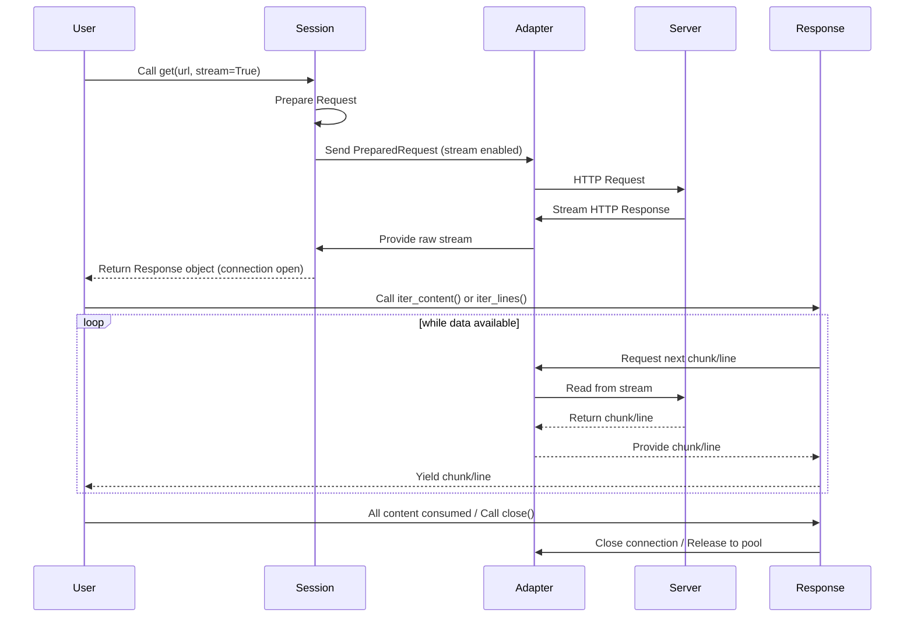

# Streaming Requests

When dealing with large HTTP responses, such as downloading big files, fetching content directly into memory can consume excessive resources and impact performance. Requests provides a mechanism to handle these responses efficiently by streaming the content, allowing you to process data in chunks as it arrives rather than waiting for the entire response to download.

This approach helps prevent high memory consumption and can improve the responsiveness of your application, especially for applications like file downloads or processing continuous data streams.

## Enabling Streaming

To enable streaming for a request, you need to set the `stream` parameter to `True` when making your request using `requests.Session` methods or top-level functions like `requests.get` or `requests.post`.

```python
import requests

# Using a Session
with requests.Session() as s:
    response = s.get('https://example.com/large-file.zip', stream=True)

# Using a top-level function
response = requests.get('https://example.com/large-file.zip', stream=True)
```

When `stream=True` is set, Requests does not immediately download the response content. Instead, it leaves the connection open, allowing you to iterate over the response data.

## Reading Streamed Content

The `Response` object provides the `iter_content()` method, which allows you to iterate over the response data in specified chunks. This is the primary way to consume a streamed response.

### `iter_content()` Parameters

| Name | Type | Description |
|---|---|---|
| `chunk_size` | `int` or `None` | The number of bytes to read into memory for each chunk. A value of `None` will read data as it arrives (if `stream=True`) or as a single chunk (if `stream=False` and content is already consumed). Requests uses an internal `CONTENT_CHUNK_SIZE` of `10 * 1024` bytes (10KB) when reading the full `response.content`. |
| `decode_unicode` | `bool` | If `True`, content will be decoded using the best available encoding based on the response headers or auto-detection. Defaults to `False`. |

### Example: Downloading a Large File in Chunks

```python
import requests

url = 'https://example.com/large-document.pdf' # Replace with a URL to a large file
local_filename = url.split('/')[-1]

try:
    with requests.get(url, stream=True) as r:
        r.raise_for_status() # Raise an exception for bad status codes
        with open(local_filename, 'wb') as f:
            for chunk in r.iter_content(chunk_size=8192): # Iterate in 8KB chunks
                f.write(chunk)
    print(f"File '{local_filename}' downloaded successfully in chunks.")
except requests.exceptions.HTTPError as e:
    print(f"HTTP error occurred: {e}")
except requests.exceptions.ConnectionError as e:
    print(f"Connection error occurred: {e}")
except requests.exceptions.RequestException as e:
    print(f"An error occurred: {e}")
```

This example demonstrates how to download a file in 8KB chunks. The `iter_content()` method yields bytes, which are then written to a local file. This avoids loading the entire file into memory at once.

### `iter_lines()` for Line-by-Line Processing

For text-based streamed responses where you need to process content line by line, you can use the `iter_lines()` method. This method builds upon `iter_content()` to yield one line at a time.

```python
import requests

url = 'https://example.com/stream-data.txt' # Replace with a URL that streams lines of text

with requests.get(url, stream=True) as r:
    for line in r.iter_lines(decode_unicode=True):
        if line: # Filter out keep-alive new lines
            print(f"Received line: {line}")
```

### Streaming Request Flow



## Important Considerations

*   **Consuming Content**: Once you start iterating with `iter_content()` or `iter_lines()`, the response content is being consumed. If you later try to access the `response.content` property, it will raise a `StreamConsumedError` because the data has already been read from the stream.

*   **Connection Release**: The underlying connection is automatically released back to the connection pool once the response content is fully exhausted (i.e., all chunks have been read) or when `response.close()` is called explicitly. It is good practice to use `with requests.get(...) as r:` to ensure the connection is properly closed.

*   **Redirects**: If a streamed request encounters a redirect, Requests will consume the content of the redirect response and then initiate a new request to the target URL. This means that if you're streaming, the content of the intermediate redirect responses is read and discarded to follow the redirection chain.

*   **Error Handling**: Be prepared to handle exceptions like `requests.exceptions.ChunkedEncodingError`, `requests.exceptions.ContentDecodingError`, `requests.exceptions.ConnectionError`, or `requests.exceptions.RequestsSSLError` that might occur during the streaming process, especially over unstable networks.

--- 

Streaming requests are an essential tool for efficiently handling large data transfers in HTTP communications. By processing content in chunks, you can maintain application responsiveness and manage memory usage effectively. To further customize the request-response lifecycle, explore [Hooks](./advanced-usage-hooks.md).