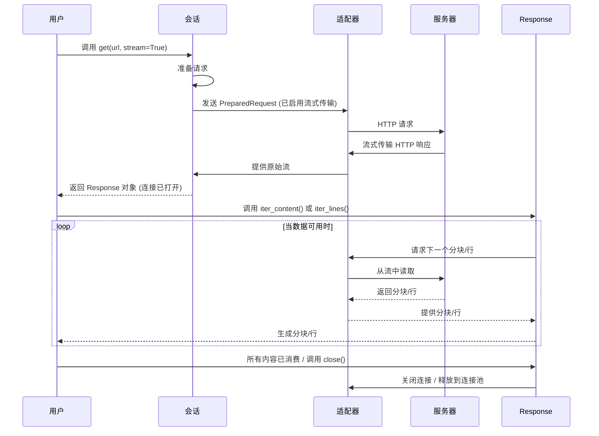

# 流式请求

在处理大型 HTTP 响应时，例如下载大文件，将内容直接获取到内存中可能会消耗过多资源并影响性能。Requests 提供了一种通过流式传输内容来高效处理这些响应的机制，使您能够在数据到达时分块处理，而不是等待整个响应下载完成。

这种方法有助于防止高内存消耗，并可以提高应用程序的响应能力，特别是对于文件下载或处理连续数据流等应用程序。

## 启用流式传输

要为请求启用流式传输，在使用 `requests.Session` 方法或顶层函数（例如 `requests.get` 或 `requests.post`）发出请求时，需要将 `stream` 参数设置为 `True`。

```python
import requests

# 使用 Session
with requests.Session() as s:
    response = s.get('https://example.com/large-file.zip', stream=True)

# 使用顶层函数
response = requests.get('https://example.com/large-file.zip', stream=True)
```

当设置 `stream=True` 时，Requests 不会立即下载响应内容。相反，它会保持连接打开，允许您迭代响应数据。

## 读取流式内容

`Response` 对象提供了 `iter_content()` 方法，允许您以指定的分块迭代响应数据。这是消费流式响应的主要方式。

### `iter_content()` 参数

| Name | Type | Description |
|---|---|---|
| `chunk_size` | `int` 或 `None` | 每个分块读取到内存中的字节数。`None` 值表示数据到达时即读取（如果 `stream=True`），或作为一个分块读取（如果 `stream=False` 且内容已被消费）。当读取完整的 `response.content` 时，Requests 使用内部 `CONTENT_CHUNK_SIZE`，即 `10 * 1024` 字节（10KB）。 |
| `decode_unicode` | `bool` | 如果为 `True`，内容将根据响应头或自动检测使用最佳可用编码进行解码。默认为 `False`。 |

### 示例：分块下载大文件

```python
import requests

url = 'https://example.com/large-document.pdf' # 替换为大文件的 URL
local_filename = url.split('/')[-1]

try:
    with requests.get(url, stream=True) as r:
        r.raise_for_status() # 对于不良状态码抛出异常
        with open(local_filename, 'wb') as f:
            for chunk in r.iter_content(chunk_size=8192): # 以 8KB 分块迭代
                f.write(chunk)
    print(f"文件 '{local_filename}' 已成功分块下载。")
except requests.exceptions.HTTPError as e:
    print(f"发生 HTTP 错误: {e}")
except requests.exceptions.ConnectionError as e:
    print(f"发生连接错误: {e}")
except requests.exceptions.RequestException as e:
    print(f"发生错误: {e}")
```

此示例演示了如何以 8KB 分块下载文件。`iter_content()` 方法生成字节，然后将其写入本地文件。这避免了一次性将整个文件加载到内存中。

### `iter_lines()` 用于逐行处理

对于需要逐行处理内容的基于文本的流式响应，您可以使用 `iter_lines()` 方法。此方法基于 `iter_content()` 构建，每次生成一行。

```python
import requests

url = 'https://example.com/stream-data.txt' # 替换为流式传输文本行的 URL

with requests.get(url, stream=True) as r:
    for line in r.iter_lines(decode_unicode=True):
        if line: # 过滤掉保持连接的新行
            print(f"收到行: {line}")
```

### 流式请求流程



## 重要注意事项

*   **内容消费**：一旦您开始使用 `iter_content()` 或 `iter_lines()` 进行迭代，响应内容就会被消费。如果您稍后尝试访问 `response.content` 属性，它将引发 `StreamConsumedError`，因为数据已从流中读取。

*   **连接释放**：一旦响应内容完全耗尽（即所有分块都已读取）或显式调用 `response.close()` 时，底层连接会自动释放回连接池。使用 `with requests.get(...) as r:` 是确保连接正确关闭的良好实践。

*   **重定向**：如果流式请求遇到重定向，Requests 将消费重定向响应的内容，然后发起对目标 URL 的新请求。这意味着如果您正在进行流式传输，中间重定向响应的内容将被读取并丢弃，以便遵循重定向链。

*   **错误处理**：请准备好处理在流式传输过程中可能发生的异常，例如 `requests.exceptions.ChunkedEncodingError`、`requests.exceptions.ContentDecodingError`、`requests.exceptions.ConnectionError` 或 `requests.exceptions.RequestsSSLError`，尤其是在网络不稳定时。

---

流式请求是高效处理 HTTP 通信中大数据传输的重要工具。通过分块处理内容，您可以保持应用程序的响应能力并有效管理内存使用。要进一步自定义请求-响应生命周期，请探索 [钩子](./advanced-usage-hooks.md)。