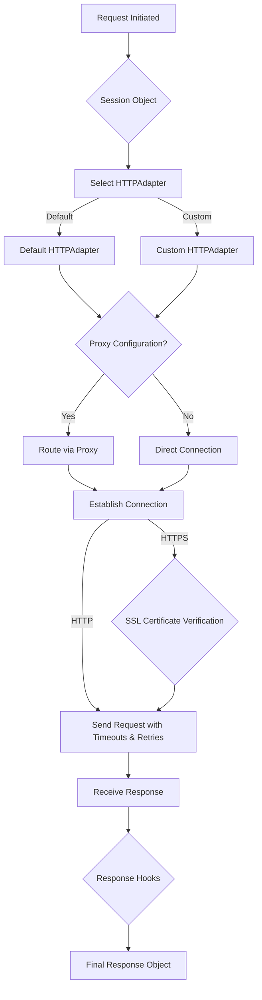

# Advanced Usage

Once you have mastered the basics covered in the [User Guide](./user-guide.md), you may find yourself needing more control over your HTTP requests. This section dives deeper into the advanced features of Requests, equipping you to handle complex scenarios involving network behavior, security, and custom functionality.

Here, we will introduce concepts that provide fine-grained control over the request lifecycle. You will learn how to manage connection timeouts, automatically retry failed requests, route traffic through proxies, handle SSL certificate verification with precision, and even extend the core functionality of Requests using Transport Adapters and event hooks.

<x-cards data-columns="3">
  <x-card data-title="Timeouts, Retries, and Proxies" data-href="/advanced-usage/timeouts-retries-proxies" data-icon="lucide:timer">
    Network conditions can be unpredictable. Requests allows you to build resilient applications by configuring timeouts to prevent hanging requests, setting up automatic retries for transient failures, and routing your requests through proxies for security or to bypass network restrictions.
  </x-card>
  <x-card data-title="SSL Certificate Verification" data-href="/advanced-usage/ssl-cert-verification" data-icon="lucide:shield-check">
    Secure communication over HTTPS is standard practice. While Requests handles certificate verification by default, you may need to specify your own CA bundle, provide a client-side certificate for mutual TLS, or, in specific situations, disable verification. This section covers how to manage these SSL/TLS settings securely.
  </x-card>
  <x-card data-title="Custom Adapters and Hooks" data-href="/advanced-usage/adapters-and-hooks" data-icon="lucide:puzzle">
    For specialized requirements, Requests offers powerful extension mechanisms. Create custom Transport Adapters to implement unique transport protocols or connection logic. Additionally, the hook system allows you to register callbacks to inspect or modify responses, enabling tasks like logging or custom parsing.
  </x-card>
</x-cards>

---

By leveraging these advanced features, you can tailor Requests to fit the specific needs of your application. For a complete and detailed breakdown of all available classes and methods, consult the [API Reference](./api-reference.md).