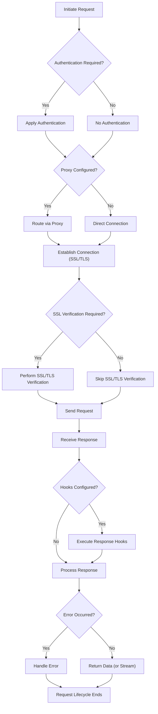

# Advanced Usage

This section explores advanced features and configurations of the Requests library, enabling you to customize and optimize your HTTP interactions for specific use cases. You will learn how to handle various authentication schemes, route requests through proxies, manage SSL/TLS verification, and implement robust error handling. Additionally, we cover efficient ways to stream large responses and leverage hooks to inject custom logic into the request lifecycle.

To help you visualize how these advanced features fit into the overall request process, consider the following flow:

## Authentication

When interacting with APIs that require credentials, Requests provides various methods for handling authentication. This includes basic HTTP authentication, digest authentication, and the ability to define custom authentication handlers to meet specific requirements.

Learn more about securing your requests: [Authentication](./advanced-usage-authentication.md).

## Proxies

Proxies are essential for routing your HTTP requests through an intermediary server, which can be useful for network security, accessing georestricted content, or debugging. Requests allows you to configure both HTTP and HTTPS proxies, and manage proxy bypass rules.

Discover how to set up and manage proxies for your requests: [Proxies](./advanced-usage-proxies.md).

## SSL Verification & Client Certificates

Ensuring secure communication is critical when dealing with sensitive data. Requests performs SSL certificate verification by default to ensure you are connecting to the intended server. You can also configure client-side certificates for mutual TLS authentication or disable verification for specific scenarios (e.g., local development or testing).

Understand how to handle SSL/TLS verification and client certificates: [SSL Verification & Client Certificates](./advanced-usage-ssl-verification-client-certificates.md).

## Error Handling

HTTP requests can encounter various issues, from network connectivity problems to server-side errors indicated by HTTP status codes. Robust error handling is crucial for building reliable applications. Requests provides specific exceptions for different types of errors, allowing you to catch and manage them effectively.

Explore common exceptions and strategies for robust error handling: [Error Handling](./advanced-usage-error-handling.md).

## Streaming Requests

When dealing with very large response bodies, such as file downloads, it's often inefficient to load the entire content into memory at once. Requests supports streaming responses, allowing you to process data in chunks as it arrives, which conserves memory and improves performance.

Find out how to efficiently handle large HTTP responses: [Streaming Requests](./advanced-usage-streaming-requests.md).

## Hooks

Hooks provide a powerful way to inject custom logic into the request-response lifecycle. You can register callback functions that execute at specific points, such as before sending a request or after receiving a response. This allows for flexible customization, logging, and modification of request or response objects.

Learn how to leverage the Requests hook system for extended functionality: [Hooks](./advanced-usage-hooks.md).

---

This section has provided an overview of Requests' advanced capabilities, each designed to give you greater control and flexibility over your HTTP communications. By diving into the linked sub-sections, you can master these features to build more sophisticated and resilient applications. Your next step is to explore the detailed API reference to understand the exact parameters and behaviors of each function and method. Continue to the [API Reference](./api-reference.md) to delve into the library's comprehensive documentation.