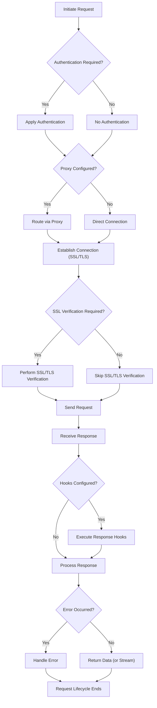

# 高级用法

本节探讨 Requests 库的高级特性和配置，使您能够为特定用例定制和优化 HTTP 交互。您将学习如何处理各种认证方案，通过代理路由请求，管理 SSL/TLS 验证，以及实现强大的错误处理。此外，我们还将介绍高效地流式传输大型响应以及利用钩子将自定义逻辑注入请求生命周期的方法。

为了帮助您直观地了解这些高级特性如何融入整体请求流程，请看以下流程图：

## 认证

当与需要凭据的 API 交互时，Requests 提供了多种处理认证的方法。这包括基本的 HTTP 认证、摘要认证以及定义自定义认证处理程序以满足特定需求的能力。

了解更多关于保护您的请求的信息：[认证](./advanced-usage-authentication.md)。

## 代理

代理对于通过中间服务器路由 HTTP 请求至关重要，这对于网络安全、访问地理受限内容或调试非常有用。Requests 允许您配置 HTTP 和 HTTPS 代理，并管理代理绕过规则。

了解如何为您的请求设置和管理代理：[代理](./advanced-usage-proxies.md)。

## SSL 验证与客户端证书

在处理敏感数据时，确保安全通信至关重要。Requests 默认执行 SSL 证书验证，以确保您连接到预期的服务器。您还可以配置客户端证书以进行双向 TLS 认证，或在特定场景（例如本地开发或测试）下禁用验证。

了解如何处理 SSL/TLS 验证和客户端证书：[SSL 验证与客户端证书](./advanced-usage-ssl-verification-client-certificates.md)。

## 错误处理

HTTP 请求可能会遇到各种问题，从网络连接问题到 HTTP 状态码指示的服务器端错误。强大的错误处理对于构建可靠的应用程序至关重要。Requests 为不同类型的错误提供了特定的异常，让您能够有效地捕获和管理它们。

探索常见的异常和强大的错误处理策略：[错误处理](./advanced-usage-error-handling.md)。

## 流式请求

当处理非常大的响应体（例如文件下载）时，一次性将整个内容加载到内存中通常效率低下。Requests 支持流式响应，允许您在数据到达时分块处理数据，从而节省内存并提高性能。

了解如何高效处理大型 HTTP 响应：[流式请求](./advanced-usage-streaming-requests.md)。

## 钩子

钩子提供了一种强大的方式，可以将自定义逻辑注入请求-响应生命周期。您可以注册回调函数，这些函数在特定点执行，例如在发送请求之前或接收响应之后。这使得灵活的定制、日志记录以及请求或响应对象的修改成为可能。

了解如何利用 Requests 钩子系统以扩展功能：[钩子](./advanced-usage-hooks.md)。

---

本节概述了 Requests 的高级功能，每个功能都旨在让您对 HTTP 通信拥有更大的控制和灵活性。通过深入链接的子章节，您可以掌握这些功能，从而构建更复杂、更具弹性的应用程序。您的下一步是查阅详细的 API 参考，以了解每个函数和方法的具体参数和行为。继续前往 [API 参考](./api-reference.md) 深入了解该库的全面文档。