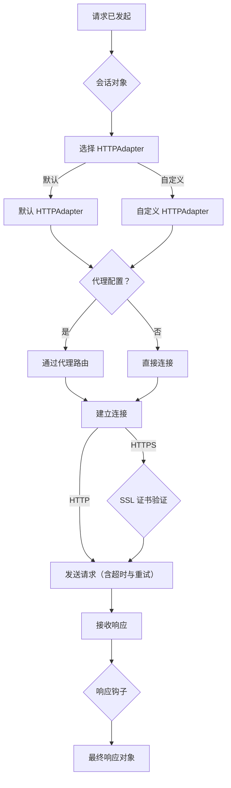

# 高级用法

掌握 [用户指南](./user-guide.md) 中涵盖的基础知识后，您可能会发现需要对 HTTP 请求进行更多控制。本节将深入探讨 Requests 的高级功能，帮助您处理涉及网络行为、安全性和自定义功能的复杂场景。

在这里，我们将介绍一些概念，以实现对请求生命周期的精细控制。您将学习如何管理连接超时、自动重试失败的请求、通过代理路由流量、精确处理 SSL 证书验证，甚至使用传输适配器和事件钩子来扩展 Requests 的核心功能。

<x-cards data-columns="3">
  <x-card data-title="超时、重试和代理" data-href="/advanced-usage/timeouts-retries-proxies" data-icon="lucide:timer">
    网络状况可能无法预测。Requests 允许您通过配置超时来防止请求挂起、为暂时性故障设置自动重试，以及通过代理路由请求以确保安全或绕过网络限制，从而构建具有弹性的应用程序。
  </x-card>
  <x-card data-title="SSL 证书验证" data-href="/advanced-usage/ssl-cert-verification" data-icon="lucide:shield-check">
    通过 HTTPS 进行安全通信是标准做法。虽然 Requests 默认处理证书验证，但您可能需要指定自己的 CA 捆绑包、提供用于双向 TLS 的客户端证书，或在特定情况下禁用验证。本节将介绍如何安全地管理这些 SSL/TLS 设置。
  </x-card>
  <x-card data-title="自定义适配器和钩子" data-href="/advanced-usage/adapters-and-hooks" data-icon="lucide:puzzle">
    针对特殊需求，Requests 提供了强大的扩展机制。您可以创建自定义传输适配器以实现独特的传输协议或连接逻辑。此外，钩子系统允许您注册回调来检查或修改响应，从而实现日志记录或自定义解析等任务。
  </x-card>
</x-cards>

---

通过利用这些高级功能，您可以定制 Requests 以满足您应用程序的特定需求。有关所有可用类和方法的完整详细说明，请参阅 [API 参考](./api-reference.md)。