# Exceptions

This section provides a comprehensive list and description of all custom exception types raised by the Requests library. Understanding these specific exceptions enables you to implement precise and robust error handling in your applications. For practical strategies on how to handle these errors, refer to the [Error Handling](./advanced-usage-error-handling.md) guide.

## Exception Hierarchy

The following diagram illustrates the primary inheritance hierarchy of the most common exceptions within Requests, all stemming from the base `RequestException`.

```mermaid
graph TD
    A["RequestException"]
    A -- "Inherits from" --> B["ConnectionError"]
    A -- "Inherits from" --> C["HTTPError"]
    A -- "Inherits from" --> D["Timeout"]
    A -- "Inherits from" --> E["InvalidURL"]
    A -- "Inherits from" --> F["TooManyRedirects"]
    A -- "Inherits from" --> G["InvalidJSONError"]
    A -- "Inherits from" --> H["MissingSchema"]
    A -- "Inherits from" --> I["InvalidSchema"]
    A -- "Inherits from" --> J["URLRequired"]
    A -- "Inherits from" --> K["InvalidHeader"]
    A -- "Inherits from" --> L["ChunkedEncodingError"]
    A -- "Inherits from" --> M["ContentDecodingError"]
    A -- "Inherits from" --> N["StreamConsumedError"]
    A -- "Inherits from" --> O["RetryError"]
    A -- "Inherits from" --> P["UnrewindableBodyError"]

    B -- "Inherits from" --> B1["ProxyError"]
    B -- "Inherits from" --> B2["SSLError"]
    B -- "Inherits from" --> B3["ConnectTimeout"]

    D -- "Inherits from" --> D1["ReadTimeout"]

    E -- "Inherits from" --> E1["InvalidProxyURL"]

    G -- "Inherits from" --> G1["JSONDecodeError"]

    subgraph Key Base Classes for Context
        IOError["IOError"]
        ValueError["ValueError"]
        BaseHTTPError["BaseHTTPError"]
        TypeError["TypeError"]
        CompatJSONDecodeError["CompatJSONDecodeError"]
    end

    IOError -- "Inherits from" --> A
    ValueError -- "Inherits from" --> H
    ValueError -- "Inherits from" --> I
    ValueError -- "Inherits from" --> E
    ValueError -- "Inherits from" --> K
    BaseHTTPError -- "Inherits from" --> M
    TypeError -- "Inherits from" --> N
    CompatJSONDecodeError -- "Inherits from" --> G1
```

## Requests Exceptions

The table below details each exception, its direct parent classes in Python, and a brief description of the condition it indicates.

| Exception Name           | Inherits From                                                | Description                                                                                                                                                            |
| :----------------------- | :----------------------------------------------------------- | :--------------------------------------------------------------------------------------------------------------------------------------------------------------------- |
| `RequestException`       | `IOError`                                                    | There was an ambiguous exception that occurred while handling your request. This is the base class for most Requests exceptions.                                      |
| `InvalidJSONError`       | `RequestException`                                           | A JSON error occurred.                                                                                                                                                 |
| `JSONDecodeError`        | `InvalidJSONError`, `CompatJSONDecodeError`                  | Couldn't decode the text into JSON.                                                                                                                                    |
| `HTTPError`              | `RequestException`                                           | An HTTP error occurred.                                                                                                                                                |
| `ConnectionError`        | `RequestException`                                           | A Connection error occurred.                                                                                                                                           |
| `ProxyError`             | `ConnectionError`                                            | A proxy error occurred.                                                                                                                                                |
| `SSLError`               | `ConnectionError`                                            | An SSL error occurred.                                                                                                                                                 |
| `Timeout`                | `RequestException`                                           | The request timed out. Catching this error will catch both `ConnectTimeout` and `ReadTimeout` errors.                                                                  |
| `ConnectTimeout`         | `ConnectionError`, `Timeout`                                 | The request timed out while trying to connect to the remote server. Requests that produced this error are safe to retry.                                             |
| `ReadTimeout`            | `Timeout`                                                    | The server did not send any data in the allotted amount of time.                                                                                                       |
| `URLRequired`            | `RequestException`                                           | A valid URL is required to make a request.                                                                                                                             |
| `TooManyRedirects`       | `RequestException`                                           | Too many redirects.                                                                                                                                                    |
| `MissingSchema`          | `RequestException`, `ValueError`                             | The URL scheme (e.g. http or https) is missing.                                                                                                                        |
| `InvalidSchema`          | `RequestException`, `ValueError`                             | The URL scheme provided is either invalid or unsupported.                                                                                                              |
| `InvalidURL`             | `RequestException`, `ValueError`                             | The URL provided was somehow invalid.                                                                                                                                  |
| `InvalidHeader`          | `RequestException`, `ValueError`                             | The header value provided was somehow invalid.                                                                                                                         |
| `InvalidProxyURL`        | `InvalidURL`                                                 | The proxy URL provided is invalid.                                                                                                                                     |
| `ChunkedEncodingError`   | `RequestException`                                           | The server declared chunked encoding but sent an invalid chunk.                                                                                                        |
| `ContentDecodingError`   | `RequestException`, `BaseHTTPError`                          | Failed to decode response content.                                                                                                                                     |
| `StreamConsumedError`    | `RequestException`, `TypeError`                              | The content for this response was already consumed.                                                                                                                    |
| `RetryError`             | `RequestException`                                           | Custom retries logic failed.                                                                                                                                           |
| `UnrewindableBodyError`  | `RequestException`                                           | Requests encountered an error when trying to rewind a body.                                                                                                            |

## Warnings

Requests also defines a set of warning classes to indicate potential issues that do not necessarily halt program execution.

| Warning Name              | Inherits From                                  | Description                                                               |
| :------------------------ | :--------------------------------------------- | :------------------------------------------------------------------------ |
| `RequestsWarning`         | `Warning`                                      | Base warning for Requests.                                                |
| `FileModeWarning`         | `RequestsWarning`, `DeprecationWarning`        | A file was opened in text mode, but Requests determined its binary length. |
| `RequestsDependencyWarning` | `RequestsWarning`                              | An imported dependency doesn't match the expected version range.          |

---

Understanding these exceptions is crucial for writing resilient applications that interact with web services. For detailed examples and patterns on how to catch and handle these exceptions effectively, proceed to the [Error Handling](./advanced-usage-error-handling.md) section.