# 异常

本节提供了 Requests 库抛出的所有自定义异常类型的完整列表和描述。理解这些特定异常使您能够在应用程序中实现精确而健壮的错误处理。有关如何处理这些错误的实用策略，请参阅[错误处理](./advanced-usage-error-handling.md)指南。

## 异常层次结构

以下图表展示了 Requests 中最常见异常的主要继承层次结构，它们都源自基类 `RequestException`。

```mermaid
graph TD
    A["RequestException"]
    A -- "Inherits from" --> B["ConnectionError"]
    A -- "Inherits from" --> C["HTTPError"]
    A -- "Inherits from" --> D["Timeout"]
    A -- "Inherits from" --> E["InvalidURL"]
    A -- "Inherits from" --> F["TooManyRedirects"]
    A -- "Inherits from" --> G["InvalidJSONError"]
    A -- "Inherits from" --> H["MissingSchema"]
    A -- "Inherits from" --> I["InvalidSchema"]
    A -- "Inherits from" --> J["URLRequired"]
    A -- "Inherits from" --> K["InvalidHeader"]
    A -- "Inherits from" --> L["ChunkedEncodingError"]
    A -- "Inherits from" --> M["ContentDecodingError"]
    A -- "Inherits from" --> N["StreamConsumedError"]
    A -- "Inherits from" --> O["RetryError"]
    A -- "Inherits from" --> P["UnrewindableBodyError"]

    B -- "Inherits from" --> B1["ProxyError"]
    B -- "Inherits from" --> B2["SSLError"]
    B -- "Inherits from" --> B3["ConnectTimeout"]

    D -- "Inherits from" --> D1["ReadTimeout"]

    E -- "Inherits from" --> E1["InvalidProxyURL"]

    G -- "Inherits from" --> G1["JSONDecodeError"]

    subgraph Key Base Classes for Context
        IOError["IOError"]
        ValueError["ValueError"]
        BaseHTTPError["BaseHTTPError"]
        TypeError["TypeError"]
        CompatJSONDecodeError["CompatJSONDecodeError"]
    end

    IOError -- "Inherits from" --> A
    ValueError -- "Inherits from" --> H
    ValueError -- "Inherits from" --> I
    ValueError -- "Inherits from" --> E
    ValueError -- "Inherits from" --> K
    BaseHTTPError -- "Inherits from" --> M
    TypeError -- "Inherits from" --> N
    CompatJSONDecodeError -- "Inherits from" --> G1
```

## Requests 异常

下表详细介绍了每个异常、其在 Python 中的直接父类以及其指示的条件的简要描述。

| 异常名称 | 继承自 | 描述 |
| :----------------------- | :----------------------------------------------------------- | :--------------------------------------------------------------------------------------------------------------------------------------------------------------------- |
| `RequestException` | `IOError` | `RequestException`：处理您的请求时发生了模糊异常。这是大多数 Requests 异常的基类。 |
| `InvalidJSONError` | `RequestException` | `InvalidJSONError`：发生了 JSON 错误。 |
| `JSONDecodeError` | `InvalidJSONError`, `CompatJSONDecodeError` | `JSONDecodeError`：无法将文本解码为 JSON。 |
| `HTTPError` | `RequestException` | `HTTPError`：发生了 HTTP 错误。 |
| `ConnectionError` | `RequestException` | `ConnectionError`：发生了连接错误。 |
| `ProxyError` | `ConnectionError` | `ProxyError`：发生了代理错误。 |
| `SSLError` | `ConnectionError` | `SSLError`：发生了 SSL 错误。 |
| `Timeout` | `RequestException` | `Timeout`：请求超时。捕获此错误将同时捕获 `ConnectTimeout` 和 `ReadTimeout` 错误。 |
| `ConnectTimeout` | `ConnectionError`, `Timeout` | `ConnectTimeout`：尝试连接到远程服务器时请求超时。产生此错误的请求可以安全地重试。 |
| `ReadTimeout` | `Timeout` | `ReadTimeout`：服务器在分配的时间内未发送任何数据。 |
| `URLRequired` | `RequestException` | `URLRequired`：发出请求需要一个有效的 URL。 |
| `TooManyRedirects` | `RequestException` | `TooManyRedirects`：重定向次数过多。 |
| `MissingSchema` | `RequestException`, `ValueError` | `MissingSchema`：URL 方案（例如 http 或 https）缺失。 |
| `InvalidSchema` | `RequestException`, `ValueError` | `InvalidSchema`：提供的 URL 方案无效或不受支持。 |
| `InvalidURL` | `RequestException`, `ValueError` | `InvalidURL`：提供的 URL 在某种程度上无效。 |
| `InvalidHeader` | `RequestException`, `ValueError` | `InvalidHeader`：提供的标头值在某种程度上无效。 |
| `InvalidProxyURL` | `InvalidURL` | `InvalidProxyURL`：提供的代理 URL 无效。 |
| `ChunkedEncodingError` | `RequestException` | `ChunkedEncodingError`：服务器声明了分块编码但发送了无效块。 |
| `ContentDecodingError` | `RequestException`, `BaseHTTPError` | `ContentDecodingError`：无法解码响应内容。 |
| `StreamConsumedError` | `RequestException`, `TypeError` | `StreamConsumedError`：此响应的内容已被使用。 |
| `RetryError` | `RequestException` | `RetryError`：自定义重试逻辑失败。 |
| `UnrewindableBodyError` | `RequestException` | `UnrewindableBodyError`：Requests 在尝试回退正文时遇到错误。 |

## 警告

Requests 还定义了一组警告类，用于指示不一定停止程序执行的潜在问题。

| 警告名称 | 继承自 | 描述 |
| :------------------------ | :--------------------------------------------- | :------------------------------------------------------------------------ |
| `RequestsWarning` | `Warning` | `RequestsWarning`：Requests 的基本警告。 |
| `FileModeWarning` | `RequestsWarning`, `DeprecationWarning` | `FileModeWarning`：文件以文本模式打开，但 Requests 确定了其二进制长度。 |
| `RequestsDependencyWarning` | `RequestsWarning` | `RequestsDependencyWarning`：导入的依赖项与预期版本范围不匹配。 |

---

理解这些异常对于编写与 Web 服务交互的弹性应用程序至关重要。有关如何有效捕获和处理这些异常的详细示例和模式，请转到[错误处理](./advanced-usage-error-handling.md)部分。