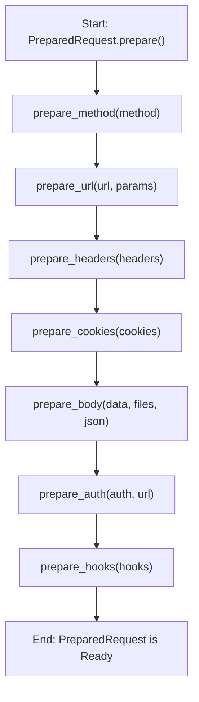

# Request & Response Objects

In the Requests library, the `Request`, `PreparedRequest`, and `Response` objects are central to how HTTP communications are built, sent, and received. Understanding their lifecycle and attributes is key to effectively using the library. This section details the properties and methods of these core objects.

For an overview of how these objects fit into the overall Request-Response flow, refer to the [Core Concepts](./core-concepts.md) section.

## The Request Object

The `Request` object is what you, the user, create to define the parameters of your intended HTTP interaction. It's a mutable object that holds information like the HTTP method, URL, headers, data, and more, before it is prepared for transmission.

### Initialization Parameters

When you create a `requests.Request` object, you provide the fundamental details of your request. These parameters are later used to construct the `PreparedRequest`.

| Parameter | Type | Description |
|---|---|---|
| `method` | `str` | The HTTP method to use (e.g., `'GET'`, `'POST'`). |
| `url` | `str` | The URL to which the request will be sent. |
| `headers` | `dict` | A dictionary of HTTP headers to include. |
| `files` | `dict` | A dictionary of `{filename: fileobject}` for multipart file uploads. |
| `data` | `str`, `bytes`, `list` of `tuple`, `dict` | The body to attach to the request. If a dictionary or list of tuples is provided, form-encoding occurs. |
| `json` | Any JSON-serializable type | JSON data for the request body (alternative to `data` or `files`). |
| `params` | `dict` or `list` of `tuple` | URL parameters to append to the URL query string. |
| `auth` | `AuthBase` or `tuple` | An authentication handler or a `(user, pass)` tuple for basic authentication. |
| `cookies` | `dict` or `CookieJar` | A dictionary or CookieJar of cookies to attach to this request. |
| `hooks` | `dict` | A dictionary of callback hooks, primarily for internal use, allowing custom logic at various stages. |

### The `prepare()` Method

The `prepare()` method of the `Request` object is crucial. It transforms the user-defined `Request` into a `PreparedRequest`, which contains the exact bytes that will be sent over the network.

**Returns**

| Name | Type | Description |
|---|---|---|
| `prepared_request` | `requests.PreparedRequest` | The fully mutable `PreparedRequest` object ready for transmission. |

**Example**

```python
import requests

req = requests.Request('GET', 'https://httpbin.org/get', params={'key': 'value'})
prepared_req = req.prepare()

print(prepared_req)
print(prepared_req.url)
```

**Example Response**
```
<PreparedRequest [GET]>
https://httpbin.org/get?key=value
```

This example shows how to create a `Request` object and then prepare it, which results in a `PreparedRequest` instance with the URL parameters properly encoded.

## The PreparedRequest Object

The `PreparedRequest` object represents the final, immutable form of your request before it's sent. It contains the exact HTTP verb, URL, headers, and body bytes that will be transmitted. You typically obtain a `PreparedRequest` by calling the `prepare()` method on a `Request` object; you should not instantiate it manually.

### Key Attributes

*   `method`: The HTTP verb (e.g., `'GET'`, `'POST'`) after normalization (uppercased).
*   `url`: The fully prepared URL, including parameters and IDNA encoding for hostnames.
*   `headers`: A `CaseInsensitiveDict` of HTTP headers ready to be sent.
*   `body`: The request body as bytes, or a file-like object for streamed requests.
*   `hooks`: A dictionary of callback hooks that can be triggered during the request-response lifecycle.

### The Preparation Process

The `PreparedRequest`'s `prepare()` method orchestrates a series of internal preparation steps. Each step handles a specific part of the request, ensuring it conforms to HTTP standards and Requests' internal logic. This sequence is vital for ensuring the request is correctly formed.



### Example

While you typically get a `PreparedRequest` from `Request.prepare()`, here's how you might interact with one after it's been prepared (e.g., within a hook):

```python
import requests

session = requests.Session()
req = requests.Request('POST', 'https://httpbin.org/post', data={'foo': 'bar'})
prepared_req = req.prepare()

print(f"Prepared Method: {prepared_req.method}")
print(f"Prepared URL: {prepared_req.url}")
print(f"Prepared Headers: {prepared_req.headers}")
print(f"Prepared Body: {prepared_req.body.decode('utf-8')}")
```

**Example Response**
```
Prepared Method: POST
Prepared URL: https://httpbin.org/post
Prepared Headers: {'Content-Type': 'application/x-www-form-urlencoded', 'Content-Length': '7'}
Prepared Body: foo=bar
```

This output shows the fully processed state of the request before it leaves your system.

## The Response Object

The `Response` object is the server's reply to an HTTP request. It encapsulates all aspects of the server's response, including the status code, headers, the response body, and information about the request that led to this response.

### Key Attributes and Properties

The `Response` object provides numerous attributes and properties for inspecting the server's reply:

| Attribute/Property | Type | Description |
|---|---|---|
| `status_code` | `int` | The HTTP status code of the response (e.g., 200, 404). |
| `reason` | `str` | The textual reason phrase of the HTTP status (e.g., "OK", "Not Found"). |
| `headers` | `CaseInsensitiveDict` | A case-insensitive dictionary of response headers. |
| `url` | `str` | The final URL of the response, useful after redirects. |
| `history` | `list` of `Response` | A list of `Response` objects from redirect history. |
| `encoding` | `str` | The encoding used to decode `r.text`. Automatically detected if not set. |
| `content` | `bytes` | The raw content of the response, in bytes. |
| `text` | `str` | The content of the response, decoded into Unicode using `encoding`. |
| `json()` | Any Python object | Decodes the JSON response body into a Python object (dictionary, list, etc.). Raises `JSONDecodeError` if not valid JSON. |
| `ok` | `bool` | `True` if `status_code` is less than 400, `False` otherwise. |
| `is_redirect` | `bool` | `True` if the response is a well-formed HTTP redirect. |
| `is_permanent_redirect` | `bool` | `True` if the response is a permanent redirect (301, 308). |
| `apparent_encoding` | `str` | The apparent encoding detected by `charset_normalizer` or `chardet`. |
| `links` | `dict` | Parsed header links of the response, if any. |
| `elapsed` | `datetime.timedelta` | The time taken between sending the request and finishing parsing the headers. |
| `request` | `PreparedRequest` | The `PreparedRequest` object to which this is a response. |

### Methods for Content Handling and Error Checking

#### `iter_content(chunk_size=1, decode_unicode=False)`

Iterates over the response data. This is particularly useful for large responses, preventing the entire content from being loaded into memory at once (when `stream=True` is set on the original request).

**Parameters**

| Parameter | Type | Description |
|---|---|---|
| `chunk_size` | `int` or `None` | The number of bytes to read into memory per chunk. `None` reads data as it arrives (if streaming) or as a single chunk (if not streaming). |
| `decode_unicode` | `bool` | If `True`, content will be decoded using the best available encoding.

**Example**

```python
import requests

# Assuming 'stream=True' was used in the original session.send() or requests.get()
# Example: r = requests.get('https://example.com/largefile', stream=True)
r = requests.Response()
# Simulate a raw response object for demonstration
class MockRaw: # Placeholder for urllib3.HTTPResponse
    def __init__(self, content):
        self._content = content.encode('utf-8')
        self._index = 0
    def read(self, size):
        if self._index >= len(self._content):
            return b''
        chunk = self._content[self._index : self._index + size]
        self._index += size
        return chunk
    def close(self):
        pass
    def release_conn(self):
        pass

r.raw = MockRaw("This is a long test string that will be chunked.\nAnother line.\nAnd one more.")
r.status_code = 200

for chunk in r.iter_content(chunk_size=10):
    print(f"Received chunk: {chunk}")
```

**Example Response (simulated chunks)**
```
Received chunk: b'This is a '
Received chunk: b'long test '
Received chunk: b'string tha'
Received chunk: b't will be '
Received chunk: b'chunked.\nA'
Received chunk: b'nother lin'
Received chunk: b'e.\nAnd one'
Received chunk: b' more.'
```

This demonstrates how `iter_content` yields chunks of the response body.

#### `iter_lines(chunk_size=512, decode_unicode=False, delimiter=None)`

Iterates over the response data, one line at a time. This is useful for processing line-delimited data without loading the entire response.

**Parameters**

| Parameter | Type | Description |
|---|---|---|
| `chunk_size` | `int` | The size of chunks to read into memory. |
| `decode_unicode` | `bool` | If `True`, content will be decoded into Unicode. |
| `delimiter` | `bytes` or `None` | The delimiter to split lines by. If `None`, uses standard line endings. |

**Example**

```python
import requests

r = requests.Response()
class MockRaw: # Placeholder for urllib3.HTTPResponse
    def __init__(self, content):
        self._content = content.encode('utf-8')
        self._index = 0
    def read(self, size):
        if self._index >= len(self._content):
            return b''
        chunk = self._content[self._index : self._index + size]
        self._index += size
        return chunk
    def close(self):
        pass
    def release_conn(self):
        pass

r.raw = MockRaw("Line 1\nLine 2\nLine 3")
r.status_code = 200

for line in r.iter_lines():
    print(f"Received line: {line.decode('utf-8')}")
```

**Example Response (simulated lines)**
```
Received line: Line 1
Received line: Line 2
Received line: Line 3
```

This shows how `iter_lines` processes the response stream line by line.

#### `json(**kwargs)`

Decodes the JSON response body into a Python object (e.g., dictionary, list). This method automatically handles encoding detection for common JSON encodings.

**Parameters**

| Parameter | Type | Description |
|---|---|---|
| `**kwargs` | `dict` | Optional arguments passed directly to `json.loads`. |

**Example**

```python
import requests

r = requests.get('https://httpbin.org/json')
json_data = r.json()

print(f"JSON data type: {type(json_data)}")
print(f"JSON data content: {json_data}")
```

**Example Response**
```
JSON data type: <class 'dict'>
JSON data content: {'slideshow': {'author': 'Yours Truly', 'date': 'date of publication', 'slides': [{'title': 'Wake up to WonderWidgets!', 'type': 'all'}, {'items': ['Why ', 'When ', 'Where '], 'title': 'Overview', 'type': 'slide'}], 'title': 'Sample Slide Show'}}
```

This example retrieves a JSON response and parses it into a Python dictionary.

#### `raise_for_status()`

Raises an `HTTPError` if the `status_code` of the response indicates a client error (4xx) or server error (5xx).

**Example**

```python
import requests
from requests.exceptions import HTTPError

try:
    # This URL returns a 404 Not Found error
    r = requests.get('https://httpbin.org/status/404')
    r.raise_for_status()
except HTTPError as e:
    print(f"HTTP Error occurred: {e}")

try:
    # This URL returns a 200 OK status
    r = requests.get('https://httpbin.org/status/200')
    r.raise_for_status()
    print("Request successful, no HTTPError raised.")
except HTTPError as e:
    print(f"HTTP Error occurred: {e}")
```

**Example Response**
```
HTTP Error occurred: 404 Client Error: NOT FOUND for url: https://httpbin.org/status/404
Request successful, no HTTPError raised.
```

This demonstrates how `raise_for_status()` can be used to easily check for and handle common HTTP error responses.

---

Understanding the Request, PreparedRequest, and Response objects provides a deep insight into how Requests manages your HTTP communications. You can now build, inspect, and handle responses effectively. To learn more about common errors that can occur during these communications, proceed to the [Exceptions](./api-reference-exceptions.md) section.