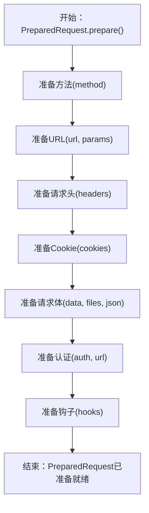

# 请求与响应对象

在 Requests 库中，`Request`、`PreparedRequest` 和 `Response` 对象是构建、发送和接收 HTTP 通信的核心。理解它们的生命周期和属性是有效使用该库的关键。本节将详细介绍这些核心对象的属性和方法。

有关这些对象如何融入整体请求-响应流程的概述，请参阅[核心概念](./core-concepts.md)部分。

## Request 对象

`Request` 对象是用户创建的，用于定义其预期 HTTP 交互的参数。它是一个可变对象，在准备传输之前，它会保存 HTTP 方法、URL、请求头、数据等信息。

### 初始化参数

创建 `requests.Request` 对象时，您会提供请求的基本详细信息。这些参数稍后将用于构建 `PreparedRequest`。

| 参数 | 类型 | 描述 |
|---|---|---|
| `method` | `str` | 要使用的 HTTP 方法（例如，'GET'，'POST'）。 |
| `url` | `str` | 请求将发送到的 URL。 |
| `headers` | `dict` | 要包含的 HTTP 请求头字典。 |
| `files` | `dict` | 用于多部分文件上传的 `{filename: fileobject}` 字典。 |
| `data` | `str`, `bytes`, `list` of `tuple`, `dict` | 要附加到请求正文。如果提供字典或元组列表，则会进行表单编码。 |
| `json` | Any JSON-serializable type | 请求正文的 JSON 数据（`data` 或 `files` 的替代方案）。 |
| `params` | `dict` or `list` of `tuple` | 要附加到 URL 查询字符串的 URL 参数。 |
| `auth` | `AuthBase` or `tuple` | 身份验证处理器或用于基本身份验证的 `(user, pass)` 元组。 |
| `cookies` | `dict` or `CookieJar` | 要附加到此请求的 cookie 字典或 CookieJar。 |
| `hooks` | `dict` | 回调钩子字典，主要用于内部使用，允许在不同阶段自定义逻辑。 |

### `prepare()` 方法

`Request` 对象的 `prepare()` 方法至关重要。它将用户定义的 `Request` 转换为 `PreparedRequest`，后者包含将通过网络发送的精确字节。

**返回值**

| 名称 | 类型 | 描述 |
|---|---|---|
| `prepared_request` | `requests.PreparedRequest` | 完全可变的 `PreparedRequest` 对象，可用于传输。 |

**示例**

```python
import requests

req = requests.Request('GET', 'https://httpbin.org/get', params={'key': 'value'})
prepared_req = req.prepare()

print(prepared_req)
print(prepared_req.url)
```

**示例响应**
```
<PreparedRequest [GET]>
https://httpbin.org/get?key=value
```

此示例展示了如何创建 `Request` 对象，然后准备它，从而得到一个 `PreparedRequest` 实例，其中 URL 参数已正确编码。

## PreparedRequest 对象

`PreparedRequest` 对象表示请求在发送之前的最终、不可变形式。它包含将要传输的精确 HTTP 动词、URL、请求头和请求体字节。您通常通过调用 `Request` 对象的 `prepare()` 方法来获取 `PreparedRequest`；不应手动实例化它。

### 关键属性

*   `method`: HTTP 动词（例如，'GET'，'POST'），经过规范化（大写）。
*   `url`: 完全准备好的 URL，包括参数和用于主机名的 IDNA 编码。
*   `headers`: 一个 `CaseInsensitiveDict` 类型的 HTTP 请求头，可供发送。
*   `body`: 请求体作为字节，或用于流式请求的文件类对象。
*   `hooks`: 一个回调钩子字典，可在请求-响应生命周期中触发。

### 准备过程

`PreparedRequest` 的 `prepare()` 方法协调一系列内部准备步骤。每个步骤处理请求的特定部分，确保其符合 HTTP 标准和 Requests 的内部逻辑。此序列对于确保请求正确形成至关重要。



### 示例

虽然您通常从 `Request.prepare()` 获取 `PreparedRequest`，但这里展示了如何在准备好之后（例如，在钩子中）与其交互：

```python
import requests

session = requests.Session()
req = requests.Request('POST', 'https://httpbin.org/post', data={'foo': 'bar'})
prepared_req = req.prepare()

print(f"Prepared Method: {prepared_req.method}")
print(f"Prepared URL: {prepared_req.url}")
print(f"Prepared Headers: {prepared_req.headers}")
print(f"Prepared Body: {prepared_req.body.decode('utf-8')}")
```

**示例响应**
```
Prepared Method: POST
Prepared URL: https://httpbin.org/post
Prepared Headers: {'Content-Type': 'application/x-www-form-urlencoded', 'Content-Length': '7'}
Prepared Body: foo=bar
```

此输出显示请求在离开您的系统之前的完全处理状态。

## Response 对象

`Response` 对象是服务器对 HTTP 请求的回复。它封装了服务器响应的所有方面，包括状态码、请求头、响应体以及导致此响应的请求信息。

### 关键属性和特性

`Response` 对象提供了许多属性和特性，用于检查服务器的回复：

| 属性/特性 | 类型 | 描述 |
|---|---|---|
| `status_code` | `int` | 响应的 HTTP 状态码（例如，200，404）。 |
| `reason` | `str` | HTTP 状态的文本原因短语（例如，“OK”，“Not Found”）。 |
| `headers` | `CaseInsensitiveDict` | 响应请求头的不区分大小写的字典。 |
| `url` | `str` | 响应的最终 URL，在重定向后很有用。 |
| `history` | `list` of `Response` | 来自重定向历史的 `Response` 对象列表。 |
| `encoding` | `str` | 用于解码 `r.text` 的编码。如果未设置，则自动检测。 |
| `content` | `bytes` | 响应的原始内容，以字节为单位。 |
| `text` | `str` | 响应的内容，使用 `encoding` 解码为 Unicode。 |
| `json()` | Any Python object | 将 JSON 响应体解码为 Python 对象（字典、列表等）。如果不是有效的 JSON，则引发 `JSONDecodeError`。 |
| `ok` | `bool` | 如果 `status_code` 小于 400 则为 `True`，否则为 `False`。 |
| `is_redirect` | `bool` | 如果响应是格式良好的 HTTP 重定向，则为 `True`。 |
| `is_permanent_redirect` | `bool` | 如果响应是永久重定向（301，308），则为 `True`。 |
| `apparent_encoding` | `str` | 由 `charset_normalizer` 或 `chardet` 检测到的表观编码。 |
| `links` | `dict` | 响应的已解析请求头链接（如果有）。 |
| `elapsed` | `datetime.timedelta` | 从发送请求到完成解析请求头之间所花费的时间。 |
| `request` | `PreparedRequest` | 此响应对应的 `PreparedRequest` 对象。 |

### 内容处理和错误检查方法

#### `iter_content(chunk_size=1, decode_unicode=False)`

迭代响应数据。这对于大型响应特别有用，可以防止一次性将整个内容加载到内存中（当原始请求上设置 `stream=True` 时）。

**参数**

| 参数 | 类型 | 描述 |
|---|---|---|
| `chunk_size` | `int` or `None` | 每个块读取到内存中的字节数。`None` 在数据到达时读取（如果流式传输）或作为单个块读取（如果非流式传输）。 |
| `decode_unicode` | `bool` | 如果为 `True`，内容将使用最佳可用编码进行解码。 |

**示例**

```python
import requests

# Assuming 'stream=True' was used in the original session.send() or requests.get()
# Example: r = requests.get('https://example.com/largefile', stream=True)
r = requests.Response()
# Simulate a raw response object for demonstration
class MockRaw: # Placeholder for urllib3.HTTPResponse
    def __init__(self, content):
        self._content = content.encode('utf-8')
        self._index = 0
    def read(self, size):
        if self._index >= len(self._content):
            return b''
        chunk = self._content[self._index : self._index + size]
        self._index += size
        return chunk
    def close(self):
        pass
    def release_conn(self):
        pass

r.raw = MockRaw("This is a long test string that will be chunked.\nAnother line.\nAnd one more.")
r.status_code = 200

for chunk in r.iter_content(chunk_size=10):
    print(f"Received chunk: {chunk}")
```

**示例响应（模拟分块）**
```
Received chunk: b'This is a '
Received chunk: b'long test '
Received chunk: b'string tha'
Received chunk: b't will be '
Received chunk: b'chunked.\nA'
Received chunk: b'nother lin'
Received chunk: b'e.\nAnd one'
Received chunk: b' more.'
```

这展示了 `iter_content` 如何分块生成响应体。

#### `iter_lines(chunk_size=512, decode_unicode=False, delimiter=None)`

逐行迭代响应数据。这对于处理行分隔数据而无需加载整个响应非常有用。

**参数**

| 参数 | 类型 | 描述 |
|---|---|---|
| `chunk_size` | `int` | 要读入内存的块大小。 |
| `decode_unicode` | `bool` | 如果为 `True`，内容将解码为 Unicode。 |
| `delimiter` | `bytes` or `None` | 用于分割行的分隔符。如果为 `None`，则使用标准行尾。 |

**示例**

```python
import requests

r = requests.Response()
class MockRaw: # Placeholder for urllib3.HTTPResponse
    def __init__(self, content):
        self._content = content.encode('utf-8')
        self._index = 0
    def read(self, size):
        if self._index >= len(self._content):
            return b''
        chunk = self._content[self._index : self._index + size]
        self._index += size
        return chunk
    def close(self):
        pass
    def release_conn(self):
        pass

r.raw = MockRaw("Line 1\nLine 2\nLine 3")
r.status_code = 200

for line in r.iter_lines():
    print(f"Received line: {line.decode('utf-8')}")
```

**示例响应（模拟行）**
```
Received line: Line 1
Received line: Line 2
Received line: Line 3
```

这展示了 `iter_lines` 如何逐行处理响应流。

#### `json(**kwargs)`

将 JSON 响应体解码为 Python 对象（例如，字典、列表）。此方法自动处理常见 JSON 编码的编码检测。

**参数**

| 参数 | 类型 | 描述 |
|---|---|---|
| `**kwargs` | `dict` | 直接传递给 `json.loads` 的可选参数。 |

**示例**

```python
import requests

r = requests.get('https://httpbin.org/json')
json_data = r.json()

print(f"JSON data type: {type(json_data)}")
print(f"JSON data content: {json_data}")
```

**示例响应**
```
JSON data type: <class 'dict'>
JSON data content: {'slideshow': {'author': 'Yours Truly', 'date': 'date of publication', 'slides': [{'title': 'Wake up to WonderWidgets!', 'type': 'all'}, {'items': ['Why ', 'When ', 'Where '], 'title': 'Overview', 'type': 'slide'}], 'title': 'Sample Slide Show'}}
```

此示例检索 JSON 响应并将其解析为 Python 字典。

#### `raise_for_status()`

如果响应的 `status_code` 指示客户端错误 (4xx) 或服务器错误 (5xx)，则引发 `HTTPError`。

**示例**

```python
import requests
from requests.exceptions import HTTPError

try:
    # This URL returns a 404 Not Found error
    r = requests.get('https://httpbin.org/status/404')
    r.raise_for_status()
except HTTPError as e:
    print(f"HTTP Error occurred: {e}")

try:
    # This URL returns a 200 OK status
    r = requests.get('https://httpbin.org/status/200')
    r.raise_for_status()
    print("Request successful, no HTTPError raised.")
except HTTPError as e:
    print(f"HTTP Error occurred: {e}")
```

**示例响应**
```
HTTP Error occurred: 404 Client Error: NOT FOUND for url: https://httpbin.org/status/404
Request successful, no HTTPError raised.
```

这展示了如何使用 `raise_for_status()` 轻松检查和处理常见的 HTTP 错误响应。

---

理解 `Request`、`PreparedRequest` 和 `Response` 对象提供了对 Requests 如何管理 HTTP 通信的深入见解。您现在可以有效地构建、检查和处理响应。要了解有关这些通信过程中可能发生的常见错误的更多信息，请继续阅读[异常](./api-reference-exceptions.md)部分。