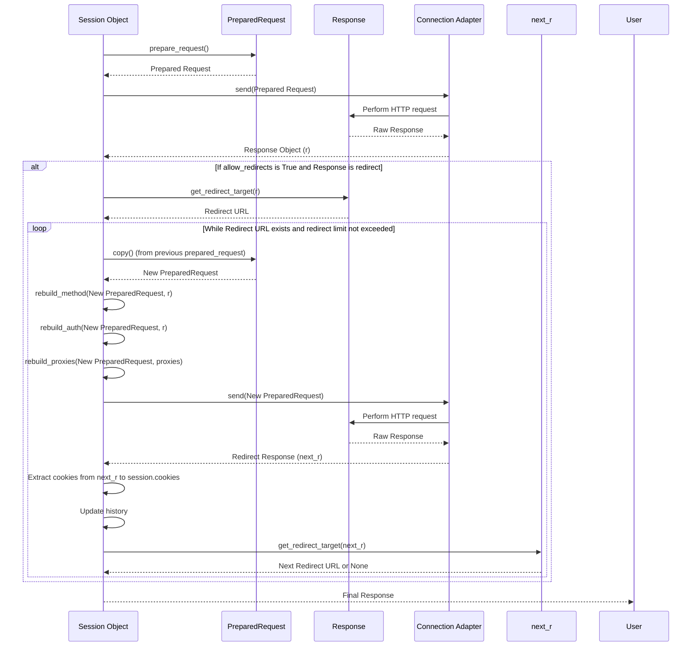

# Session Object

The `Session` object in Requests provides a powerful way to persist certain parameters across multiple requests, such as cookies, authentication, and proxy configurations. This ensures efficient and consistent communication when making a series of HTTP requests to the same host or requiring shared state.

For an overview of core concepts including requests and responses, refer to the [Requests & Responses](./core-concepts-requests-responses.md) section. To understand the fundamental building blocks of the library, see [Core Concepts](./core-concepts.md).

## Understanding Sessions

A `Session` object acts as a persistent client, allowing you to manage and reuse connection settings and state over time. When you use a `Session`, it maintains:

- **Cookie persistence**: Cookies received in responses are automatically stored and sent with subsequent requests.
- **Connection pooling**: Underlying TCP connections are reused, reducing latency for multiple requests to the same host.
- **Default settings**: You can set default headers, authentication, parameters, and proxies that apply to all requests made through that session.

### Basic Usage

You can create a `Session` object and use it to make requests. It also supports being used as a context manager, ensuring that connections are properly closed.

```python
import requests

# Basic usage
s = requests.Session()
r = s.get('https://httpbin.org/cookies/set/sessioncookie/12345')
print(f"Initial cookie: {r.cookies.get('sessioncookie')}")

r2 = s.get('https://httpbin.org/cookies')
print(f"Cookie in subsequent request: {r2.text}")
s.close()

# Using as a context manager
with requests.Session() as s:
    r = s.get('https://httpbin.org/get')
    print(f"Response status: {r.status_code}")
# Session automatically closed here
```

## Session Attributes

The `Session` object exposes several public attributes that you can configure to set default behaviors for all requests made through the session.

| Attribute | Type | Description | Default Value |
|---|---|---|---|
| `headers` | `CaseInsensitiveDict` | A case-insensitive dictionary of HTTP headers to be sent on each `Request` from this session. | `default_headers()` |
| `auth` | `tuple` or `object` | Default Authentication tuple or object to attach to `Request`s. | `None` |
| `proxies` | `dict` | Dictionary mapping protocol or protocol and host to proxy URLs (e.g., `{'http': 'foo.bar:3128'}`). | `{}` |
| `hooks` | `dict` | Event-handling hooks for the session. | `default_hooks()` |
| `params` | `dict` | Dictionary of querystring data to attach to each `Request`. Values can be lists for multivalued parameters. | `{}` |
| `stream` | `bool` | Default stream response content behavior. | `False` |
| `verify` | `bool` or `str` | Default SSL Verification behavior. `True` verifies TLS certificate, `False` bypasses (use only for testing), or a string path to a CA bundle. | `True` |
| `cert` | `str` or `tuple` | Default SSL client certificate. String is path to `.pem` file. Tuple is `('cert', 'key')` pair. | `None` |
| `max_redirects` | `int` | Maximum number of redirects allowed before raising `TooManyRedirects` exception. | `30` (`DEFAULT_REDIRECT_LIMIT`) |
| `trust_env` | `bool` | If `True`, trust environment settings for proxy configuration and default authentication (e.g., `HTTP_PROXY`, `.netrc`). | `True` |
| `cookies` | `RequestsCookieJar` | A `CookieJar` containing all currently outstanding cookies set on this session. | Empty `RequestsCookieJar` |
| `adapters` | `OrderedDict` | Internal dictionary mapping URL prefixes to `HTTPAdapter` instances. | Configured with `http://` and `https://` adapters |

## Session Methods

### `prepare_request(request)`

Constructs a `PreparedRequest` for transmission by merging settings from the provided `Request` instance with those of the `Session`.

**Parameters**

| Name | Type | Description |
|---|---|---|
| `request` | `Request` | The `Request` instance to prepare with this session's settings. |

**Returns**

| Name | Type | Description |
|---|---|---|
| `PreparedRequest` | `requests.PreparedRequest` | The prepared request object ready for sending. |

**Example**

```python
import requests

s = requests.Session()
req = requests.Request('GET', 'https://httpbin.org/get', params={'key': 'value'})

prepared_req = s.prepare_request(req)
print(f"Prepared URL: {prepared_req.url}")
print(f"Prepared headers: {prepared_req.headers}")
```

This example shows how to prepare a `Request` object using a `Session`, which applies session-level settings like default parameters.

### `request(method, url, ...)`

This is the core method for constructing, preparing, and sending a `Request`. It returns a `Response` object.

**Parameters**

| Name | Type | Description |
|---|---|---|
| `method` | `str` | The HTTP method (e.g., `'GET'`, `'POST'`) for the new `Request` object. |
| `url` | `str` | The URL for the new `Request` object. |
| `params` | `dict` or `bytes` | (Optional) Data to be sent in the query string. |
| `data` | `dict`, `list`, `bytes`, or `file-like` | (Optional) Data to send in the body for methods like POST/PUT. |
| `json` | `dict` | (Optional) JSON data to send in the body. Automatically sets `Content-Type` to `application/json`. |
| `headers` | `dict` | (Optional) HTTP Headers to send with the `Request`. |
| `cookies` | `dict` or `CookieJar` | (Optional) Cookies to send with the `Request`. |
| `files` | `dict` | (Optional) Dictionary of `'filename': file-like-objects` for multipart encoding upload. |
| `auth` | `tuple` or `callable` | (Optional) Auth tuple or callable to enable Basic/Digest/Custom HTTP Auth. |
| `timeout` | `float` or `tuple` | (Optional) How many seconds to wait for the server to send data. Can be a float for total timeout, or `(connect timeout, read timeout)` tuple. |
| `allow_redirects` | `bool` | (Optional) If `True` (default), follow HTTP redirects. |
| `proxies` | `dict` | (Optional) Dictionary mapping protocol/hostname to proxy URL. |
| `hooks` | `dict` | (Optional) Dictionary mapping hook name to one event or list of callable events. |
| `stream` | `bool` | (Optional) Whether to immediately download the response content. Defaults to `False`. |
| `verify` | `bool` or `str` | (Optional) Controls TLS certificate verification. `True` (default), `False`, or a path to a CA bundle. |
| `cert` | `str` or `tuple` | (Optional) Path to SSL client cert file (`.pem`) or `('cert', 'key')` pair. |

**Returns**

| Name | Type | Description |
|---|---|---|
| `Response` | `requests.Response` | The response object from the HTTP request. |

**Example**

```python
import requests

with requests.Session() as s:
    # POST request with JSON data
    response = s.request('POST', 'https://httpbin.org/post', json={'key': 'value'})
    print(f"POST response status: {response.status_code}")
    print(f"POST response JSON: {response.json()}")

    # GET request with custom headers
    response_get = s.request('GET', 'https://httpbin.org/headers', headers={'X-Custom-Header': 'Requests-Session'})
    print(f"GET response headers: {response_get.json()['headers']}")
```

This example demonstrates using the `request` method to send both POST and GET requests with specific data and headers, leveraging the session's capabilities.

### HTTP Verb Methods (`get()`, `post()`, `put()`, `patch()`, `delete()`, `head()`, `options()`)

These methods are convenient wrappers around the `session.request()` method, making it simpler to perform common HTTP operations. They automatically set the `method` parameter and pass other `**kwargs` directly to `request()`.

**Example: `get()`**

```python
import requests

with requests.Session() as s:
    response = s.get('https://httpbin.org/get', params={'foo': 'bar'})
    print(f"GET status: {response.status_code}")
    print(f"GET args: {response.json()['args']}")
```

**Example: `post()`**

```python
import requests

with requests.Session() as s:
    response = s.post('https://httpbin.org/post', data={'payload': 'data'})
    print(f"POST status: {response.status_code}")
    print(f"POST form: {response.json()['form']}")
```

These examples illustrate the straightforward use of `get()` and `post()` methods within a session.

### `send(request, **kwargs)`

Sends a `PreparedRequest` object. This method is primarily used internally by `session.request()` and `session.resolve_redirects()`, but can be directly invoked if you have a pre-prepared request.

**Parameters**

| Name | Type | Description |
|---|---|---|
| `request` | `PreparedRequest` | The `PreparedRequest` instance to send. |
| `**kwargs` | `dict` | Additional keyword arguments like `timeout`, `allow_redirects`, `stream`, `verify`, `cert`, `proxies`. These override session-level defaults. |

**Returns**

| Name | Type | Description |
|---|---|---|
| `Response` | `requests.Response` | The response object from the HTTP request. |

**Example**

```python
import requests

with requests.Session() as s:
    req = requests.Request('GET', 'https://httpbin.org/status/200')
    prepared_req = s.prepare_request(req)

    response = s.send(prepared_req, timeout=5, allow_redirects=True)
    print(f"Send status: {response.status_code}")
```

This example manually prepares a request and sends it using `session.send()`.

### `get_adapter(url)`

Returns the appropriate connection adapter for the given URL. Adapters manage the actual connection to the server.

**Parameters**

| Name | Type | Description |
|---|---|---|
| `url` | `str` | The URL for which to find an adapter. |

**Returns**

| Name | Type | Description |
|---|---|---|
| `BaseAdapter` | `requests.adapters.BaseAdapter` | The adapter responsible for handling the URL's scheme. |

**Example**

```python
import requests
from requests.adapters import HTTPAdapter

s = requests.Session()
adapter = s.get_adapter('https://example.com')
print(f"Adapter for HTTPS: {type(adapter).__name__}")

s.mount('ftp://', HTTPAdapter()) # Mount a new adapter
ftp_adapter = s.get_adapter('ftp://example.com/file.txt')
print(f"Adapter for FTP: {type(ftp_adapter).__name__}")
```

This example demonstrates how to retrieve the adapter used for a given URL scheme.

### `close()`

Closes all adapters currently mounted on the session, effectively closing all underlying HTTP connections.

**Example**

```python
import requests

s = requests.Session()
s.get('https://httpbin.org/get') # Makes a connection
print("Session active...")
s.close() # Closes connections
print("Session closed.")
```

This example shows explicitly closing a session. When using a session as a context manager (`with requests.Session() as s:`), `close()` is automatically called upon exiting the block.

### `mount(prefix, adapter)`

Registers a connection adapter to a URL prefix. This allows you to specify custom behavior for certain URL schemes or domains.

**Parameters**

| Name | Type | Description |
|---|---|---|
| `prefix` | `str` | The URL prefix (e.g., `'http://'`, `'https://'`, `'http://example.com/'`) to associate with the adapter. |
| `adapter` | `requests.adapters.BaseAdapter` | The adapter instance to mount. |

**Example**

```python
import requests
from requests.adapters import HTTPAdapter

with requests.Session() as s:
    # Mount a custom adapter for example.com
    s.mount('https://example.com/', HTTPAdapter(max_retries=3))
    print("Custom adapter mounted for https://example.com/")
    # All requests to example.com will now use this adapter
    # For other domains, default adapters will be used
```

This example demonstrates how to mount a custom `HTTPAdapter` to handle requests to a specific domain, allowing for fine-grained control over connection settings like retries.

### Internal Redirect Handling Methods

The `Session` object inherits from `SessionRedirectMixin` and includes several internal methods to manage HTTP redirects. These methods ensure that redirects are handled correctly, including updating URLs, managing headers (like `Authorization`), and handling cookies.



### `session()` (Deprecated)

This top-level function returns a `Session` object. It has been deprecated since Requests version 1.0.0 and is kept only for backward compatibility. New code should directly instantiate `requests.Session()`.

```python
import requests

s = requests.session() # Deprecated
print(type(s)) # <class 'requests.sessions.Session'>

new_s = requests.Session() # Recommended way
print(type(new_s)) # <class 'requests.sessions.Session'>
```

This example demonstrates both the deprecated `requests.session()` function and the recommended direct instantiation of `requests.Session()`.

---

This section provided a comprehensive reference for the `Session` object, detailing its attributes and methods for managing persistent connections and settings. With this information, you can leverage sessions to optimize your HTTP interactions.

To further explore the objects involved in HTTP communication, proceed to the [Request & Response Objects](./api-reference-request-response-objects.md) section.