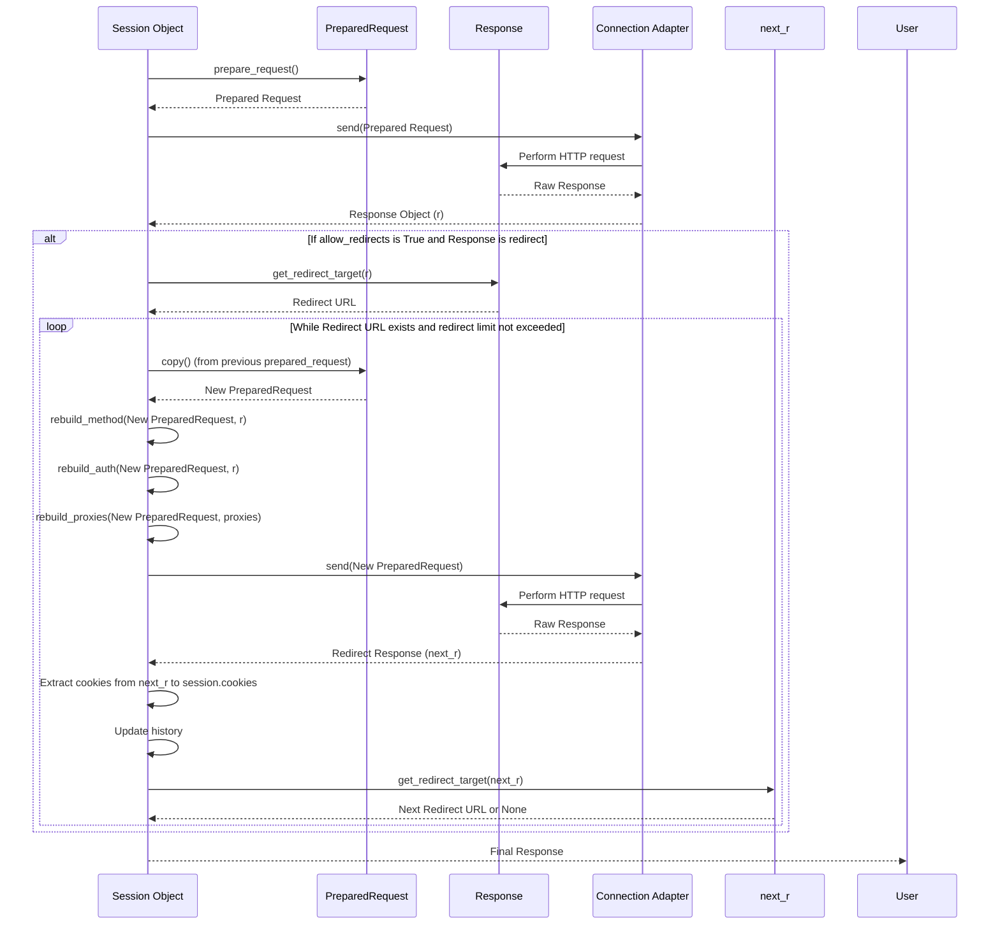

# Session 对象

Requests 中的 `Session` 对象提供了一种强大的方式，可以在多个请求中持久化某些参数，例如 cookie、身份验证和代理配置。这确保了向同一主机发出系列 HTTP 请求或需要共享状态时，通信高效且一致。

有关包括请求和响应在内的核心概念概述，请参阅[请求与响应](./core-concepts-requests-responses.md)部分。要了解库的基本构建块，请参阅[核心概念](./core-concepts.md)。

## 理解 Session

`Session` 对象充当持久客户端，允许您随时间管理和重用连接设置和状态。当您使用 `Session` 时，它会维护：

- **Cookie 持久性**：响应中收到的 Cookie 会自动存储并随后续请求发送。
- **连接池**：底层 TCP 连接被重用，从而减少了对同一主机的多个请求的延迟。
- **默认设置**：您可以设置适用于通过该会话发出的所有请求的默认请求头、身份验证、参数和代理。

### 基本用法

您可以创建 `Session` 对象并使用它来发出请求。它还支持用作上下文管理器，确保连接正确关闭。

```python
import requests

# Basic usage
s = requests.Session()
r = s.get('https://httpbin.org/cookies/set/sessioncookie/12345')
print(f"Initial cookie: {r.cookies.get('sessioncookie')}")

r2 = s.get('https://httpbin.org/cookies')
print(f"Cookie in subsequent request: {r2.text}")
s.close()

# Using as a context manager
with requests.Session() as s:
    r = s.get('https://httpbin.org/get')
    print(f"Response status: {r.status_code}")
# Session automatically closed here
```

## Session 属性

`Session` 对象公开了多个公共属性，您可以配置这些属性以设置通过该会话发出的所有请求的默认行为。

| Attribute | Type | Description | Default Value |
|---|---|---|---|
| `headers` | `CaseInsensitiveDict` | 一个不区分大小写的 HTTP 请求头字典，将随此会话中的每个 `Request` 发送。 | `default_headers()` |
| `auth` | `tuple` or `object` | 附加到 `Request`s 的默认身份验证元组或对象。 | `None` |
| `proxies` | `dict` | 将协议或协议与主机映射到代理 URL 的字典（例如，`{'http': 'foo.bar:3128'}`）。 | `{}` |
| `hooks` | `dict` | 会话的事件处理钩子。 | `default_hooks()` |
| `params` | `dict` | 附加到每个 `Request` 的查询字符串数据字典。对于多值参数，值可以是列表。 | `{}` |
| `stream` | `bool` | 默认流式响应内容行为。 | `False` |
| `verify` | `bool` or `str` | 默认 SSL 验证行为。`True` 验证 TLS 证书，`False` 绕过（仅用于测试），或 CA 捆绑包的字符串路径。 | `True` |
| `cert` | `str` or `tuple` | 默认 SSL 客户端证书。字符串是 `.pem` 文件的路径。元组是 `('cert', 'key')` 对。 | `None` |
| `max_redirects` | `int` | 在引发 `TooManyRedirects` 异常之前允许的最大重定向次数。 | `30` (`DEFAULT_REDIRECT_LIMIT`) |
| `trust_env` | `bool` | 如果为 `True`，则信任代理配置和默认身份验证的环境设置（例如，`HTTP_PROXY`，`.netrc`）。 | `True` |
| `cookies` | `RequestsCookieJar` | 一个 `CookieJar`，包含此会话中所有当前未处理的 cookie。 | Empty `RequestsCookieJar` |
| `adapters` | `OrderedDict` | 将 URL 前缀映射到 `HTTPAdapter` 实例的内部字典。 | Configured with `http://` and `https://` adapters |

## Session 方法

### `prepare_request(request)`

通过将提供的 `Request` 实例的设置与 `Session` 的设置合并，构造一个用于传输的 `PreparedRequest`。

**Parameters**

| Name | Type | Description |
|---|---|---|
| `request` | `Request` | 要使用此会话设置准备的 `Request` 实例。 |

**Returns**

| Name | Type | Description |
|---|---|---|
| `PreparedRequest` | `requests.PreparedRequest` | 准备好的请求对象，可供发送。 |

**Example**

```python
import requests

s = requests.Session()
req = requests.Request('GET', 'https://httpbin.org/get', params={'key': 'value'})

prepared_req = s.prepare_request(req)
print(f"Prepared URL: {prepared_req.url}")
print(f"Prepared headers: {prepared_req.headers}")
```

此示例展示了如何使用 `Session` 准备 `Request` 对象，从而应用会话级别的设置，例如默认参数。

### `request(method, url, ...)`

这是构造、准备和发送 `Request` 的核心方法。它返回一个 `Response` 对象。

**Parameters**

| Name | Type | Description |
|---|---|---|
| `method` | `str` | 新 `Request` 对象的 HTTP 方法（例如，`'GET'`，`'POST'`）。 |
| `url` | `str` | 新 `Request` 对象的 URL。 |
| `params` | `dict` or `bytes` | （可选）要在查询字符串中发送的数据。 |
| `data` | `dict`, `list`, `bytes`, or `file-like` | （可选）要通过 POST/PUT 等方法在正文中发送的数据。 |
| `json` | `dict` | （可选）要在正文中发送的 JSON 数据。自动将 `Content-Type` 设置为 `application/json`。 |
| `headers` | `dict` | （可选）要随 `Request` 发送的 HTTP 请求头。 |
| `cookies` | `dict` or `CookieJar` | （可选）要随 `Request` 发送的 Cookie。 |
| `files` | `dict` | （可选）用于多部分编码上传的 `filename': file-like-objects` 字典。 |
| `auth` | `tuple` or `callable` | （可选）用于启用基本/摘要/自定义 HTTP 身份验证的身份验证元组或可调用对象。 |
| `timeout` | `float` or `tuple` | （可选）等待服务器发送数据的秒数。可以是总超时时间的浮点数，或 `(连接超时, 读取超时)` 元组。 |
| `allow_redirects` | `bool` | （可选）如果为 `True`（默认），则跟随 HTTP 重定向。 |
| `proxies` | `dict` | （可选）将协议/主机名映射到代理 URL 的字典。 |
| `hooks` | `dict` | （可选）将钩子名称映射到一个事件或可调用事件列表的字典。 |
| `stream` | `bool` | （可选）是否立即下载响应内容。默认为 `False`。 |
| `verify` | `bool` or `str` | （可选）控制 TLS 证书验证。`True`（默认）、`False`，或 CA 捆绑包的路径。 |
| `cert` | `str` or `tuple` | （可选）SSL 客户端证书文件（`.pem`）的路径或 `('cert', 'key')` 对。 |

**Returns**

| Name | Type | Description |
|---|---|---|
| `Response` | `requests.Response` | 来自 HTTP 请求的响应对象。 |

**Example**

```python
import requests

with requests.Session() as s:
    # POST request with JSON data
    response = s.request('POST', 'https://httpbin.org/post', json={'key': 'value'})
    print(f"POST response status: {response.status_code}")
    print(f"POST response JSON: {response.json()}")

    # GET request with custom headers
    response_get = s.request('GET', 'https://httpbin.org/headers', headers={'X-Custom-Header': 'Requests-Session'})
    print(f"GET response headers: {response_get.json()['headers']}")
```

此示例演示了如何使用 `request` 方法发送带有特定数据和请求头的 POST 和 GET 请求，从而利用会话的功能。

### HTTP 动词方法（`get()`、`post()`、`put()`、`patch()`、`delete()`、`head()`、`options()`）

这些方法是 `session.request()` 方法的便捷包装器，使执行常见的 HTTP 操作更简单。它们自动设置 `method` 参数并将其他 `**kwargs` 直接传递给 `request()`。

**Example: `get()`**

```python
import requests

with requests.Session() as s:
    response = s.get('https://httpbin.org/get', params={'foo': 'bar'})
    print(f"GET status: {response.status_code}")
    print(f"GET args: {response.json()['args']}")
```

**Example: `post()`**

```python
import requests

with requests.Session() as s:
    response = s.post('https://httpbin.org/post', data={'payload': 'data'})
    print(f"POST status: {response.status_code}")
    print(f"POST form: {response.json()['form']}")
```

这些示例说明了在会话中直接使用 `get()` 和 `post()` 方法。

### `send(request, **kwargs)`

发送一个 `PreparedRequest` 对象。此方法主要由 `session.request()` 和 `session.resolve_redirects()` 内部使用，但如果您有一个预先准备好的请求，也可以直接调用它。

**Parameters**

| Name | Type | Description |
|---|---|---|
| `request` | `PreparedRequest` | 要发送的 `PreparedRequest` 实例。 |
| `**kwargs` | `dict` | 额外的关键字参数，例如 `timeout`、`allow_redirects`、`stream`、`verify`、`cert`、`proxies`。这些参数会覆盖会话级别的默认值。 |

**Returns**

| Name | Type | Description |
|---|---|---|
| `Response` | `requests.Response` | 来自 HTTP 请求的响应对象。 |

**Example**

```python
import requests

with requests.Session() as s:
    req = requests.Request('GET', 'https://httpbin.org/status/200')
    prepared_req = s.prepare_request(req);

    response = s.send(prepared_req, timeout=5, allow_redirects=True)
    print(f"Send status: {response.status_code}")
```

此示例手动准备请求并使用 `session.send()` 发送它。

### `get_adapter(url)`

返回给定 URL 的相应连接适配器。适配器管理与服务器的实际连接。

**Parameters**

| Name | Type | Description |
|---|---|---|
| `url` | `str` | 要查找适配器的 URL。 |

**Returns**

| Name | Type | Description |
|---|---|---|
| `BaseAdapter` | `requests.adapters.BaseAdapter` | 负责处理 URL 方案的适配器。 |

**Example**

```python
import requests
from requests.adapters import HTTPAdapter

s = requests.Session()
adapter = s.get_adapter('https://example.com')
print(f"Adapter for HTTPS: {type(adapter).__name__}")

s.mount('ftp://', HTTPAdapter()) # Mount a new adapter
ftp_adapter = s.get_adapter('ftp://example.com/file.txt')
print(f"Adapter for FTP: {type(ftp_adapter).__name__}")
```

此示例演示了如何检索用于给定 URL 方案的适配器。

### `close()`

关闭当前会话上挂载的所有适配器，从而有效关闭所有底层 HTTP 连接。

**Example**

```python
import requests

s = requests.Session()
s.get('https://httpbin.org/get') # Makes a connection
print("Session active...")
s.close() # Closes connections
print("Session closed.")
```

此示例展示了显式关闭会话。当将会话用作上下文管理器（`with requests.Session() as s:`）时，`close()` 会在退出代码块时自动调用。

### `mount(prefix, adapter)`

向 URL 前缀注册连接适配器。这允许您为特定的 URL 方案或域指定自定义行为。

**Parameters**

| Name | Type | Description |
|---|---|---|
| `prefix` | `str` | 要与适配器关联的 URL 前缀（例如，`'http://'`、`'https://'`、`'http://example.com/'`）。 |
| `adapter` | `requests.adapters.BaseAdapter` | 要挂载的适配器实例。 |

**Example**

```python
import requests
from requests.adapters import HTTPAdapter

with requests.Session() as s:
    # Mount a custom adapter for example.com
    s.mount('https://example.com/', HTTPAdapter(max_retries=3))
    print("Custom adapter mounted for https://example.com/")
    # All requests to example.com will now use this adapter
    # For other domains, default adapters will be used
```

此示例演示了如何挂载自定义 `HTTPAdapter` 来处理对特定域的请求，从而实现对连接设置（如重试）的精细控制。

### 内部重定向处理方法

`Session` 对象继承自 `SessionRedirectMixin`，并包含多个用于管理 HTTP 重定向的内部方法。这些方法确保重定向得到正确处理，包括更新 URL、管理请求头（如 `Authorization`）和处理 cookie。



### `session()` (已弃用)

此顶级函数返回一个 `Session` 对象。它自 Requests 1.0.0 版本以来已被弃用，仅为向后兼容性而保留。新代码应直接实例化 `requests.Session()`。

```python
import requests

s = requests.session() # Deprecated
print(type(s)) # <class 'requests.sessions.Session'>

new_s = requests.Session() # Recommended way
print(type(new_s)) # <class 'requests.sessions.Session'>
```

此示例演示了已弃用的 `requests.session()` 函数和推荐的直接实例化 `requests.Session()` 的方式。

---

本节提供了 `Session` 对象的全面参考，详细介绍了其用于管理持久连接和设置的属性和方法。有了这些信息，您可以利用会话来优化 HTTP 交互。

要进一步探索 HTTP 通信中涉及的对象，请继续阅读[请求与响应对象](./api-reference-request-response-objects.md)部分。