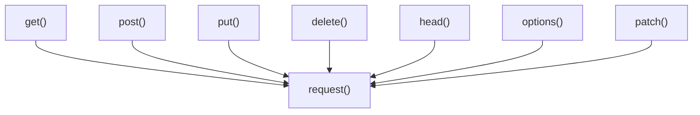

# Top-Level Functions

The Requests library offers a set of top-level functions that provide a simplified and direct interface for performing common HTTP operations. These functions act as convenient wrappers around the more comprehensive `request()` function, abstracting away some of the complexities of session management for basic use cases. While suitable for single, independent requests, for more advanced scenarios or when making multiple requests to the same host, using a [Session Object](./api-reference-session-object.md) is often more efficient.

These functions are your primary entry points for interacting with web services using Requests. Below is an overview of how these top-level functions relate to the core `request()` function:



For a deeper understanding of the `Request` and `Response` objects involved in these operations, refer to the [Request & Response Objects](./api-reference-request-response-objects.md) section.

## request()

This is the foundational function that all other top-level functions in `requests.api` utilize. It constructs and dispatches a `Request` object using an internal `Session`.

**Parameters**

| Name | Type | Description |
|---|---|---|
| `method` | `string` | The HTTP method for the new `Request` object: `GET`, `OPTIONS`, `HEAD`, `POST`, `PUT`, `PATCH`, or `DELETE`. |
| `url` | `string` | The URL for the new `Request` object. |
| `params` | `dict`, `list of tuples`, or `bytes` | (Optional) Data to send in the query string. |
| `data` | `dict`, `list of tuples`, `bytes`, or `file-like object` | (Optional) Data to send in the body of the `Request`. |
| `json` | `Python object` | (Optional) A JSON serializable Python object to send in the body of the `Request`. |
| `headers` | `dict` | (Optional) Dictionary of HTTP Headers to send with the `Request`. |
| `cookies` | `dict` or `CookieJar` | (Optional) Dictionary or CookieJar object to send with the `Request`. |
| `files` | `dict` | (Optional) Dictionary of `'name': file-like-objects` (or `{'name': file-tuple}`) for multipart encoding upload. `file-tuple` can be a 2-tuple `('filename', fileobj)`, 3-tuple `('filename', fileobj, 'content_type')` or a 4-tuple `('filename', fileobj, 'content_type', custom_headers)`. |
| `auth` | `tuple` | (Optional) Auth tuple to enable Basic/Digest/Custom HTTP Auth. |
| `timeout` | `float` or `tuple` | (Optional) How many seconds to wait for the server to send data before giving up, as a float, or a `(connect timeout, read timeout)` tuple. |
| `allow_redirects` | `bool` | (Optional) Enable/disable GET/OPTIONS/POST/PUT/PATCH/DELETE/HEAD redirection. Defaults to `True`. |
| `proxies` | `dict` | (Optional) Dictionary mapping protocol to the URL of the proxy. |
| `verify` | `bool` or `string` | (Optional) Controls whether to verify the server's TLS certificate. If a string, it must be a path to a CA bundle to use. Defaults to `True`. |
| `stream` | `bool` | (Optional) If `False`, the response content will be immediately downloaded. |
| `cert` | `string` or `tuple` | (Optional) If string, path to ssl client cert file (.pem). If tuple, `('cert', 'key')` pair. |

**Returns**

| Name | Type | Description |
|---|---|---|
| `response` | `requests.Response` | The `Response` object containing the server's response. |

**Usage Example**

```python
import requests

# Make a GET request using the core request function
req = requests.request('GET', 'https://httpbin.org/get')
print(req)
```

**Example Response**
```
<Response [200]>
```

This example demonstrates a basic GET request using the `request()` function. The returned `Response` object provides access to the status code, headers, and content of the server's reply.

## get()

Sends a GET request, the most common method for retrieving data from a server.

**Parameters**

| Name | Type | Description |
|---|---|---|
| `url` | `string` | The URL for the new `Request` object. |
| `params` | `dict`, `list of tuples`, or `bytes` | (Optional) Dictionary, list of tuples, or bytes to send in the query string. |
| `**kwargs` | - | Optional arguments that the `request()` function takes (e.g., `headers`, `timeout`, `verify`). |

**Returns**

| Name | Type | Description |
|---|---|---|
| `response` | `requests.Response` | The `Response` object containing the server's response. |

**Usage Example**

```python
import requests

# Send a GET request with query parameters
response = requests.get('https://httpbin.org/get', params={'key1': 'value1', 'key2': 'value2'})
print(response)
print(response.json())
```

**Example Response**
```
<Response [200]>
{
  "args": {
    "key1": "value1", 
    "key2": "value2"
  },
  "headers": {
    "Accept": "*/*", 
    "Accept-Encoding": "gzip, deflate", 
    "Host": "httpbin.org", 
    "User-Agent": "python-requests/X.Y.Z"
  },
  "origin": "your_ip_address", 
  "url": "https://httpbin.org/get?key1=value1&key2=value2"
}
```

This example shows how to use `requests.get()` to retrieve data, including passing query string parameters. The `.json()` method is used to parse the JSON response body.

## options()

Sends an OPTIONS request. This method is used to describe the communication options for the target resource without initiating a specific action or transferring resource content.

**Parameters**

| Name | Type | Description |
|---|---|---|
| `url` | `string` | The URL for the new `Request` object. |
| `**kwargs` | - | Optional arguments that the `request()` function takes. |

**Returns**

| Name | Type | Description |
|---|---|---|
| `response` | `requests.Response` | The `Response` object. |

**Usage Example**

```python
import requests

# Send an OPTIONS request to see allowed methods
response = requests.options('https://httpbin.org/get')
print(response)
print(response.headers.get('Allow'))
```

**Example Response**
```
<Response [200]>
GET, PUT, POST, DELETE, PATCH, OPTIONS
```

This example demonstrates fetching the allowed HTTP methods for a resource using `requests.options()`.

## head()

Sends a HEAD request. This method is identical to GET but without the response body. It is often used to retrieve metadata, such as headers, without transferring the entire content.

**Parameters**

| Name | Type | Description |
|---|---|---|
| `url` | `string` | The URL for the new `Request` object. |
| `**kwargs` | - | Optional arguments that the `request()` function takes. If `allow_redirects` is not provided, it will be set to `False` (as opposed to the default `request()` behavior). |

**Returns**

| Name | Type | Description |
|---|---|---|
| `response` | `requests.Response` | The `Response` object. |

**Usage Example**

```python
import requests

# Send a HEAD request to get headers only
response = requests.head('https://httpbin.org/get')
print(response)
print(response.headers.get('Content-Type'))
print(response.content) # No content expected
```

**Example Response**
```
<Response [200]>
application/json
b''
```

This example shows how to use `requests.head()` to retrieve only the response headers. Note that `response.content` will be empty (`b''`) as expected for a HEAD request.

## post()

Sends a POST request. This method is commonly used to submit data to be processed to a specified resource.

**Parameters**

| Name | Type | Description |
|---|---|---|
| `url` | `string` | The URL for the new `Request` object. |
| `data` | `dict`, `list of tuples`, `bytes`, or `file-like object` | (Optional) Data to send in the body of the `Request`, typically form data. |
| `json` | `Python object` | (Optional) A JSON serializable Python object to send in the body of the `Request`. |
| `**kwargs` | - | Optional arguments that the `request()` function takes. |

**Returns**

| Name | Type | Description |
|---|---|---|
| `response` | `requests.Response` | The `Response` object. |

**Usage Example**

```python
import requests

# Send a POST request with form data
response_form = requests.post('https://httpbin.org/post', data={'field1': 'value1', 'field2': 'value2'})
print(response_form)
print(response_form.json()['form'])

# Send a POST request with JSON data
response_json = requests.post('https://httpbin.org/post', json={'key': 'value'})
print(response_json)
print(response_json.json()['json'])
```

**Example Response (Form Data)**
```
<Response [200]>
{
  "field1": "value1", 
  "field2": "value2"
}
```

**Example Response (JSON Data)**
```
<Response [200]>
{
  "key": "value"
}
```

These examples illustrate sending data using `requests.post()`, both as URL-encoded form data via the `data` parameter and as JSON data via the `json` parameter.

## put()

Sends a PUT request. This method is used to update an existing resource or create a new resource at a specified URI.

**Parameters**

| Name | Type | Description |
|---|---|---|
| `url` | `string` | The URL for the new `Request` object. |
| `data` | `dict`, `list of tuples`, `bytes`, or `file-like object` | (Optional) Data to send in the body of the `Request`. |
| `json` | `Python object` | (Optional) A JSON serializable Python object to send in the body of the `Request`. |
| `**kwargs` | - | Optional arguments that the `request()` function takes. |

**Returns**

| Name | Type | Description |
|---|---|---|
| `response` | `requests.Response` | The `Response` object. |

**Usage Example**

```python
import requests

# Send a PUT request with JSON data to update a resource
response = requests.put('https://httpbin.org/put', json={'new_data': 'updated_content'})
print(response)
print(response.json()['json'])
```

**Example Response**
```
<Response [200]>
{
  "new_data": "updated_content"
}
```

This example demonstrates how to send JSON data with a PUT request to update or create a resource.

## patch()

Sends a PATCH request. This method is used to apply partial modifications to a resource.

**Parameters**

| Name | Type | Description |
|---|---|---|
| `url` | `string` | The URL for the new `Request` object. |
| `data` | `dict`, `list of tuples`, `bytes`, or `file-like object` | (Optional) Data to send in the body of the `Request`. |
| `json` | `Python object` | (Optional) A JSON serializable Python object to send in the body of the `Request`. |
| `**kwargs` | - | Optional arguments that the `request()` function takes. |

**Returns**

| Name | Type | Description |
|---|---|---|
| `response` | `requests.Response` | The `Response` object. |

**Usage Example**

```python
import requests

# Send a PATCH request with JSON data for partial update
response = requests.patch('https://httpbin.org/patch', json={'patch_field': 'new_value'})
print(response)
print(response.json()['json'])
```

**Example Response**
```
<Response [200]>
{
  "patch_field": "new_value"
}
```

This example shows how to use `requests.patch()` to send data for a partial update of a resource.

## delete()

Sends a DELETE request. This method is used to delete a specified resource.

**Parameters**

| Name | Type | Description |
|---|---|---|
| `url` | `string` | The URL for the new `Request` object. |
| `**kwargs` | - | Optional arguments that the `request()` function takes. |

**Returns**

| Name | Type | Description |
|---|---|---|
| `response` | `requests.Response` | The `Response` object. |

**Usage Example**

```python
import requests

# Send a DELETE request to remove a resource
response = requests.delete('https://httpbin.org/delete')
print(response)
print(response.json())
```

**Example Response**
```
<Response [200]>
{
  "args": {}, 
  "data": "", 
  "files": {}, 
  "form": {}, 
  "headers": {
    "Accept": "*/*", 
    "Accept-Encoding": "gzip, deflate", 
    "Host": "httpbin.org", 
    "User-Agent": "python-requests/X.Y.Z"
  },
  "json": null, 
  "origin": "your_ip_address", 
  "url": "https://httpbin.org/delete"
}
```

This example demonstrates how to use `requests.delete()` to request the removal of a resource. The response confirms the successful processing of the DELETE request.

---

This section provided a detailed overview of Requests' top-level functions, offering a straightforward way to interact with web services. For persistent connections, session management, and other advanced configurations, proceed to the [Session Object](./api-reference-session-object.md) section.