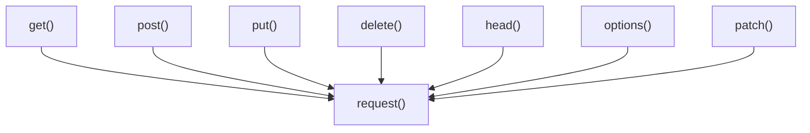

# 顶层函数

Requests 库提供了一组顶层函数，它们为执行常见 HTTP 操作提供了简化且直接的接口。这些函数是对更全面的 `request()` 函数的便捷封装，为基本用例抽象掉了会话管理的一些复杂性。虽然这些函数适用于单个、独立的请求，但对于更高级的场景或向同一主机发出多个请求时，使用 [Session 对象](./api-reference-session-object.md) 通常更高效。

这些函数是您使用 Requests 与 Web 服务交互的主要入口点。以下是这些顶层函数与核心 `request()` 函数的关系概述：



如需更深入了解这些操作中涉及的 `Request` 和 `Response` 对象，请参阅 [Request 与 Response 对象](./api-reference-request-response-objects.md) 部分。

## request()

这是 `requests.api` 中所有其他顶层函数所使用的基础函数。它使用内部 `Session` 构造并分派一个 `Request` 对象。

**参数**

| 名称 | 类型 | 描述 |
|---|---|---|
| `method` | `string` | 新 `Request` 对象的 HTTP 方法：`GET`、`OPTIONS`、`HEAD`、`POST`、`PUT`、`PATCH` 或 `DELETE`。 |
| `url` | `string` | 新 `Request` 对象的 URL。 |
| `params` | `dict`、`list of tuples` 或 `bytes` | （可选）要在查询字符串中发送的数据。 |
| `data` | `dict`、`list of tuples`、`bytes` 或 `file-like object` | （可选）要在 `Request` 正文中发送的数据。 |
| `json` | `Python object` | （可选）要在 `Request` 正文中发送的 JSON 可序列化 Python 对象。 |
| `headers` | `dict` | （可选）随 `Request` 发送的 HTTP 标头字典。 |
| `cookies` | `dict` 或 `CookieJar` | （可选）随 `Request` 发送的字典或 CookieJar 对象。 |
| `files` | `dict` | （可选）用于多部分编码上传的 `{'name': 文件类对象}` 字典（或 `{'name': 文件元组}`）。`文件元组` 可以是 2 元组 `('文件名', 文件对象)`、3 元组 `('文件名', 文件对象, '内容类型')` 或 4 元组 `('文件名', 文件对象, '内容类型', 自定义标头)`。 |
| `auth` | `tuple` | （可选）用于启用基本/摘要/自定义 HTTP 身份验证的身份验证元组。 |
| `timeout` | `float` 或 `tuple` | （可选）等待服务器发送数据前的秒数（浮点数），或 `(连接超时, 读取超时)` 元组。 |
| `allow_redirects` | `bool` | （可选）启用/禁用 GET/OPTIONS/POST/PUT/PATCH/DELETE/HEAD 重定向。默认为 `True`。 |
| `proxies` | `dict` | （可选）将协议映射到代理 URL 的字典。 |
| `verify` | `bool` 或 `string` | （可选）控制是否验证服务器的 TLS 证书。如果为字符串，则必须是 CA 捆绑包的路径。默认为 `True`。 |
| `stream` | `bool` | （可选）如果为 `False`，响应内容将立即下载。 |
| `cert` | `string` 或 `tuple` | （可选）如果为字符串，则为 SSL 客户端证书文件 (.pem) 的路径。如果为元组，则为 `('证书', '密钥')` 对。 |

**返回**

| 名称 | 类型 | 描述 |
|---|---|---|
| `response` | `requests.Response` | 包含服务器响应的 `Response` 对象。 |

**使用示例**

```python
import requests

# Make a GET request using the core request function
req = requests.request('GET', 'https://httpbin.org/get')
print(req)
```

**示例响应**
```
<Response [200]>
```

此示例演示了使用 `request()` 函数执行的基本 GET 请求。返回的 `Response` 对象提供了对服务器响应的状态码、标头和内容的访问。

## get()

发送 GET 请求，这是从服务器检索数据的最常用方法。

**参数**

| 名称 | 类型 | 描述 |
|---|---|---|
| `url` | `string` | 新 `Request` 对象的 URL。 |
| `params` | `dict`、`list of tuples` 或 `bytes` | （可选）要在查询字符串中发送的字典、元组列表或字节。 |
| `**kwargs` | - | （可选）`request()` 函数接受的参数（例如 `headers`、`timeout`、`verify`）。 |

**返回**

| 名称 | 类型 | 描述 |
|---|---|---|
| `response` | `requests.Response` | 包含服务器响应的 `Response` 对象。 |

**使用示例**

```python
import requests

# Send a GET request with query parameters
response = requests.get('https://httpbin.org/get', params={'key1': 'value1', 'key2': 'value2'})
print(response)
print(response.json())
```

**示例响应**
```
<Response [200]>
{
  "args": {
    "key1": "value1", 
    "key2": "value2"
  },
  "headers": {
    "Accept": "*/*", 
    "Accept-Encoding": "gzip, deflate", 
    "Host": "httpbin.org", 
    "User-Agent": "python-requests/X.Y.Z"
  },
  "origin": "your_ip_address", 
  "url": "https://httpbin.org/get?key1=value1&key2=value2"
}
```

此示例演示了如何使用 `requests.get()` 检索数据，包括传递查询字符串参数。`.json()` 方法用于解析 JSON 响应正文。

## options()

发送 OPTIONS 请求。此方法用于描述目标资源的通信选项，而无需启动特定操作或传输资源内容。

**参数**

| 名称 | 类型 | 描述 |
|---|---|---|
| `url` | `string` | 新 `Request` 对象的 URL。 |
| `**kwargs` | - | （可选）`request()` 函数接受的参数。 |

**返回**

| 名称 | 类型 | 描述 |
|---|---|---|
| `response` | `requests.Response` | `Response` 对象。 |

**使用示例**

```python
import requests

# Send an OPTIONS request to see allowed methods
response = requests.options('https://httpbin.org/get')
print(response)
print(response.headers.get('Allow'))
```

**示例响应**
```
<Response [200]>
GET, PUT, POST, DELETE, PATCH, OPTIONS
```

此示例演示了如何使用 `requests.options()` 获取资源允许的 HTTP 方法。

## head()

发送 HEAD 请求。此方法与 GET 相同，但没有响应正文。它通常用于检索元数据（例如标头），而无需传输整个内容。

**参数**

| 名称 | 类型 | 描述 |
|---|---|---|
| `url` | `string` | 新 `Request` 对象的 URL。 |
| `**kwargs` | - | （可选）`request()` 函数接受的参数。如果未提供 `allow_redirects`，它将被设置为 `False`（与 `request()` 的默认行为相反）。 |

**返回**

| 名称 | 类型 | 描述 |
|---|---|---|
| `response` | `requests.Response` | `Response` 对象。 |

**使用示例**

```python
import requests

# Send a HEAD request to get headers only
response = requests.head('https://httpbin.org/get')
print(response)
print(response.headers.get('Content-Type'))
print(response.content) # No content expected
```

**示例响应**
```
<Response [200]>
application/json
b''
```

此示例演示了如何使用 `requests.head()` 仅检索响应标头。请注意，正如 HEAD 请求所预期，`response.content` 将为空 (`b''`)。

## post()

发送 POST 请求。此方法通常用于向指定资源提交待处理数据。

**参数**

| 名称 | 类型 | 描述 |
|---|---|---|
| `url` | `string` | 新 `Request` 对象的 URL。 |
| `data` | `dict`、`list of tuples`、`bytes` 或 `file-like object` | （可选）要在 `Request` 正文中发送的数据，通常是表单数据。 |
| `json` | `Python object` | （可选）要在 `Request` 正文中发送的 JSON 可序列化 Python 对象。 |
| `**kwargs` | - | （可选）`request()` 函数接受的参数。 |

**返回**

| 名称 | 类型 | 描述 |
|---|---|---|
| `response` | `requests.Response` | `Response` 对象。 |

**使用示例**

```python
import requests

# Send a POST request with form data
response_form = requests.post('https://httpbin.org/post', data={'field1': 'value1', 'field2': 'value2'})
print(response_form)
print(response_form.json()['form'])

# Send a POST request with JSON data
response_json = requests.post('https://httpbin.org/post', json={'key': 'value'})
print(response_json)
print(response_json.json()['json'])
```

**示例响应（表单数据）**
```
<Response [200]>
{
  "field1": "value1", 
  "field2": "value2"
}
```

**示例响应（JSON 数据）**
```
<Response [200]>
{
  "key": "value"
}
```

这些示例说明了如何使用 `requests.post()` 发送数据，包括通过 `data` 参数发送 URL 编码的表单数据，以及通过 `json` 参数发送 JSON 数据。

## put()

发送 PUT 请求。此方法用于更新现有资源或在指定 URI 创建新资源。

**参数**

| 名称 | 类型 | 描述 |
|---|---|---|
| `url` | `string` | 新 `Request` 对象的 URL。 |
| `data` | `dict`、`list of tuples`、`bytes` 或 `file-like object` | （可选）要在 `Request` 正文中发送的数据。 |
| `json` | `Python object` | （可选）要在 `Request` 正文中发送的 JSON 可序列化 Python 对象。 |
| `**kwargs` | - | （可选）`request()` 函数接受的参数。 |

**返回**

| 名称 | 类型 | 描述 |
|---|---|---|
| `response` | `requests.Response` | `Response` 对象。 |

**使用示例**

```python
import requests

# Send a PUT request with JSON data to update a resource
response = requests.put('https://httpbin.org/put', json={'new_data': 'updated_content'})
print(response)
print(response.json()['json'])
```

**示例响应**
```
<Response [200]>
{
  "new_data": "updated_content"
}
```

此示例演示了如何使用 PUT 请求发送 JSON 数据以更新或创建资源。

## patch()

发送 PATCH 请求。此方法用于对资源应用部分修改。

**参数**

| 名称 | 类型 | 描述 |
|---|---|---|
| `url` | `string` | 新 `Request` 对象的 URL。 |
| `data` | `dict`、`list of tuples`、`bytes` 或 `file-like object` | （可选）要在 `Request` 正文中发送的数据。 |
| `json` | `Python object` | （可选）要在 `Request` 正文中发送的 JSON 可序列化 Python 对象。 |
| `**kwargs` | - | （可选）`request()` 函数接受的参数。 |

**返回**

| 名称 | 类型 | 描述 |
|---|---|---|
| `response` | `requests.Response` | `Response` 对象。 |

**使用示例**

```python
import requests

# Send a PATCH request with JSON data for partial update
response = requests.patch('https://httpbin.org/patch', json={'patch_field': 'new_value'})
print(response)
print(response.json()['json'])
```

**示例响应**
```
<Response [200]>
{
  "patch_field": "new_value"
}
```

此示例演示了如何使用 `requests.patch()` 发送数据以对资源进行部分更新。

## delete()

发送 DELETE 请求。此方法用于删除指定资源。

**参数**

| 名称 | 类型 | 描述 |
|---|---|---|
| `url` | `string` | 新 `Request` 对象的 URL。 |
| `**kwargs` | - | （可选）`request()` 函数接受的参数。 |

**返回**

| 名称 | 类型 | 描述 |
|---|---|---|
| `response` | `requests.Response` | `Response` 对象。 |

**使用示例**

```python
import requests

# Send a DELETE request to remove a resource
response = requests.delete('https://httpbin.org/delete')
print(response)
print(response.json())
```

**示例响应**
```
<Response [200]>
{
  "args": {}, 
  "data": "", 
  "files": {}, 
  "form": {}, 
  "headers": {
    "Accept": "*/*", 
    "Accept-Encoding": "gzip, deflate", 
    "Host": "httpbin.org", 
    "User-Agent": "python-requests/X.Y.Z"
  },
  "json": null, 
  "origin": "your_ip_address", 
  "url": "https://httpbin.org/delete"
}
```

此示例演示了如何使用 `requests.delete()` 请求删除资源。响应确认 DELETE 请求已成功处理。

---

本节详细概述了 Requests 的顶层函数，提供了与 Web 服务交互的直接方式。对于持久连接、会话管理和其他高级配置，请继续阅读 [Session 对象](./api-reference-session-object.md) 部分。