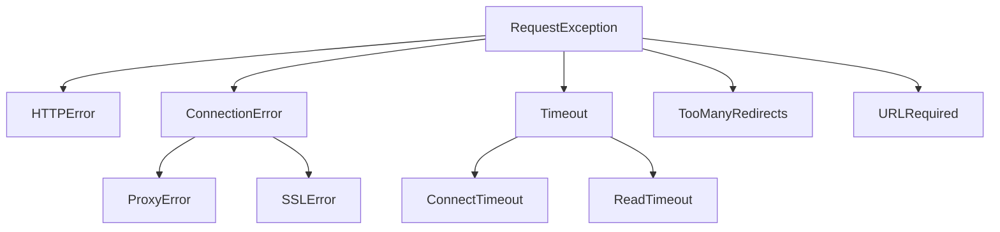

# API Reference

This section provides a detailed reference for the public classes, methods, and functions in the Requests library. It is designed for developers who need to understand the specific parameters, return values, and attributes of different components.

## Top-Level Functions

These functions provide a simple interface for making HTTP requests and are the most common entry point for using the library.

```python
import requests

response = requests.get('https://api.github.com')
```

Each function is a shortcut for `requests.request()`.

| Function | HTTP Method | Description |
|---|---|---|
| `requests.get(url, params=None, **kwargs)` | GET | Retrieves data from the specified URL. |
| `requests.post(url, data=None, json=None, **kwargs)` | POST | Submits data to be processed to a specified resource. |
| `requests.put(url, data=None, **kwargs)` | PUT | Uploads a representation of the specified resource. |
| `requests.patch(url, data=None, **kwargs)` | PATCH | Applies partial modifications to a resource. |
| `requests.delete(url, **kwargs)` | DELETE | Deletes the specified resource. |
| `requests.head(url, **kwargs)` | HEAD | Retrieves the headers for a resource without the response body. |
| `requests.options(url, **kwargs)` | OPTIONS | Retrieves the communication options for the target resource. |

### `requests.request()`

All the functions above are wrappers for the `requests.request()` function, which provides full control over the request.

```python
requests.request(method, url, **kwargs)
```

| Parameter | Description |
|---|---|
| `method` | The HTTP method to use: `GET`, `POST`, `PUT`, `PATCH`, `DELETE`, `HEAD`, `OPTIONS`. |
| `url` | The URL for the new `Request` object. |
| `params` | (optional) A dictionary, list of tuples, or bytes to be sent in the query string. |
| `data` | (optional) A dictionary, list of tuples, bytes, or file-like object to send in the request body. |
| `json` | (optional) A JSON-serializable Python object to send in the request body. |
| `headers` | (optional) A dictionary of HTTP Headers to send with the request. |
| `cookies` | (optional) A dictionary or `CookieJar` object to send with the request. |
| `files` | (optional) A dictionary for multipart encoding uploads (e.g., `{'name': file-like-object}`). |
| `auth` | (optional) An authentication object or a `(user, pass)` tuple for Basic HTTP Auth. |
| `timeout` | (optional) The number of seconds to wait for the server to send data. Can be a float or a `(connect_timeout, read_timeout)` tuple. |
| `allow_redirects` | (optional) A boolean to enable or disable redirection. Defaults to `True`. |
| `proxies` | (optional) A dictionary mapping protocol to the URL of the proxy. |
| `verify` | (optional) Either a boolean to control TLS certificate verification or a string path to a CA bundle. Defaults to `True`. |
| `stream` | (optional) If `False` (default), the response content is immediately downloaded. |
| `cert` | (optional) A path to an SSL client certificate file (`.pem`) or a `('cert', 'key')` tuple. |

## Session Object

The `Session` object allows you to persist parameters across requests. It also maintains cookies over all requests made from the `Session` instance and uses `urllib3`'s connection pooling. If you are making several requests to the same host, the underlying TCP connection will be reused, which can result in a significant performance increase.

```python
import requests

s = requests.Session()
s.headers.update({'x-test': 'true'})

# Both 'x-test' and 'x-test2' headers are sent in the request
s.get('https://httpbin.org/headers', headers={'x-test2': 'true'})
```

### Session Attributes

You can set default values for these attributes on a `Session` instance. These will be used for all subsequent requests made with that session.

| Attribute | Description |
|---|---|
| `headers` | A case-insensitive dictionary of headers to be sent on each request. |
| `auth` | Default authentication tuple or object. |
| `proxies` | A dictionary of proxies to be used. |
| `hooks` | A dictionary of event-handling hooks. The only supported hook is `'response'`. |
| `params` | A dictionary of query string data to attach to each request. |
| `stream` | Default for whether to stream response content. Defaults to `False`. |
| `verify` | Default for SSL verification. Defaults to `True`. |
| `cert` | Default SSL client certificate. |
| `max_redirects` | Maximum number of redirects allowed. Defaults to 30. |
| `cookies` | A `RequestsCookieJar` object containing cookies. |
| `trust_env` | If `True`, trusts environment settings for proxy configuration, default authentication, etc. Defaults to `True`. |
| `adapters` | An ordered dictionary of mounted `HTTPAdapter` instances. |

### Session Methods

A `Session` object has all the methods of the top-level API (`get`, `post`, etc.). Additionally, it has these methods:

| Method | Description |
|---|---|
| `send(request, **kwargs)` | Sends a `PreparedRequest`. |
| `mount(prefix, adapter)` | Registers a connection adapter to a URL prefix. |
| `close()` | Closes all adapters and the session. |
| `prepare_request(request)` | Constructs a `PreparedRequest` from a `Request` object with session-level settings. |

## Response Object

When you make a request, Requests returns a `Response` object, which contains the server's response.

```python
response = requests.get('https://httpbin.org/json')
print(response.status_code)
print(response.headers['content-type'])
print(response.json())
```

### Response Attributes and Methods

| Member | Description |
|---|---|
| `status_code` | The integer HTTP status code (e.g., `200`, `404`). |
| `headers` | A case-insensitive dictionary of the response headers. |
| `encoding` | The encoding to use to decode `response.text`. |
| `text` | The content of the response, in unicode. |
| `content` | The content of the response, in bytes. |
| `json(**kwargs)` | Decodes the response body as JSON. Returns a Python object. |
| `ok` | A boolean property that is `True` if `status_code` is less than 400. |
| `url` | The final URL location of the response (after redirects). |
| `reason` | The textual reason for the HTTP status (e.g., `"OK"`, `"Not Found"`). |
| `cookies` | A `RequestsCookieJar` of cookies the server sent back. |
| `elapsed` | A `timedelta` object representing the time elapsed between sending the request and the arrival of the response. |
| `history` | A list of `Response` objects from the history of the request (redirects). |
| `request` | The `PreparedRequest` object to which this is a response. |
| `raise_for_status()` | Raises an `HTTPError` if the HTTP request returned an unsuccessful status code (4xx or 5xx). |
| `iter_content(chunk_size=1, decode_unicode=False)` | Iterates over the response data. Useful for streaming large files. |
| `iter_lines()` | Iterates over the response data, one line at a time. |
| `close()` | Releases the connection back to the pool. |

## Exceptions

Requests raises exceptions for various errors. All exceptions are available in the `requests.exceptions` module and inherit from `requests.exceptions.RequestException`.



| Exception | Description |
|---|---|
| `RequestException` | The base exception class for all Requests exceptions. |
| `ConnectionError` | Raised for network-related problems (e.g., DNS failure, refused connection). |
| `HTTPError` | Raised in response to unsuccessful status codes (4xx or 5xx) when `response.raise_for_status()` is called. |
| `URLRequired` | Raised when a valid URL is not provided to make a request. |
| `TooManyRedirects` | Raised when a request exceeds the configured number of maximum redirections. |
| `Timeout` | The base class for timeout exceptions. Catches both `ConnectTimeout` and `ReadTimeout`. |
| `ConnectTimeout` | Raised when a timeout occurs while trying to connect to the remote server. |
| `ReadTimeout` | Raised when the server does not send any data in the allotted amount of time. |

Example of handling exceptions:

```python
import requests
from requests.exceptions import ConnectionError, Timeout, HTTPError

try:
    response = requests.get('https://httpbin.org/status/404', timeout=5)
    response.raise_for_status()  # Raise an exception for bad status codes
except ConnectionError as e:
    print(f"Connection error: {e}")
except Timeout as e:
    print(f"Timeout error: {e}")
except HTTPError as e:
    print(f"HTTP error: {e}")
except requests.exceptions.RequestException as e:
    print(f"An unexpected error occurred: {e}")
```

## Authentication

Requests provides several built-in authentication handlers. They can be passed to the `auth` parameter of a request.

### `requests.auth.HTTPBasicAuth`
Attaches HTTP Basic Authentication to a request.

```python
from requests.auth import HTTPBasicAuth
response = requests.get('https://httpbin.org/basic-auth/user/pass', auth=HTTPBasicAuth('user', 'pass'))

# A shortcut is to pass a tuple
response = requests.get('https://httpbin.org/basic-auth/user/pass', auth=('user', 'pass'))
```

### `requests.auth.HTTPDigestAuth`
Attaches HTTP Digest Authentication to a request.

```python
from requests.auth import HTTPDigestAuth
url = 'https://httpbin.org/digest-auth/qop/user/pass'
response = requests.get(url, auth=HTTPDigestAuth('user', 'pass'))
```

## Other Core Objects

### `requests.Request` and `requests.PreparedRequest`
For advanced use cases, you can construct a `Request` object, modify it, and then prepare it into a `PreparedRequest` before sending it with a `Session`. This allows for fine-grained control over the request before it is sent over the wire.

```python
from requests import Request, Session

s = Session()
req = Request('GET', 'https://httpbin.org/get', headers={'Accept': 'application/json'})
prepped = s.prepare_request(req)

# prepped now contains the exact bytes that will be sent
resp = s.send(prepped)
print(resp.status_code)
```

### `requests.adapters.HTTPAdapter`
The built-in transport adapter for HTTP/HTTPS. You can create an instance to configure connection behavior, such as setting maximum retries, and mount it to a `Session`.

```python
import requests
from requests.adapters import HTTPAdapter

s = requests.Session()
# Retry up to 3 times on connection errors
a = HTTPAdapter(max_retries=3)
s.mount('http://', a)
s.mount('https://', a)

# This request will be retried if it fails with a connection-related error
response = s.get('https://httpbin.org/status/503')
```

### `requests.status_codes`
An object that provides a mapping from common names for HTTP statuses to their numerical codes. This allows for more readable code when checking status codes.

```python
import requests

response = requests.get('https://httpbin.org/get')
if response.status_code == requests.codes.ok:
    print('Request was successful!')

print(requests.codes.not_found) # 404
print(requests.codes['temporary_redirect']) # 307
```

### `requests.structures.CaseInsensitiveDict`
This is the data structure used for headers in Requests. It is a dictionary where keys are treated as case-insensitive, which aligns with the HTTP specification.

```python
import requests

headers = {'Content-Type': 'application/json'}
ci_headers = requests.structures.CaseInsensitiveDict(headers)

print(ci_headers['content-type']) # 'application/json'
print(ci_headers['CONTENT-TYPE']) # 'application/json'
```

This reference covers the main components of the Requests API. For more advanced scenarios, refer to the User Guide and Advanced Usage sections.