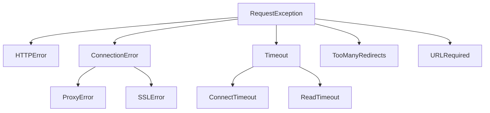

# API 参考

本节为 Requests 库中的公共类、方法和函数提供了详细的参考。它专为需要了解不同组件的具体参数、返回值和属性的开发者设计。

## 顶层函数

这些函数为发出 HTTP 请求提供了一个简单的接口，是使用该库最常见的入口点。

```python
import requests

response = requests.get('https://api.github.com')
```

每个函数都是 `requests.request()` 的快捷方式。

| 函数 | HTTP 方法 | 描述 |
|---|---|---|
| `requests.get(url, params=None, **kwargs)` | GET | 从指定 URL 检索数据。 |
| `requests.post(url, data=None, json=None, **kwargs)` | POST | 将待处理数据提交到指定资源。 |
| `requests.put(url, data=None, **kwargs)` | PUT | 上传指定资源的表示形式。 |
| `requests.patch(url, data=None, **kwargs)` | PATCH | 对资源应用部分修改。 |
| `requests.delete(url, **kwargs)` | DELETE | 删除指定资源。 |
| `requests.head(url, **kwargs)` | HEAD | 检索资源的标头，不包括响应体。 |
| `requests.options(url, **kwargs)` | OPTIONS | 检索目标资源的通信选项。 |

### `requests.request()`

以上所有函数都是 `requests.request()` 函数的包装器，该函数提供了对请求的完全控制。

```python
requests.request(method, url, **kwargs)
```

| 参数 | 描述 |
|---|---|
| `method` | 要使用的 HTTP 方法：`GET`、`POST`、`PUT`、`PATCH`、`DELETE`、`HEAD`、`OPTIONS`。 |
| `url` | 新 `Request` 对象的 URL。 |
| `params` | （可选）要在查询字符串中发送的字典、元组列表或字节。 |
| `data` | （可选）要在请求体中发送的字典、元组列表、字节或类文件对象。 |
| `json` | （可选）要在请求体中发送的可 JSON 序列化的 Python 对象。 |
| `headers` | （可选）要随请求发送的 HTTP 标头字典。 |
| `cookies` | （可选）要随请求发送的字典或 `CookieJar` 对象。 |
| `files` | （可选）用于多部分编码上传的字典（例如 `{'name': file-like-object}`）。 |
| `auth` | （可选）用于基本 HTTP 身份验证的身份验证对象或 `(user, pass)` 元组。 |
| `timeout` | （可选）等待服务器发送数据的秒数。可以是一个浮点数或一个 `(connect_timeout, read_timeout)` 元组。 |
| `allow_redirects` | （可选）一个布尔值，用于启用或禁用重定向。默认为 `True`。 |
| `proxies` | （可选）一个将协议映射到代理 URL 的字典。 |
| `verify` | （可选）一个用于控制 TLS 证书验证的布尔值，或一个指向 CA 证书包的字符串路径。默认为 `True`。 |
| `stream` | （可选）如果为 `False`（默认值），则立即下载响应内容。 |
| `cert` | （可选）一个指向 SSL 客户端证书文件（`.pem`）的路径，或一个 `('cert', 'key')` 元组。 |

## Session 对象

`Session` 对象允许你在多个请求之间保持参数。它还会在通过 `Session` 实例发出的所有请求中保持 cookie，并使用 `urllib3` 的连接池。如果你向同一主机发出多个请求，底层的 TCP 连接将被重用，这可以显著提升性能。

```python
import requests

s = requests.Session()
s.headers.update({'x-test': 'true'})

# 'x-test' 和 'x-test2' 标头都会在请求中发送
s.get('https://httpbin.org/headers', headers={'x-test2': 'true'})
```

### Session 属性

你可以在 `Session` 实例上为这些属性设置默认值。这些值将用于通过该会话发出的所有后续请求。

| 属性 | 描述 |
|---|---|
| `headers` | 一个不区分大小写的标头字典，将在每个请求中发送。 |
| `auth` | 默认的身份验证元组或对象。 |
| `proxies` | 要使用的代理字典。 |
| `hooks` | 事件处理钩子字典。唯一支持的钩子是 `'response'`。 |
| `params` | 附加到每个请求的查询字符串数据字典。 |
| `stream` | 是否流式传输响应内容的默认设置。默认为 `False`。 |
| `verify` | SSL 验证的默认设置。默认为 `True`。 |
| `cert` | 默认的 SSL 客户端证书。 |
| `max_redirects` | 允许的最大重定向次数。默认为 30。 |
| `cookies` | 包含 cookie 的 `RequestsCookieJar` 对象。 |
| `trust_env` | 如果为 `True`，则信任用于代理配置、默认身份验证等的环境变量设置。默认为 `True`。 |
| `adapters` | 一个已挂载的 `HTTPAdapter` 实例的有序字典。 |

### Session 方法

`Session` 对象拥有顶层 API 的所有方法（`get`、`post` 等）。此外，它还有以下方法：

| 方法 | 描述 |
|---|---|
| `send(request, **kwargs)` | 发送一个 `PreparedRequest`。 |
| `mount(prefix, adapter)` | 将连接适配器注册到一个 URL 前缀。 |
| `close()` | 关闭所有适配器和会话。 |
| `prepare_request(request)` | 根据 `Request` 对象和会话级设置构造一个 `PreparedRequest`。 |

## Response 对象

当你发出请求时，Requests 会返回一个 `Response` 对象，其中包含服务器的响应。

```python
response = requests.get('https://httpbin.org/json')
print(response.status_code)
print(response.headers['content-type'])
print(response.json())
```

### Response 属性和方法

| 成员 | 描述 |
|---|---|
| `status_code` | 整数形式的 HTTP 状态码（例如 `200`、`404`）。 |
| `headers` | 一个不区分大小写的响应标头字典。 |
| `encoding` | 用于解码 `response.text` 的编码。 |
| `text` | unicode 形式的响应内容。 |
| `content` | 字节形式的响应内容。 |
| `json(**kwargs)` | 将响应体解码为 JSON。返回一个 Python 对象。 |
| `ok` | 一个布尔属性，如果 `status_code` 小于 400，则为 `True`。 |
| `url` | 响应的最终 URL 位置（重定向后）。 |
| `reason` | HTTP 状态的文本原因（例如 `"OK"`、`"Not Found"`）。 |
| `cookies` | 服务器返回的 cookie 的 `RequestsCookieJar`。 |
| `elapsed` | 一个 `timedelta` 对象，表示从发送请求到响应到达之间经过的时间。 |
| `history` | 请求历史中的 `Response` 对象列表（重定向）。 |
| `request` | 此响应对应的 `PreparedRequest` 对象。 |
| `raise_for_status()` | 如果 HTTP 请求返回不成功的状态码（4xx 或 5xx），则引发 `HTTPError`。 |
| `iter_content(chunk_size=1, decode_unicode=False)` | 遍历响应数据。对于流式传输大文件很有用。 |
| `iter_lines()` | 逐行遍历响应数据。 |
| `close()` | 将连接释放回连接池。 |

## 异常

Requests 会针对各种错误引发异常。所有异常都位于 `requests.exceptions` 模块中，并继承自 `requests.exceptions.RequestException`。



| 异常 | 描述 |
|---|---|
| `RequestException` | 所有 Requests 异常的基类。 |
| `ConnectionError` | 因网络相关问题（例如 DNS 解析失败、连接被拒绝）而引发。 |
| `HTTPError` | 当调用 `response.raise_for_status()` 且响应状态码不成功（4xx 或 5xx）时引发。 |
| `URLRequired` | 当未提供有效 URL 来发出请求时引发。 |
| `TooManyRedirects` | 当请求超过配置的最大重定向次数时引发。 |
| `Timeout` | 超时异常的基类。捕获 `ConnectTimeout` 和 `ReadTimeout`。 |
| `ConnectTimeout` | 在尝试连接到远程服务器时发生超时而引发。 |
| `ReadTimeout` | 当服务器在规定时间内未发送任何数据时引发。 |

处理异常的示例：

```python
import requests
from requests.exceptions import ConnectionError, Timeout, HTTPError

try:
    response = requests.get('https://httpbin.org/status/404', timeout=5)
    response.raise_for_status()  # 为错误的状态码引发异常
except ConnectionError as e:
    print(f"Connection error: {e}")
except Timeout as e:
    print(f"Timeout error: {e}")
except HTTPError as e:
    print(f"HTTP error: {e}")
except requests.exceptions.RequestException as e:
    print(f"An unexpected error occurred: {e}")
```

## 身份验证

Requests 提供了几种内置的身份验证处理程序。它们可以传递给请求的 `auth` 参数。

### `requests.auth.HTTPBasicAuth`
将 HTTP 基本身份验证附加到请求。

```python
from requests.auth import HTTPBasicAuth
response = requests.get('https://httpbin.org/basic-auth/user/pass', auth=HTTPBasicAuth('user', 'pass'))

# 一个快捷方式是传递一个元组
response = requests.get('https://httpbin.org/basic-auth/user/pass', auth=('user', 'pass'))
```

### `requests.auth.HTTPDigestAuth`
将 HTTP 摘要式身份验证附加到请求。

```python
from requests.auth import HTTPDigestAuth
url = 'https://httpbin.org/digest-auth/qop/user/pass'
response = requests.get(url, auth=HTTPDigestAuth('user', 'pass'))
```

## 其他核心对象

### `requests.Request` 和 `requests.PreparedRequest`
对于高级用例，你可以构造一个 `Request` 对象，对其进行修改，然后在通过 `Session` 发送之前将其准备成一个 `PreparedRequest`。这允许在请求通过网络发送之前对其进行精细控制。

```python
from requests import Request, Session

s = Session()
req = Request('GET', 'https://httpbin.org/get', headers={'Accept': 'application/json'})
prepped = s.prepare_request(req)

# prepped 现在包含将要发送的确切字节
resp = s.send(prepped)
print(resp.status_code)
```

### `requests.adapters.HTTPAdapter`
用于 HTTP/HTTPS 的内置传输适配器。你可以创建一个实例来配置连接行为，例如设置最大重试次数，并将其挂载到 `Session` 上。

```python
import requests
from requests.adapters import HTTPAdapter

s = requests.Session()
# 对连接错误最多重试 3 次
a = HTTPAdapter(max_retries=3)
s.mount('http://', a)
s.mount('https://', a)

# 如果此请求因连接相关错误而失败，将会被重试
response = s.get('https://httpbin.org/status/503')
```

### `requests.status_codes`
一个提供从常见 HTTP 状态名称到其数字代码的映射的对象。这使得在检查状态码时代码更具可读性。

```python
import requests

response = requests.get('https://httpbin.org/get')
if response.status_code == requests.codes.ok:
    print('Request was successful!')

print(requests.codes.not_found) # 404
print(requests.codes['temporary_redirect']) # 307
```

### `requests.structures.CaseInsensitiveDict`
这是 Requests 中用于标头的数据结构。它是一个键被视为不区分大小写的字典，这与 HTTP 规范一致。

```python
import requests

headers = {'Content-Type': 'application/json'}
ci_headers = requests.structures.CaseInsensitiveDict(headers)

print(ci_headers['content-type']) # 'application/json'
print(ci_headers['CONTENT-TYPE']) # 'application/json'
```

本参考涵盖了 Requests API 的主要组件。对于更高级的场景，请参阅用户指南和高级用法部分。