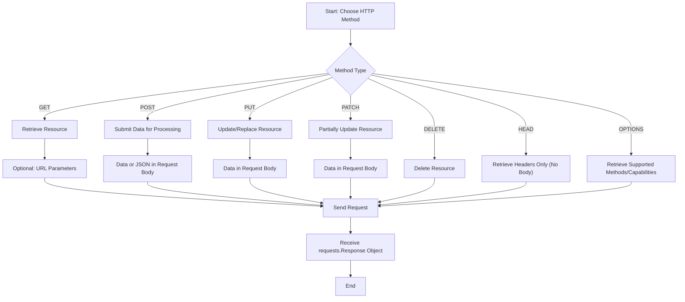

# HTTP Methods

HTTP methods define the actions you want to perform on resources identified by a URL. Requests provides simple, top-level functions for all standard HTTP methods, making it straightforward to interact with web services. Each function directly corresponds to an HTTP verb, allowing you to send requests with clear semantics.

For a comprehensive understanding of how Requests handles the underlying mechanics, refer to the [Requests & Responses](./core-concepts-requests-responses.md) section. For detailed information on additional optional arguments (`**kwargs`) that apply to these methods, such as `headers`, `auth`, `timeout`, and `proxies`, see the [Top-Level Functions](./api-reference-top-level-functions.md) section of the API Reference.

Below is an overview of the primary HTTP methods available in Requests:



## GET

Use the `requests.get()` method to send a GET request, which is used to retrieve data from a specified resource. It's the most common method for fetching information from a web server.

**Parameters**

| Name | Type | Description |
|---|---|---|
| `url` | `string` | The URL for the new `Request` object. |
| `params` | `dict`, `list of tuples`, or `bytes` | (optional) Data to send in the query string for the `Request`. |
| `**kwargs` | `various` | Optional arguments that the underlying `request` function accepts (e.g., `headers`, `timeout`, `verify`). |

**Returns**

`requests.Response`: The Response object from the server.

**Example**

```python
import requests

# Basic GET request
response = requests.get('https://httpbin.org/get')
print(response)

# GET request with URL parameters
params = {'key1': 'value1', 'key2': 'value2'}
response_with_params = requests.get('https://httpbin.org/get', params=params)
print(response_with_params.url)
```

**Example Response**

```
<Response [200]>
https://httpbin.org/get?key1=value1&key2=value2
```

## OPTIONS

Use the `requests.options()` method to send an OPTIONS request. This method is used to describe the communication options for the target resource. It allows clients to discover the capabilities of a server without actually performing a resource action.

**Parameters**

| Name | Type | Description |
|---|---|---|
| `url` | `string` | The URL for the new `Request` object. |
| `**kwargs` | `various` | Optional arguments that the underlying `request` function accepts. |

**Returns**

`requests.Response`: The Response object from the server.

**Example**

```python
import requests

response = requests.options('https://httpbin.org/get')
print(response)
print(response.headers.get('Allow')) # Often contains allowed methods
```

**Example Response**

```
<Response [200]>
GET, POST, PUT, DELETE, PATCH, OPTIONS
```

## HEAD

Use the `requests.head()` method to send a HEAD request. A HEAD request is identical to a GET request but without the response body. It is often used to retrieve metadata about a resource, such as its content type or content length, or to check if a resource exists, before downloading the entire resource.

By default, `allow_redirects` is set to `False` for `HEAD` requests.

**Parameters**

| Name | Type | Description |
|---|---|---|
| `url` | `string` | The URL for the new `Request` object. |
| `**kwargs` | `various` | Optional arguments that the underlying `request` function accepts. Note that `allow_redirects` defaults to `False`. |

**Returns**

`requests.Response`: The Response object from the server.

**Example**

```python
import requests

response = requests.head('https://httpbin.org/get')
print(response)
print(response.headers.get('Content-Type'))
print(response.headers.get('Content-Length'))
```

**Example Response**

```
<Response [200]>
application/json
308
```

## POST

Use the `requests.post()` method to send a POST request. This method is used to submit data to a specified resource, often causing a change in state or a side effect on the server. Common uses include submitting form data or uploading files.

**Parameters**

| Name | Type | Description |
|---|---|---|
| `url` | `string` | The URL for the new `Request` object. |
| `data` | `dict`, `list of tuples`, `bytes`, or `file-like object` | (optional) Data to send in the body of the `Request` for form-encoding. |
| `json` | `Python object` | (optional) A JSON serializable Python object to send in the body of the `Request`. |
| `**kwargs` | `various` | Optional arguments that the underlying `request` function accepts. |

**Returns**

`requests.Response`: The Response object from the server.

**Example**

```python
import requests

# POST request with form-encoded data
data = {'name': 'John Doe', 'occupation': 'Engineer'}
response_data = requests.post('https://httpbin.org/post', data=data)
print(f"Data response status: {response_data.status_code}")
print(response_data.json()['form'])

# POST request with JSON data
json_data = {'item': 'book', 'quantity': 5}
response_json = requests.post('https://httpbin.org/post', json=json_data)
print(f"JSON response status: {response_json.status_code}")
print(response_json.json()['json'])
```

**Example Response**

```
Data response status: 200
{'name': 'John Doe', 'occupation': 'Engineer'}
JSON response status: 200
{'item': 'book', 'quantity': 5}
```

## PUT

Use the `requests.put()` method to send a PUT request. This method is used to update or replace a target resource with the provided data. If the resource does not exist, a PUT request may create it.

**Parameters**

| Name | Type | Description |
|---|---|---|
| `url` | `string` | The URL for the new `Request` object. |
| `data` | `dict`, `list of tuples`, `bytes`, or `file-like object` | (optional) Data to send in the body of the `Request`. |
| `json` | `Python object` | (optional) A JSON serializable Python object to send in the body of the `Request`. |
| `**kwargs` | `various` | Optional arguments that the underlying `request` function accepts. |

**Returns**

`requests.Response`: The Response object from the server.

**Example**

```python
import requests

json_payload = {'id': 123, 'status': 'updated'}
response = requests.put('https://httpbin.org/put', json=json_payload)
print(response)
print(response.json()['json'])
```

**Example Response**

```
<Response [200]>
{'id': 123, 'status': 'updated'}
```

## PATCH

Use the `requests.patch()` method to send a PATCH request. This method is used to apply partial modifications to a resource. Unlike PUT, which typically replaces the entire resource, PATCH applies incremental changes.

**Parameters**

| Name | Type | Description |
|---|---|---|
| `url` | `string` | The URL for the new `Request` object. |
| `data` | `dict`, `list of tuples`, `bytes`, or `file-like object` | (optional) Data to send in the body of the `Request`. |
| `json` | `Python object` | (optional) A JSON serializable Python object to send in the body of the `Request`. |
| `**kwargs` | `various` | Optional arguments that the underlying `request` function accepts. |

**Returns**

`requests.Response`: The Response object from the server.

**Example**

```python
import requests

json_patch = {'status': 'processed'}
response = requests.patch('https://httpbin.org/patch', json=json_patch)
print(response)
print(response.json()['json'])
```

**Example Response**

```
<Response [200]>
{'status': 'processed'}
```

## DELETE

Use the `requests.delete()` method to send a DELETE request. This method is used to request the removal of the specified resource.

**Parameters**

| Name | Type | Description |
|---|---|---|
| `url` | `string` | The URL for the new `Request` object. |
| `**kwargs` | `various` | Optional arguments that the underlying `request` function accepts. |

**Returns**

`requests.Response`: The Response object from the server.

**Example**

```python
import requests

response = requests.delete('https://httpbin.org/delete')
print(response)
```

**Example Response**

```
<Response [200]>
```

--- 

This section introduced the fundamental HTTP methods and their usage within the Requests library. You now have a solid understanding of how to perform different types of HTTP operations. Continue to the [Requests & Responses](./core-concepts-requests-responses.md) section to learn more about the objects used to build and handle these communications.