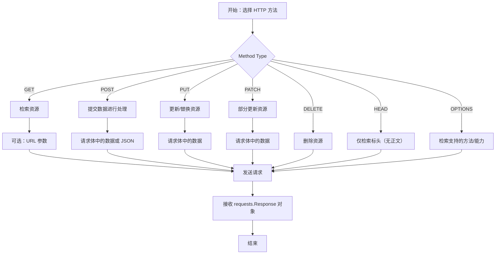

# HTTP 方法

HTTP 方法定义了您希望对由 URL 标识的资源执行的操作。Requests 库为所有标准 HTTP 方法提供了简单、顶层的函数，使得与 Web 服务交互变得直观简便。每个函数都直接对应一个 HTTP 动词，使您能够以明确的语义发送请求。

要全面了解 Requests 如何处理底层机制，请参阅 [请求与响应](./core-concepts-requests-responses.md) 部分。有关适用于这些方法的其他可选参数（`**kwargs`），例如 `headers`、`auth`、`timeout` 和 `proxies` 的详细信息，请参阅 API 参考的 [顶层函数](./api-reference-top-level-functions.md) 部分。

以下是 Requests 中可用主要 HTTP 方法的概述：



## GET

使用 `requests.get()` 方法发送 GET 请求，该请求用于从指定资源检索数据。这是从 Web 服务器获取信息最常用的方法。

**参数**

| 名称 | 类型 | 描述 |
|---|---|---|
| `url` | `string` | 新 `Request` 对象的 URL。 |
| `params` | `dict`、`tuple 列表` 或 `bytes` | （可选）要在 `Request` 查询字符串中发送的数据。 |
| `**kwargs` | `各种` | 底层 `request` 函数接受的可选参数（例如 `headers`、`timeout`、`verify`）。 |

**返回值**

`requests.Response`：来自服务器的响应对象。

**示例**

```python
import requests

# 基本 GET 请求
response = requests.get('https://httpbin.org/get')
print(response)

# 带有 URL 参数的 GET 请求
params = {'key1': 'value1', 'key2': 'value2'}
response_with_params = requests.get('https://httpbin.org/get', params=params)
print(response_with_params.url)
```

**响应示例**

```
<Response [200]>
https://httpbin.org/get?key1=value1&key2=value2
```

## OPTIONS

使用 `requests.options()` 方法发送 OPTIONS 请求。此方法用于描述目标资源的通信选项。它允许客户端发现服务器的功能而无需实际执行资源操作。

**参数**

| 名称 | 类型 | 描述 |
|---|---|---|
| `url` | `string` | 新 `Request` 对象的 URL。 |
| `**kwargs` | `各种` | 底层 `request` 函数接受的可选参数。 |

**返回值**

`requests.Response`：来自服务器的响应对象。

**示例**

```python
import requests

response = requests.options('https://httpbin.org/get')
print(response)
print(response.headers.get('Allow')) # 通常包含允许的方法
```

**响应示例**

```
<Response [200]>
GET, POST, PUT, DELETE, PATCH, OPTIONS
```

## HEAD

使用 `requests.head()` 方法发送 HEAD 请求。HEAD 请求与 GET 请求相同，但没有响应体。它通常用于在下载整个资源之前，检索有关资源的元数据，例如其内容类型或内容长度，或者检查资源是否存在。

默认情况下，`HEAD` 请求的 `allow_redirects` 设置为 `False`。

**参数**

| 名称 | 类型 | 描述 |
|---|---|---|
| `url` | `string` | 新 `Request` 对象的 URL。 |
| `**kwargs` | `各种` | 底层 `request` 函数接受的可选参数。请注意，`allow_redirects` 默认为 `False`。 |

**返回值**

`requests.Response`：来自服务器的响应对象。

**示例**

```python
import requests

response = requests.head('https://httpbin.org/get')
print(response)
print(response.headers.get('Content-Type'))
print(response.headers.get('Content-Length'))
```

**响应示例**

```
<Response [200]>
application/json
308
```

## POST

使用 `requests.post()` 方法发送 POST 请求。此方法用于向指定资源提交数据，通常会导致服务器状态的改变或产生副作用。常见用途包括提交表单数据或上传文件。

**参数**

| 名称 | 类型 | 描述 |
|---|---|---|
| `url` | `string` | 新 `Request` 对象的 URL。 |
| `data` | `dict`、`tuple 列表`、`bytes` 或 `file-like object` | （可选）要在 `Request` 正文中以表单编码形式发送的数据。 |
| `json` | `Python 对象` | （可选）要以 JSON 格式发送到 `Request` 正文的 Python 可序列化对象。 |
| `**kwargs` | `各种` | 底层 `request` 函数接受的可选参数。 |

**返回值**

`requests.Response`：来自服务器的响应对象。

**示例**

```python
import requests

# 带有表单编码数据的 POST 请求
data = {'name': 'John Doe', 'occupation': 'Engineer'}
response_data = requests.post('https://httpbin.org/post', data=data)
print(f"Data response status: {response_data.status_code}")
print(response_data.json()['form'])

# 带有 JSON 数据的 POST 请求
json_data = {'item': 'book', 'quantity': 5}
response_json = requests.post('https://httpbin.org/post', json=json_data)
print(f"JSON response status: {response_json.status_code}")
print(response_json.json()['json'])
```

**响应示例**

```
Data response status: 200
{'name': 'John Doe', 'occupation': 'Engineer'}
JSON response status: 200
{'item': 'book', 'quantity': 5}
```

## PUT

使用 `requests.put()` 方法发送 PUT 请求。此方法用于使用提供的数据更新或替换目标资源。如果资源不存在，PUT 请求可能会创建它。

**参数**

| 名称 | 类型 | 描述 |
|---|---|---|
| `url` | `string` | 新 `Request` 对象的 URL。 |
| `data` | `dict`、`tuple 列表`、`bytes` 或 `file-like object` | （可选）要在 `Request` 正文中发送的数据。 |
| `json` | `Python 对象` | （可选）要以 JSON 格式发送到 `Request` 正文的 Python 可序列化对象。 |
| `**kwargs` | `各种` | 底层 `request` 函数接受的可选参数。 |

**返回值**

`requests.Response`：来自服务器的响应对象。

**示例**

```python
import requests

json_payload = {'id': 123, 'status': 'updated'}
response = requests.put('https://httpbin.org/put', json=json_payload)
print(response)
print(response.json()['json'])
```

**响应示例**

```
<Response [200]>
{'id': 123, 'status': 'updated'}
```

## PATCH

使用 `requests.patch()` 方法发送 PATCH 请求。此方法用于对资源应用部分修改。与通常替换整个资源的 PUT 不同，PATCH 应用增量更改。

**参数**

| 名称 | 类型 | 描述 |
|---|---|---|
| `url` | `string` | 新 `Request` 对象的 URL。 |
| `data` | `dict`、`tuple 列表`、`bytes` 或 `file-like object` | （可选）要在 `Request` 正文中发送的数据。 |
| `json` | `Python 对象` | （可选）要以 JSON 格式发送到 `Request` 正文的 Python 可序列化对象。 |
| `**kwargs` | `各种` | 底层 `request` 函数接受的可选参数。 |

**返回值**

`requests.Response`：来自服务器的响应对象。

**示例**

```python
import requests

json_patch = {'status': 'processed'}
response = requests.patch('https://httpbin.org/patch', json=json_patch)
print(response)
print(response.json()['json'])
```

**响应示例**

```
<Response [200]>
{'status': 'processed'}
```

## DELETE

使用 `requests.delete()` 方法发送 DELETE 请求。此方法用于请求删除指定资源。

**参数**

| 名称 | 类型 | 描述 |
|---|---|---|
| `url` | `string` | 新 `Request` 对象的 URL。 |
| `**kwargs` | `各种` | 底层 `request` 函数接受的可选参数。 |

**返回值**

`requests.Response`：来自服务器的响应对象。

**示例**

```python
import requests

response = requests.delete('https://httpbin.org/delete')
print(response)
```

**响应示例**

```
<Response [200]>
```

---

本节介绍了 Requests 库中基本的 HTTP 方法及其用法。您现在对如何执行不同类型的 HTTP 操作有了扎实的理解。请继续阅读 [请求与响应](./core-concepts-requests-responses.md) 部分，以了解更多用于构建和处理这些通信的对象。
