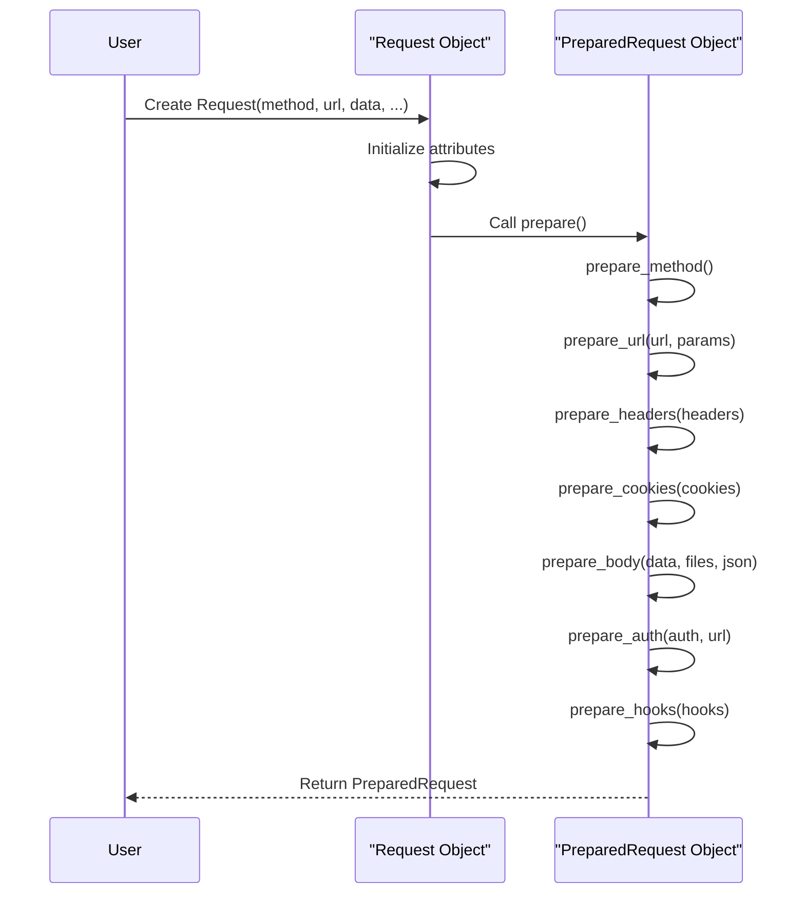
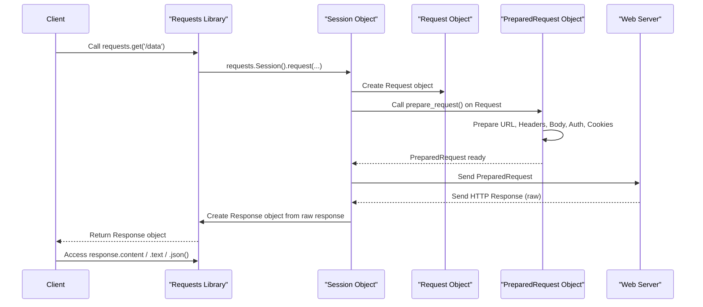

# Requests & Responses

When you make an HTTP request using Requests, you interact with several core objects that represent the request you're sending and the response you receive. Understanding these objects—the `Request`, `PreparedRequest`, and `Response`—is crucial for deeper control over your HTTP communications.

For more details on specific HTTP methods, refer to the [HTTP Methods](./core-concepts-http-methods.md) section. To understand how these objects are managed across multiple requests, see the [Sessions](./core-concepts-sessions.md) section.

## The Request Object

The `Request` object is a user-created representation of an HTTP request. It's designed to hold all the information you provide about your intended request, such as the HTTP method, URL, headers, data, and more. While you create a `Request` object, it's not directly sent over the network. Instead, it serves as a blueprint for a `PreparedRequest` object.

**Initialization Parameters**

When you create a `requests.Request` object, you can specify the following parameters:

| Name | Type | Description |
|---|---|---|
| `method` | `string` | The HTTP method (e.g., `'GET'`, `'POST'`). |
| `url` | `string` | The URL for the request. |
| `headers` | `dict` | (Optional) A dictionary of HTTP headers. |
| `files` | `dict` or `list` | (Optional) A dictionary of `{filename: fileobject}` or list of tuples for multipart uploads. |
| `data` | `dict`, `list`, `bytes`, or file-like object | (Optional) The body to attach. If a dictionary or list of tuples, form-encoding will occur. |
| `json` | Any JSON-serializable type | (Optional) JSON for the body (if `files` or `data` is not specified). |
| `params` | `dict` or `list` | (Optional) URL parameters to append to the URL. If a dictionary or list of tuples, form-encoding will occur. |
| `auth` | `tuple` or `AuthBase` object | (Optional) Auth handler or `(user, pass)` tuple. |
| `cookies` | `dict` or `CookieJar` | (Optional) Dictionary or CookieJar of cookies. |
| `hooks` | `dict` | (Optional) Dictionary of callback hooks, primarily for internal usage. |

**Example: Creating a Request Object**

```python
import requests

# Create a GET request to httpbin.org/get with a custom header and a URL parameter.
req = requests.Request(
    'GET',
    'https://httpbin.org/get',
    params={'key': 'value'},
    headers={'X-Custom-Header': 'Requests-Demo'}
)

print(req)
# Expected output: <Request [GET]>
```

### Preparing a Request

Once a `Request` object is created, you call its `prepare()` method to transform it into a `PreparedRequest` object. This method handles all the complex logic of encoding data, parsing URLs, setting up headers, and applying authentication and cookies, ensuring the request is in its final, wire-ready format.

```python
import requests

req = requests.Request('POST', 'https://httpbin.org/post', data={'name': 'requests'})

# Prepare the request for sending
prepared_req = req.prepare()

print(prepared_req)
# Expected output: <PreparedRequest [POST]>
print(prepared_req.body)
# Expected output: b'name=requests'
print(prepared_req.headers)
# Expected output: {'Content-Type': 'application/x-www-form-urlencoded', 'Content-Length': '12', ...}
```

## The PreparedRequest Object

The `PreparedRequest` object is the fully mutable representation of an HTTP request, containing the exact bytes that will be sent to the server. You typically don't instantiate this object directly; it's generated when you call `prepare()` on a `Request` object or within a `Session`.

**Key Attributes**

| Attribute | Type | Description |
|---|---|---|
| `method` | `string` | The HTTP verb (e.g., `'GET'`, `'POST'`). |
| `url` | `string` | The final HTTP URL, including encoded parameters. |
| `headers` | `CaseInsensitiveDict` | A case-insensitive dictionary of HTTP headers. |
| `body` | `bytes` or file-like object | The request body to send to the server. |
| `hooks` | `dict` | Dictionary of callback hooks. |

**Request Preparation Lifecycle**

The `PreparedRequest.prepare()` method orchestrates the full preparation of the request using a series of specialized methods. This process includes:

*   `prepare_method(method)`: Converts the HTTP method to uppercase.
*   `prepare_url(url, params)`: Parses the URL, handles IDNA encoding for hostnames, encodes URL parameters, and requotes the URI to ensure it's valid.
*   `prepare_headers(headers)`: Initializes headers as a `CaseInsensitiveDict` and validates them.
*   `prepare_cookies(cookies)`: Generates the `Cookie` header from the given cookies.
*   `prepare_body(data, files, json)`: Constructs the request body based on `data`, `files`, or `json` input. This involves form-encoding, multipart encoding for files, or JSON serialization.
*   `prepare_auth(auth, url)`: Applies authentication to the request, potentially modifying headers (e.g., `Authorization`).
*   `prepare_hooks(hooks)`: Registers any provided hooks.

The following diagram illustrates the lifecycle from `Request` to `PreparedRequest`:



## The Response Object

The `Response` object holds all the information received from the server after an HTTP request is sent. It's the primary way you interact with the server's reply.

**Key Attributes**

| Attribute | Type | Description |
|---|---|---|
| `status_code` | `int` | The HTTP status code (e.g., `200`, `404`). |
| `headers` | `CaseInsensitiveDict` | A case-insensitive dictionary of response headers. |
| `url` | `string` | The final URL location of the response (after redirects). |
| `history` | `list` of `Response` | A list of `Response` objects from redirect history. |
| `reason` | `string` | Textual reason for the HTTP status (e.g., `'OK'`, `'Not Found'`). |
| `cookies` | `CookieJar` | A CookieJar of cookies sent by the server. |
| `elapsed` | `timedelta` | The time elapsed between sending the request and receiving headers. |
| `request` | `PreparedRequest` | The `PreparedRequest` object that led to this response. |

**Accessing Response Content**

You can retrieve the response body in various formats:

*   **`response.content`**: Accesses the raw response body as bytes. This is useful for non-text data like images or binary files.
    ```python
    import requests

r = requests.get('https://httpbin.org/image/png')
print(type(r.content))
# Expected output: <class 'bytes'>
    ```

*   **`response.text`**: Accesses the response body as Unicode text. Requests automatically guesses the encoding, or you can explicitly set `response.encoding`.
    ```python
    import requests

r = requests.get('https://httpbin.org/get')
print(type(r.text))
# Expected output: <class 'str'>
print(r.text)
# Expected output: {"args": {}, "headers": ..., "origin": "...", "url": "https://httpbin.org/get"}
    ```

*   **`response.json(**kwargs)`**: Decodes the response body as JSON into a Python object (dictionary, list, etc.). This method raises `requests.exceptions.JSONDecodeError` if the content is not valid JSON.
    ```python
    import requests

r = requests.get('https://httpbin.org/json')
print(type(r.json()))
# Expected output: <class 'dict'>
print(r.json())
# Expected output: {'slideshow': {'author': 'Yours Truly', 'date': 'date of publication', 'slides': [...], 'title': 'Sample Slide Show'}}
    ```

**Status and Error Handling**

*   **`response.ok`**: A boolean property that returns `True` if `status_code` is less than 400, indicating no client or server error. It does *not* necessarily mean `200 OK`.

*   **`response.raise_for_status()`**: Raises an `HTTPError` if the HTTP request returned an unsuccessful status code (4xx or 5xx). This is a convenient way to check for errors and is typically used after a request to ensure it was successful.

    ```python
    import requests
    from requests.exceptions import HTTPError

try:
    r = requests.get('https://httpbin.org/status/404')
    r.raise_for_status() # This will raise an HTTPError for 404
except HTTPError as e:
    print(f"HTTP Error occurred: {e}")
# Expected output: HTTP Error occurred: 404 Client Error: NOT FOUND for url: https://httpbin.org/status/404
    ```

## Request-Response Flow

This diagram illustrates the typical flow of an HTTP request and response using Requests:



---

Understanding the roles of `Request`, `PreparedRequest`, and `Response` objects provides a strong foundation for using the Requests library effectively. You've seen how a request is built, prepared, and how the response is handled. For details on managing persistent settings and interactions across multiple requests, proceed to the [Session Object](./api-reference-session-object.md) section in the API Reference.