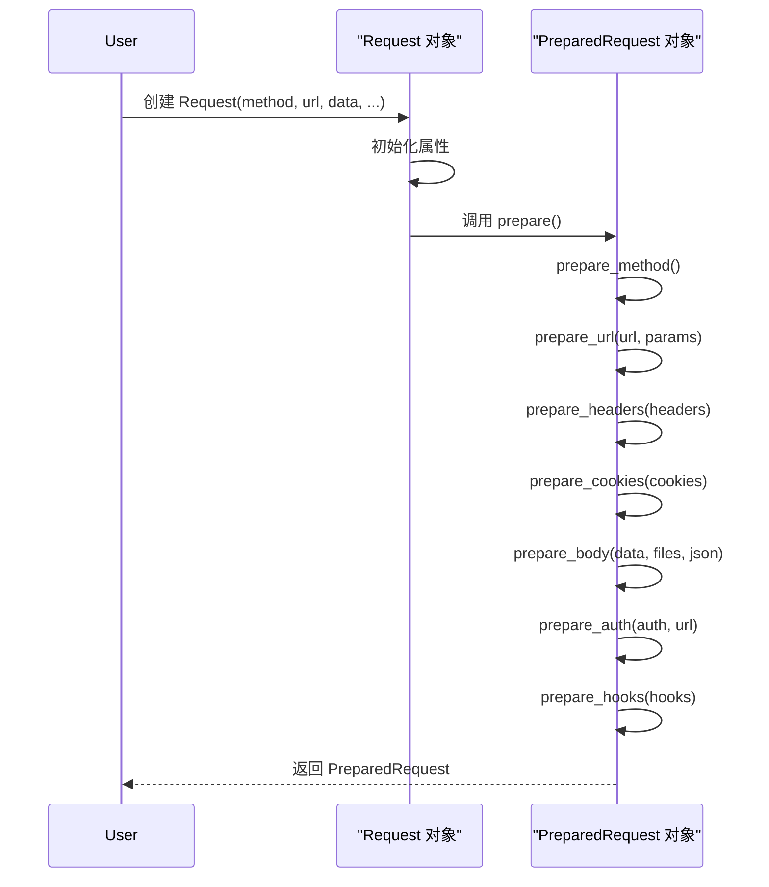
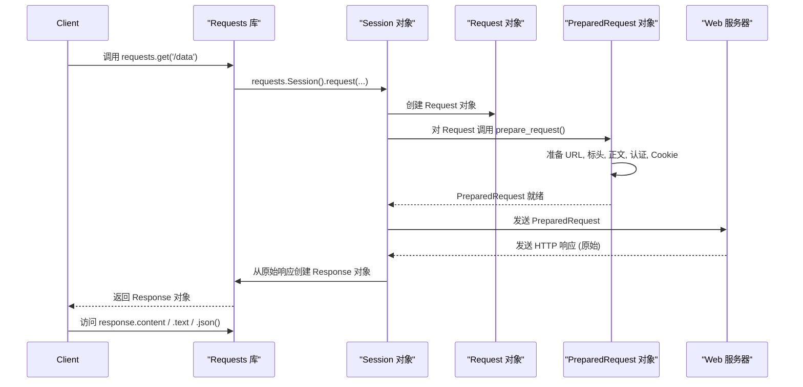

# 请求与响应

当你使用 Requests 发送 HTTP 请求时，你会与几个核心对象交互，这些对象代表你发送的请求和收到的响应。理解这些对象——`Request`、`PreparedRequest` 和 `Response`——对于更深入地控制 HTTP 通信至关重要。

有关特定 HTTP 方法的更多详细信息，请参阅[HTTP 方法](./core-concepts-http-methods.md)部分。要了解这些对象如何在多个请求中进行管理，请参阅[会话](./core-concepts-sessions.md)部分。

## Request 对象

`Request` 对象是用户创建的 HTTP 请求的表示。它旨在保存您提供的所有有关预期请求的信息，例如 HTTP 方法、URL、标头、数据等。虽然您创建了一个 `Request` 对象，但它不会直接通过网络发送。相反，它充当 `PreparedRequest` 对象的蓝图。

**初始化参数**

当您创建 `requests.Request` 对象时，可以指定以下参数：

| Name | Type | Description |
|---|---|---|
| `method` | `string` | HTTP 方法（例如，`'GET'`、`'POST'`）。 |
| `url` | `string` | 请求的 URL。 |
| `headers` | `dict` | （可选）HTTP 标头字典。 |
| `files` | `dict` 或 `list` | （可选）`{文件名: 文件对象}` 字典或用于多部分上传的元组列表。 |
| `data` | `dict`、`list`、`bytes` 或文件类对象 | （可选）要附加的正文。如果是一个字典或元组列表，将进行表单编码。 |
| `json` | 任何可 JSON 序列化的类型 | （可选）正文的 JSON（如果未指定 `files` 或 `data`）。 |
| `params` | `dict` 或 `list` | （可选）要附加到 URL 的 URL 参数。如果是一个字典或元组列表，将进行表单编码。 |
| `auth` | `tuple` 或 `AuthBase` 对象 | （可选）身份验证处理程序或 `(用户, 密码)` 元组。 |
| `cookies` | `dict` 或 `CookieJar` | （可选）Cookie 字典或 CookieJar。 |
| `hooks` | `dict` | （可选）回调钩子字典，主要用于内部使用。 |

**示例：创建 Request 对象**

```python
import requests

# 创建一个针对 httpbin.org/get 的 GET 请求，带有一个自定义标头和一个 URL 参数。
req = requests.Request(
    'GET',
    'https://httpbin.org/get',
    params={'key': 'value'},
    headers={'X-Custom-Header': 'Requests-Demo'}
)

print(req)
# 预期输出: <Request [GET]>
```

### 准备请求

创建 `Request` 对象后，调用其 `prepare()` 方法将其转换为 `PreparedRequest` 对象。此方法处理所有复杂逻辑，包括编码数据、解析 URL、设置标头以及应用身份验证和 Cookie，确保请求处于最终的、可发送的格式。

```python
import requests

req = requests.Request('POST', 'https://httpbin.org/post', data={'name': 'requests'})

# 准备发送请求
prepared_req = req.prepare()

print(prepared_req)
# 预期输出: <PreparedRequest [POST]>
print(prepared_req.body)
# 预期输出: b'name=requests'
print(prepared_req.headers)
# 预期输出: {'Content-Type': 'application/x-www-form-urlencoded', 'Content-Length': '12', ...}
```

## PreparedRequest 对象

`PreparedRequest` 对象是 HTTP 请求的完全可变表示，包含将发送到服务器的确切字节。您通常不会直接实例化此对象；它是在您对 `Request` 对象或在 `Session` 内调用 `prepare()` 时生成的。

**关键属性**

| Attribute | Type | Description |
|---|---|---|
| `method` | `string` | HTTP 动词（例如，`'GET'`、`'POST'`）。 |
| `url` | `string` | 最终的 HTTP URL，包括编码的参数。 |
| `headers` | `CaseInsensitiveDict` | 一个不区分大小写的 HTTP 标头字典。 |
| `body` | `bytes` 或文件类对象 | 要发送到服务器的请求正文。 |
| `hooks` | `dict` | 回调钩子字典。 |

**请求准备生命周期**

`PreparedRequest.prepare()` 方法通过一系列专门的方法协调请求的完整准备。此过程包括：

*   `prepare_method(method)`：将 HTTP 方法转换为大写。
*   `prepare_url(url, params)`：解析 URL，处理主机名的 IDNA 编码，编码 URL 参数，并重新引用 URI 以确保其有效。
*   `prepare_headers(headers)`：将标头初始化为 `CaseInsensitiveDict` 并验证它们。
*   `prepare_cookies(cookies)`：根据给定的 Cookie 生成 `Cookie` 标头。
*   `prepare_body(data, files, json)`：根据 `data`、`files` 或 `json` 输入构建请求正文。这涉及表单编码、文件的多部分编码或 JSON 序列化。
*   `prepare_auth(auth, url)`：对请求应用身份验证，可能修改标头（例如，`Authorization`）。
*   `prepare_hooks(hooks)`：注册任何提供的钩子。

下图说明了从 `Request` 到 `PreparedRequest` 的生命周期：



## Response 对象

`Response` 对象保存了 HTTP 请求发送后从服务器接收到的所有信息。它是您与服务器回复交互的主要方式。

**关键属性**

| Attribute | Type | Description |
|---|---|---|
| `status_code` | `int` | HTTP 状态码（例如，`200`、`404`）。 |
| `headers` | `CaseInsensitiveDict` | 一个不区分大小写的响应标头字典。 |
| `url` | `string` | 响应的最终 URL 位置（重定向后）。 |
| `history` | `list` of `Response` | 来自重定向历史的 `Response` 对象列表。 |
| `reason` | `string` | HTTP 状态的文本原因（例如，`'OK'`、`'Not Found'`）。 |
| `cookies` | `CookieJar` | 服务器发送的 Cookie 的 CookieJar。 |
| `elapsed` | `timedelta` | 发送请求到接收标头之间经过的时间。 |
| `request` | `PreparedRequest` | 导致此响应的 `PreparedRequest` 对象。 |

**访问响应内容**

您可以以各种格式检索响应正文：

*   **`response.content`**：以字节形式访问原始响应正文。这对于图像或二进制文件等非文本数据很有用。
    ```python
    import requests

r = requests.get('https://httpbin.org/image/png')
print(type(r.content))
# 预期输出: <class 'bytes'>
    ```

*   **`response.text`**：以 Unicode 文本形式访问响应正文。Requests 会自动猜测编码，或者您可以显式设置 `response.encoding`。
    ```python
    import requests

r = requests.get('https://httpbin.org/get')
print(type(r.text))
# 预期输出: <class 'str'>
print(r.text)
# 预期输出: {"args": {}, "headers": ..., "origin": "...", "url": "https://httpbin.org/get"}
    ```

*   **`response.json(**kwargs)`**：将响应正文解码为 JSON，成为 Python 对象（字典、列表等）。如果内容不是有效的 JSON，此方法将引发 `requests.exceptions.JSONDecodeError`。
    ```python
    import requests

r = requests.get('https://httpbin.org/json')
print(type(r.json()))
# 预期输出: <class 'dict'>
print(r.json())
# 预期输出: {'slideshow': {'author': 'Yours Truly', 'date': 'date of publication', 'slides': [...], 'title': 'Sample Slide Show'}}
    ```

**状态和错误处理**

*   **`response.ok`**：一个布尔属性，如果 `status_code` 小于 400，则返回 `True`，表示没有客户端或服务器错误。它*不*一定意味着 `200 OK`。

*   **`response.raise_for_status()`**：如果 HTTP 请求返回不成功的状态码（4xx 或 5xx），则引发 `HTTPError`。这是一种方便的检查错误的方法，通常在请求后使用以确保其成功。

    ```python
    import requests
    from requests.exceptions import HTTPError

try:
    r = requests.get('https://httpbin.org/status/404')
    r.raise_for_status() # 这将对 404 引发 HTTPError
except HTTPError as e:
    print(f"HTTP Error occurred: {e}")
# 预期输出: HTTP Error occurred: 404 Client Error: NOT FOUND for url: https://httpbin.org/status/404
    ```

## 请求-响应流

此图说明了使用 Requests 进行 HTTP 请求和响应的典型流程：



---

理解 `Request`、`PreparedRequest` 和 `Response` 对象的作用为有效使用 Requests 库提供了坚实的基础。您已经了解了请求是如何构建、准备以及响应是如何处理的。有关管理跨多个请求的持久设置和交互的详细信息，请参阅 API 参考中的[Session 对象](./api-reference-session-object.md)部分。