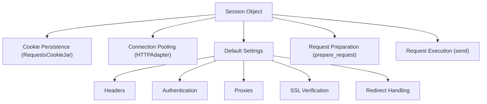

# Sessions

When you make multiple requests to the same host, such as interacting with an API or navigating a website, using a `Session` object can significantly improve efficiency and maintain state across your interactions. A `Session` in Requests allows you to persist certain parameters across requests, including cookies, authentication, and proxy settings. This means you don't have to re-apply these details for every single request.

To understand how `Session` objects interact with requests and responses, you might find it helpful to review the [Requests & Responses](./core-concepts-requests-responses.md) section.

## What a Session Does

A `Session` object serves as a central container for managing connection and request parameters. It streamlines your HTTP communication by providing:

*   **Cookie Persistence**: Cookies received from a server are automatically stored and sent back on subsequent requests to the same domain, simulating browser-like behavior.
*   **Connection Pooling**: Sessions use connection pooling via `HTTPAdapter` objects. This reuses underlying TCP connections, reducing the overhead of establishing new connections for each request and improving performance.
*   **Default Settings**: You can define default headers, authentication, proxies, and SSL verification settings once on the session, and they will be applied to all requests made through that session.

Here's a high-level view of the components a `Session` manages:



## Using Sessions

Instantiating a `Session` object is straightforward. You can use it as a context manager to ensure proper cleanup of resources:

**Example**

```python
import requests

# Using Session as a context manager
with requests.Session() as s:
    # All requests made with 's' will share settings and cookies
    response_get = s.get('https://httpbin.org/cookies/set/sessioncookie/123')
    print(f"GET Response Status: {response_get.status_code}")
    print(f"GET Cookies: {response_get.cookies.get('sessioncookie')}")

    response_get_again = s.get('https://httpbin.org/cookies')
    print(f"Second GET Response Status: {response_get_again.status_code}")
    print(f"Second GET Cookies: {response_get_again.json()['cookies'].get('sessioncookie')}")

# Or, without a context manager (remember to call s.close() manually)
s = requests.Session()
response_post = s.post('https://httpbin.org/post', data={'key': 'value'})
print(f"POST Response Status: {response_post.status_code}")
s.close()
```

In this example, the first `GET` request sets a cookie named `sessioncookie`. The second `GET` request automatically sends this cookie because it's made using the same `Session` object, demonstrating cookie persistence.

## Managing Session Settings

A `Session` object comes with a set of default attributes that you can modify to configure its behavior for all subsequent requests. These include:

| Attribute | Description | Default Value |
|---|---|---|
| `headers` | Case-insensitive dictionary of HTTP headers to send. | `default_headers()` |
| `auth` | Default authentication tuple or object. | `None` |
| `proxies` | Dictionary mapping protocol/host to proxy URL. | `{}` |
| `hooks` | Event-handling hooks for the request lifecycle. | `default_hooks()` |
| `params` | Dictionary of querystring data to attach. | `{}` |
| `stream` | Whether to stream response content by default. | `False` |
| `verify` | SSL Verification: `True` (verify), `False` (don't verify), or path to CA bundle. | `True` |
| `cert` | SSL client certificate: path to `.pem` or `('cert', 'key')` tuple. | `None` |
| `max_redirects` | Maximum number of redirects allowed before raising `TooManyRedirects`. | `30` |
| `trust_env` | Whether to trust environment settings (e.g., `HTTP_PROXY`, `REQUESTS_CA_BUNDLE`). | `True` |
| `cookies` | `RequestsCookieJar` object for managing cookies. | `RequestsCookieJar()` |
| `adapters` | `OrderedDict` of connection adapters. | `HTTPAdapter()` for `http://` and `https://` |

When you make a request using a `Session`, the request-specific settings are intelligently merged with the session's default settings. For dictionary-like settings (headers, params, auth, proxies), the session's settings are used as a base, and the request's specific settings are layered on top. This ensures that request-level configurations take precedence while leveraging session-wide defaults.

**Example: Setting Default Headers and Authentication**

```python
import requests

with requests.Session() as s:
    s.headers.update({'x-client-id': 'my-app-id'})
    s.auth = ('user', 'pass')

    # This request will automatically include 'x-client-id' header and Basic Auth
    response = s.get('https://httpbin.org/headers')
    print(f"Headers: {response.json()['headers'].get('X-Client-Id')}")
    print(f"Authorization: {response.json()['headers'].get('Authorization')}")

    # This request will also include them, but you can override
    response_override = s.get('https://httpbin.org/headers', headers={'x-client-id': 'override-id'})
    print(f"Overridden Headers: {response_override.json()['headers'].get('X-Client-Id')}")
```

## Redirect Handling with Sessions

`Session` objects also manage the complex process of HTTP redirects. They handle the redirect chain, automatically following `3xx` responses up to the `max_redirects` limit. During redirects, a session intelligently re-evaluates proxy configurations and authentication headers to avoid leaking credentials across different hosts. Methods like `resolve_redirects`, `rebuild_auth`, and `rebuild_proxies` within the session ensure proper behavior when following redirects.

## Session Lifecycle and Methods

The `Session` object orchestrates the entire request-response cycle, from preparing the request to handling the final response. Here's a brief overview of key internal steps:

*   `prepare_request(request)`: This crucial method takes a `Request` object and merges its settings with the session's persistent configurations (headers, cookies, auth, proxies, etc.) to produce a `PreparedRequest` object. This prepared request is then ready for transmission.
*   `request(...)`: This is the public interface you typically use (`get`, `post`, etc., are convenience wrappers). It constructs a `Request` object, calls `prepare_request`, and then passes the `PreparedRequest` to the `send` method.
*   `send(prepared_request, **kwargs)`: This core method dispatches the `PreparedRequest` using the appropriate `HTTPAdapter`. It also manages response hooks, handles redirects, extracts cookies from the response into the session's cookie jar, and sets the `elapsed` time.

For a complete understanding of all public methods and attributes of the `Session` object, refer to the [Session Object](./api-reference-session-object.md) section in the API Reference.

---

By leveraging `Session` objects, you can write more efficient, stateful, and readable code for your HTTP interactions. This approach is highly recommended for any application that performs multiple requests.

Next, explore how the fundamental [Headers & Status Codes](./core-concepts-headers-status-codes.md) are managed within Requests.