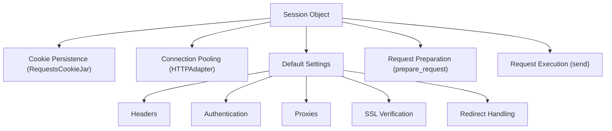

# Sessions

当你向同一个主机发出多个请求时，例如与 API 交互或浏览网站，使用 `Session` 对象可以显著提高效率并在你的交互中保持状态。Requests 中的 `Session` 允许你在多个请求之间持久化某些参数，包括 cookie、认证和代理设置。这意味着你无需为每个请求重新应用这些详细信息。

要理解 `Session` 对象如何与请求和响应交互，查阅 [请求与响应](./core-concepts-requests-responses.md) 部分可能会有所帮助。

## What a Session Does

`Session` 对象作为管理连接和请求参数的中央容器。它通过提供以下功能来简化你的 HTTP 通信：

*   **Cookie 持久化**：从服务器接收到的 cookie 会自动存储并在后续对同一域的请求中发送回去，模拟类似浏览器的行为。
*   **连接池**：Session 通过 `HTTPAdapter` 对象使用连接池。这会重用底层 TCP 连接，减少为每个请求建立新连接的开销，并提高性能。
*   **默认设置**：你可以在 Session 上一次性定义默认的请求头、认证、代理和 SSL 验证设置，它们将应用于通过该 Session 发出的所有请求。

以下是 `Session` 管理的组件的高级视图：



## Using Sessions

实例化 `Session` 对象很简单。你可以将其用作上下文管理器，以确保资源得到适当清理：

**示例**

```python
import requests

# Using Session as a context manager
with requests.Session() as s:
    # All requests made with 's' will share settings and cookies
    response_get = s.get('https://httpbin.org/cookies/set/sessioncookie/123')
    print(f"GET Response Status: {response_get.status_code}")
    print(f"GET Cookies: {response_get.cookies.get('sessioncookie')}")

    response_get_again = s.get('https://httpbin.org/cookies')
    print(f"Second GET Response Status: {response_get_again.status_code}")
    print(f"Second GET Cookies: {response_get_again.json()['cookies'].get('sessioncookie')}")

# Or, without a context manager (remember to call s.close() manually)
s = requests.Session()
response_post = s.post('https://httpbin.org/post', data={'key': 'value'})
print(f"POST Response Status: {response_post.status_code}")
s.close()
```

在此示例中，第一个 `GET` 请求设置了一个名为 `sessioncookie` 的 cookie。第二个 `GET` 请求自动发送此 cookie，因为它使用相同的 `Session` 对象发出，展示了 cookie 的持久化。

## Managing Session Settings

`Session` 对象带有一组默认属性，你可以修改这些属性来配置其在所有后续请求中的行为。这些属性包括：

| Attribute | Description | Default Value |
|---|---|---|
| `headers` | 要发送的 HTTP 请求头（不区分大小写）的字典。 | `default_headers()` |
| `auth` | 默认的认证元组或对象。 | `None` |
| `proxies` | 将协议/主机映射到代理 URL 的字典。 | `{}` |
| `hooks` | 用于请求生命周期的事件处理钩子。 | `default_hooks()` |
| `params` | 要附加的查询字符串数据的字典。 | `{}` |
| `stream` | 默认是否流式传输响应内容。 | `False` |
| `verify` | SSL 验证：`True`（验证）、`False`（不验证）或 CA 证书包的路径。 | `True` |
| `cert` | SSL 客户端证书：`.pem` 文件的路径或 `('cert', 'key')` 元组。 | `None` |
| `max_redirects` | 在引发 `TooManyRedirects` 之前允许的最大重定向次数。 | `30` |
| `trust_env` | 是否信任环境变量设置（例如，`HTTP_PROXY`、`REQUESTS_CA_BUNDLE`）。 | `True` |
| `cookies` | 用于管理 cookie 的 `RequestsCookieJar` 对象。 | `RequestsCookieJar()` |
| `adapters` | 连接适配器的 `OrderedDict`。 | `http://` 和 `https://` 的 `HTTPAdapter()` |

当你使用 `Session` 发出请求时，请求特定的设置会与 Session 的默认设置智能合并。对于字典型设置（请求头、参数、认证、代理），Session 的设置作为基础，请求的特定设置则在其之上分层。这确保了请求级别的配置优先，同时利用了 Session 范围的默认值。

**示例：设置默认请求头和认证**

```python
import requests

with requests.Session() as s:
    s.headers.update({'x-client-id': 'my-app-id'})
    s.auth = ('user', 'pass')

    # This request will automatically include 'x-client-id' header and Basic Auth
    response = s.get('https://httpbin.org/headers')
    print(f"Headers: {response.json()['headers'].get('X-Client-Id')}")
    print(f"Authorization: {response.json()['headers'].get('Authorization')}")

    # This request will also include them, but you can override
    response_override = s.get('https://httpbin.org/headers', headers={'x-client-id': 'override-id'})
    print(f"Overridden Headers: {response_override.json()['headers'].get('X-Client-Id')}")
```

## Redirect Handling with Sessions

`Session` 对象还管理 HTTP 重定向的复杂过程。它们处理重定向链，自动跟踪 `3xx` 响应直至达到 `max_redirects` 限制。在重定向期间，Session 会智能地重新评估代理配置和认证请求头，以避免凭据在不同主机之间泄露。Session 中的 `resolve_redirects`、`rebuild_auth` 和 `rebuild_proxies` 等方法确保在跟踪重定向时行为正常。

## Session Lifecycle and Methods

`Session` 对象协调整个请求-响应生命周期，从准备请求到处理最终响应。以下是关键内部步骤的简要概述：

*   `prepare_request(request)`：这个关键方法接收一个 `Request` 对象，并将其设置与 Session 的持久配置（请求头、cookie、认证、代理等）合并，以生成一个 `PreparedRequest` 对象。这个准备好的请求随后即可进行传输。
*   `request(...)`：这是你通常使用的公共接口（`get`、`post` 等是便捷封装）。它构建一个 `Request` 对象，调用 `prepare_request`，然后将 `PreparedRequest` 传递给 `send` 方法。
*   `send(prepared_request, **kwargs)`：这个核心方法使用适当的 `HTTPAdapter` 调度 `PreparedRequest`。它还管理响应钩子、处理重定向、从响应中提取 cookie 到 Session 的 cookie jar 中，并设置 `elapsed` 时间。

要全面了解 `Session` 对象的所有公共方法和属性，请参阅 API 参考中的 [Session 对象](./api-reference-session-object.md) 部分。

---

通过利用 `Session` 对象，你可以编写更高效、有状态且可读的 HTTP 交互代码。对于执行多个请求的任何应用程序，强烈推荐采用此方法。

接下来，探索 Requests 中如何管理基本的 [请求头与状态码](./core-concepts-headers-status-codes.md)。