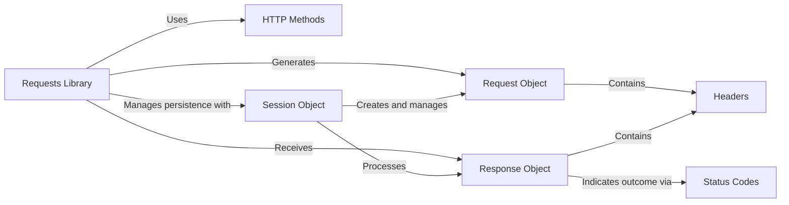

# Core Concepts

This section explains the fundamental concepts and architectural components that underpin the Requests library, providing a solid theoretical foundation for understanding its operations. Understanding these core concepts is crucial for effectively using and troubleshooting Requests for various HTTP communication needs.

While this section provides an overview, you can delve deeper into specific topics by exploring the dedicated sub-sections:

*   [HTTP Methods](./core-concepts-http-methods.md)
*   [Requests & Responses](./core-concepts-requests-responses.md)
*   [Sessions](./core-concepts-sessions.md)
*   [Headers & Status Codes](./core-concepts-headers-status-codes.md)

## Requests Library Architecture

The Requests library is designed to make HTTP requests simple and intuitive. It abstracts away much of the complexity, allowing you to focus on interacting with web services. The diagram below illustrates the high-level relationships between the primary components you'll interact with.

## Key Components

### HTTP Methods

HTTP methods, such as `GET`, `POST`, `PUT`, `DELETE`, and `HEAD`, define the type of action you want to perform on a resource. Requests provides straightforward functions for each common method, making it simple to construct your requests. Each method carries specific semantics regarding idempotence and safety.

Learn more about how to use different HTTP methods and their nuances in [HTTP Methods](./core-concepts-http-methods.md).

### Requests & Responses

At the heart of the library are the `Request` and `Response` objects. A `Request` object encapsulates all the information needed to send an HTTP request, including the URL, headers, data, and parameters. Once the request is sent, the server's reply is encapsulated in a `Response` object, providing access to the status code, headers, and the response body.

Explore the properties and methods of these central objects in [Requests & Responses](./core-concepts-requests-responses.md).

### Sessions

The `Session` object in Requests allows you to persist certain parameters across multiple requests. This is particularly useful when you need to maintain state, such as cookies, authentication credentials, or proxy configurations, across several interactions with a server. Using a Session can also significantly improve performance by reusing underlying TCP connections.

Understand the benefits and usage of the `Session` object in [Sessions](./core-concepts-sessions.md).

### Headers & Status Codes

HTTP **Headers** are key-value pairs that carry metadata about the request or response, such as content type, caching instructions, or authentication tokens. Requests handles headers as case-insensitive dictionaries. **Status Codes** are three-digit numbers returned by the server, indicating the outcome of a request (e.g., 200 OK, 404 Not Found, 500 Internal Server Error).

Find detailed information on handling HTTP headers and interpreting status codes in [Headers & Status Codes](./core-concepts-headers-status-codes.md).

---

With a foundational understanding of these core concepts, you are now ready to dive into the practical application of the Requests library. Continue to the [HTTP Methods](./core-concepts-http-methods.md) section to begin making your first specific types of HTTP requests.