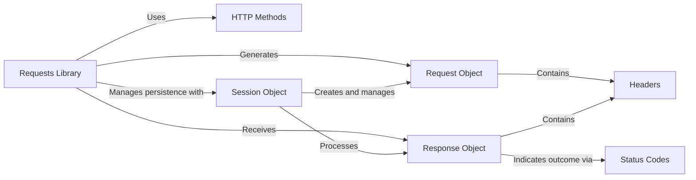

# 核心概念

本节解释了支撑 Requests 库的基本概念和架构组件，为理解其操作提供了坚实的理论基础。理解这些核心概念对于有效使用 Requests 并解决各种 HTTP 通信需求问题至关重要。

虽然本节提供了概述，但您可以通过探索专用子部分深入了解特定主题：

*   [HTTP 方法](./core-concepts-http-methods.md)
*   [请求与响应](./core-concepts-requests-responses.md)
*   [会话](./core-concepts-sessions.md)
*   [请求头与状态码](./core-concepts-headers-status-codes.md)

## Requests 库架构

Requests 库旨在让 HTTP 请求变得简单直观。它抽象了大部分复杂性，让您可以专注于与 Web 服务交互。下图展示了您将与之交互的主要组件之间的高级关系。

## 关键组件

### HTTP 方法

HTTP 方法，例如 `GET`、`POST`、`PUT`、`DELETE` 和 `HEAD`，定义了您要对资源执行的操作类型。Requests 为每种常用方法提供了直观的函数，让构建请求变得简单。每种方法都带有关于幂等性和安全性的特定语义。

在 [HTTP 方法](./core-concepts-http-methods.md) 中了解更多关于如何使用不同 HTTP 方法及其细微差别的信息。

### 请求与响应

库的核心是 `Request` 和 `Response` 对象。`Request` 对象封装了发送 HTTP 请求所需的所有信息，包括 URL、请求头、数据和参数。请求发送后，服务器的回复则封装在 `Response` 对象中，提供对状态码、响应头和响应体的访问。

在 [请求与响应](./core-concepts-requests-responses.md) 中探索这些核心对象的属性和方法。

### 会话

Requests 中的 `Session` 对象允许您在多个请求之间持久化某些参数。当您需要在与服务器的多次交互中维护状态（例如 Cookie、身份验证凭据或代理配置）时，这尤其有用。使用 Session 还可以通过重用底层 TCP 连接显著提高性能。

在 [会话](./core-concepts-sessions.md) 中了解 `Session` 对象的优点和用法。

### 请求头与状态码

HTTP **请求头**是携带请求或响应元数据的键值对，例如内容类型、缓存指令或身份验证令牌。Requests 将请求头作为不区分大小写的字典处理。**状态码**是服务器返回的三位数字，表示请求的结果（例如 200 OK、404 Not Found、500 Internal Server Error）。

在 [请求头与状态码](./core-concepts-headers-status-codes.md) 中查找有关处理 HTTP 请求头和解释状态码的详细信息。

---

凭借对这些核心概念的基础理解，您现在可以深入了解 Requests 库的实际应用。继续前往 [HTTP 方法](./core-concepts-http-methods.md) 部分，开始进行您的第一批特定类型的 HTTP 请求。