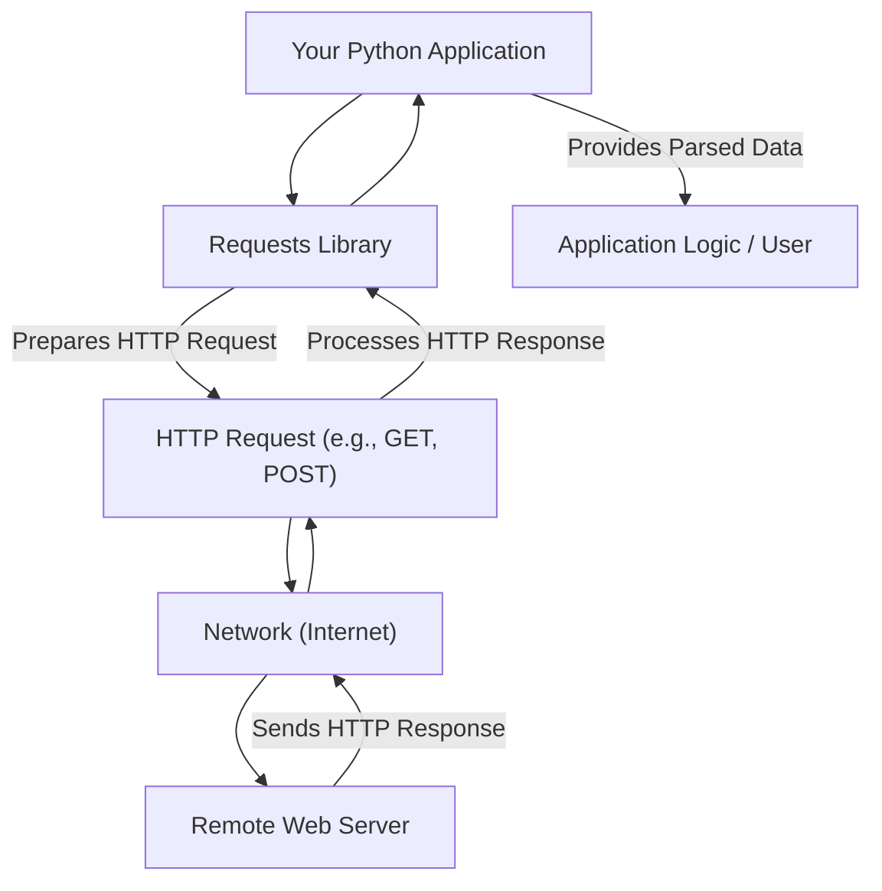

# Overview

Requests is an elegant and straightforward HTTP library for Python, designed to simplify web interactions for human beings. It streamlines the process of sending HTTP/1.1 requests, removing the need for manual URL query string additions or complex form-encoding of data. Today, you can simply use the `json` method for data.

## Core Principles

The fundamental principle behind Requests is to make HTTP communication intuitive. It abstracts away common complexities, allowing developers to focus on the application logic rather than low-level HTTP details. This approach is exemplified by its ability to accept Python dictionaries for request data, which it then handles automatically.

## Reliability and Adoption

Requests is a widely adopted and trusted library within the Python ecosystem. It sees approximately 30 million weekly downloads and is a dependency for over 1,000,000 repositories on GitHub. This extensive usage speaks to its stability and reliability.

## How Requests Works

Here’s a simplified view of how the Requests library facilitates web communication:

This diagram illustrates the flow from your application, through the Requests library for request preparation and response handling, to the interaction with a remote web server over the network. Requests manages the underlying communication, presenting you with clean, parsed data.

## Key Capabilities

Requests is ready for building robust and reliable HTTP–speaking applications. Some of its key capabilities include:

*   Keep-Alive & Connection Pooling
*   Sessions with Cookie Persistence
*   Browser-style TLS/SSL Verification
*   Basic & Digest Authentication
*   Automatic Content Decompression and Decoding
*   Multi-part File Uploads
*   Connection Timeouts
*   Streaming Downloads

These features provide a solid foundation for handling diverse HTTP communication needs.

---

To begin using the Requests library, navigate to the [Getting Started](./getting-started.md) section, which provides instructions for installation and your first code example. For a comprehensive reference of all public APIs, classes, and methods, explore the [API Reference](./api-reference.md) or the complete documentation on [Read the Docs](https://requests.readthedocs.io).