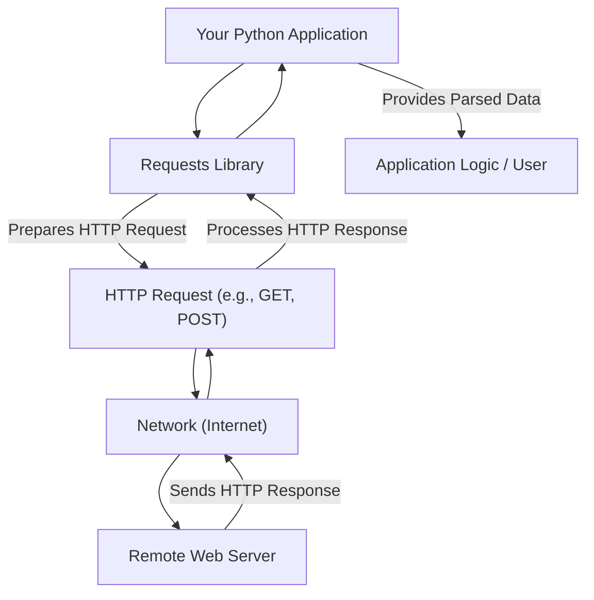

# 概述

Requests 是一个为 Python 设计的优雅直观的 HTTP 库，旨在简化人类的 Web 交互。它简化了发送 HTTP/1.1 请求的过程，无需手动添加 URL 查询字符串或复杂地对数据进行表单编码。如今，您可以简单地使用 `json` 方法来处理数据。

## 核心原则

Requests 背后的基本原则是使 HTTP 通信直观。它抽象了常见的复杂性，允许开发者专注于应用程序逻辑而非低级 HTTP 细节。这种方法体现在它能够接受 Python 字典作为请求数据，然后自动处理这些数据。

## 可靠性和采用

Requests 是 Python 生态系统中一个被广泛采用和信任的库。它每周下载量约 3000 万次，是 GitHub 上超过 1,000,000 个仓库的依赖项。这种广泛的使用证明了其稳定性与可靠性。

## Requests 的工作原理

以下是 Requests 库如何促进 Web 通信的简化视图：

此图解说明了从您的应用程序，通过 Requests 库进行请求准备和响应处理，到通过网络与远程 Web 服务器交互的流程。Requests 管理底层通信，为您提供清晰、解析后的数据。

## 主要功能

Requests 已为构建健壮可靠的 HTTP 应用程序做好准备。它的一些主要功能包括：

*   Keep-Alive 和连接池
*   带 Cookie 持久化的会话
*   浏览器风格的 TLS/SSL 验证
*   基本和摘要认证
*   自动内容解压和解码
*   多部分文件上传
*   连接超时
*   流式下载

这些功能为处理各种 HTTP 通信需求提供了坚实的基础。

---

要开始使用 Requests 库，请前往[入门](./getting-started.md)部分，其中提供了安装说明和您的第一个代码示例。有关所有公共 API、类和方法的全面参考，请查阅[API 参考](./api-reference.md)或 [Read the Docs](https://requests.readthedocs.io) 上的完整文档。