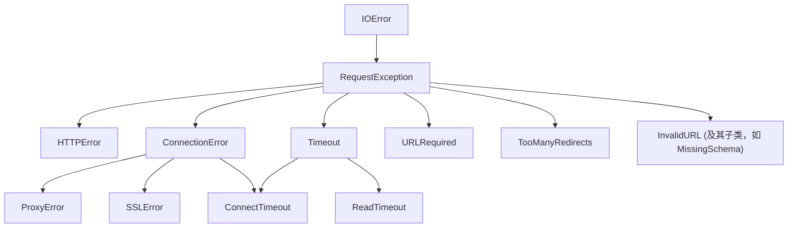

# 错误处理

在处理网络请求时，可能会出现问题。服务器可能不可用、连接可能中断，或者你可能会遇到无效的 URL。Requests 旨在通过抛出异常来处理这些情况。这使你能够构建可以从容管理故障、具有韧性的应用程序。

所有由 Requests 抛出的异常都继承自基类异常 `requests.exceptions.RequestException`。

## 失败的状态码：`HTTPError`

最常见的检查之一是查看请求是否成功。如果服务器返回错误状态码（在 4xx 或 5xx 范围内），Requests 不会自动抛出异常。但是，你可以使用 `response.raise_for_status()` 方法来主动抛出异常。

如果请求失败，将会抛出 `HTTPError` 异常。

```python
import requests

for status_code in [404, 503]:
    try:
        url = f'https://httpbin.org/status/{status_code}'
        response = requests.get(url)

        # 如果 HTTP 请求返回失败的状态码，该方法将抛出 HTTPError 异常。
        response.raise_for_status()
    except requests.exceptions.HTTPError as err:
        print(f'HTTP error for status {status_code}: {err}')
    except Exception as err:
        print(f'An unexpected error occurred: {err}')
```

这段代码会针对 404（客户端错误）和 503（服务器错误）状态码产生输出，演示了 `raise_for_status()` 如何帮助捕获这些问题。

## 连接问题：`ConnectionError`

网络层面的错误，例如 DNS 解析失败、连接被拒绝或其他连接问题，都将抛出 `ConnectionError` 异常。

```python
import requests

try:
    response = requests.get('https://this-domain-does-not-exist.com')
except requests.exceptions.ConnectionError as err:
    print(f'Connection error occurred: {err}')
```

当应用程序无法访问目标服务器时，捕获此异常可以处理所有这类情况。

## 超时

你可以配置 requests 在等待指定秒数后停止等待响应。如果发生超时，则会抛出 `Timeout` 异常。`Timeout` 异常是以下两种更具体的超时异常的父类：

- `ConnectTimeout`: 尝试建立连接时发生超时，会抛出此异常。
- `ReadTimeout`: 如果服务器在规定时间内未发送任何数据，会抛出此异常。

```python
import requests

try:
    # 该请求将在尝试连接时超时。
    response = requests.get('https://github.com', timeout=0.001)
except requests.exceptions.ConnectTimeout as err:
    print(f'Connection timed out: {err}')
except requests.exceptions.ReadTimeout as err:
    print(f'Read timed out: {err}')
except requests.exceptions.Timeout as err:
    print(f'A timeout occurred: {err}')
```

## 重定向次数过多：`TooManyRedirects`

默认情况下，Requests 最多会执行 30 次重定向。如果超过此限制，它将抛出 `TooManyRedirects` 异常。这可以防止你的应用程序陷入无限重定向循环。

```python
import requests

try:
    # httpbin.org/redirect/N 会执行 N 次重定向。默认限制为 30 次。
    response = requests.get('https://httpbin.org/redirect/35')
except requests.exceptions.TooManyRedirects as err:
    print(f'Too many redirects: {err}')
```

## 无效的 URL

如果你提供格式错误的 URL，Requests 会抛出异常，这通常发生在网络请求发出之前。最常见的是 `MissingSchema` 异常，它会在你忘记添加 `http://` 或 `https://` 协议头时发生。

```python
import requests

try:
    response = requests.get('google.com')
except requests.exceptions.MissingSchema as err:
    print(f'Invalid URL: {err}')
```

## 异常层级结构

理解异常的层级结构可以帮助你更有效地捕获它们。例如，捕获 `ConnectionError` 也会捕获 `ProxyError` 和 `SSLError`。

以下是主要异常类型的简化关系图：



## 下一步

既然你已经能够从容地处理错误，就可以开始探索更复杂的场景了。请继续阅读[高级用法](./advanced-usage.md)指南，了解有关代理、SSL 验证、自定义适配器等更多内容。