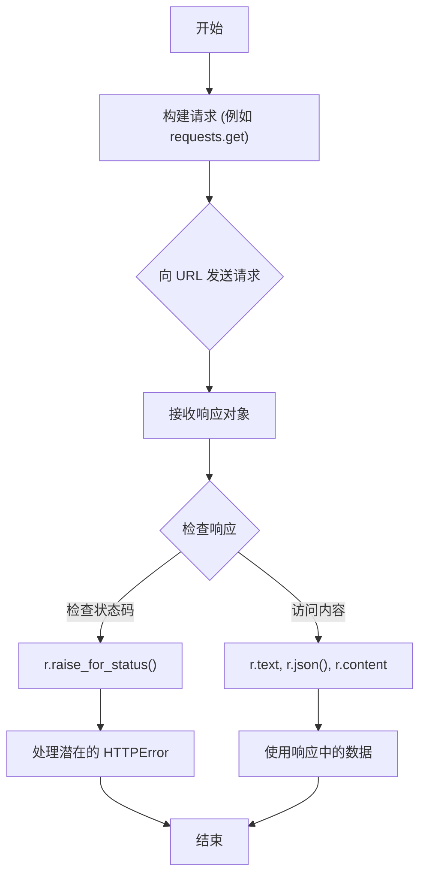

# 用户指南

本指南对 Requests 库的核心功能进行了实用性探索。它超越了基础知识，涵盖了你将遇到的最常见用例，从发送各种类型的请求到处理响应和管理会话。这些示例旨在做到实用，可直接用于你的项目中。

如果你尚未安装 Requests 或还未发出第一个请求，请先阅读 [入门指南](./getting-started.md)。

### 标准工作流程

使用 Requests 库的典型交互遵循一个简单的模式：构建请求、发送请求，然后处理响应。这个工作流程可以让你高效地与 Web 服务和 API 进行交互。

本指南分为以下几个部分，每个部分都侧重于该库的一个关键方面。

<x-cards data-columns="2">
  <x-card data-title="发送请求" data-icon="lucide:send" data-href="/user-guide/making-a-request">
    学习如何发送 GET、POST 和 PUT 等各种 HTTP 请求。本节内容涵盖传递 URL 参数、自定义标头以及不同类型的请求体，包括表单数据和 JSON 负载。
  </x-card>
  <x-card data-title="处理响应" data-icon="lucide:arrow-down-left" data-href="/user-guide/handling-responses">
    发送请求后，你会收到一个 `Response` 对象。了解如何以不同格式（文本、JSON、二进制）访问响应体、检查状态码以及读取标头。
  </x-card>
  <x-card data-title="会话对象" data-icon="lucide:book-copy" data-href="/user-guide/session-objects">
    使用 `Session` 对象可以在多个请求之间保持参数和 Cookie。这通过复用 TCP 连接来提高性能，对于构建高效的 API 客户端至关重要。
  </x-card>
  <x-card data-title="身份验证" data-icon="lucide:key-round" data-href="/user-guide/authentication">
    许多 API 都需要身份验证。Requests 提供了多种内置方案，例如基本和摘要式身份验证，可帮助你轻松保护请求安全。
  </x-card>
  <x-card data-title="错误处理" data-icon="lucide:shield-alert" data-href="/user-guide/error-handling">
    网络请求可能会失败。一个稳健的应用程序必须能够处理连接问题、超时和错误的 HTTP 状态。学习如何捕获和管理异常，以构建更具韧性的应用程序。
  </x-card>
</x-cards>

---

掌握这些核心概念后，你将能够应对大多数常见的 HTTP 交互。当你准备好处理更复杂的场景时，例如配置超时、使用代理或验证 SSL 证书，请继续阅读 [高级用法](./advanced-usage.md) 指南。